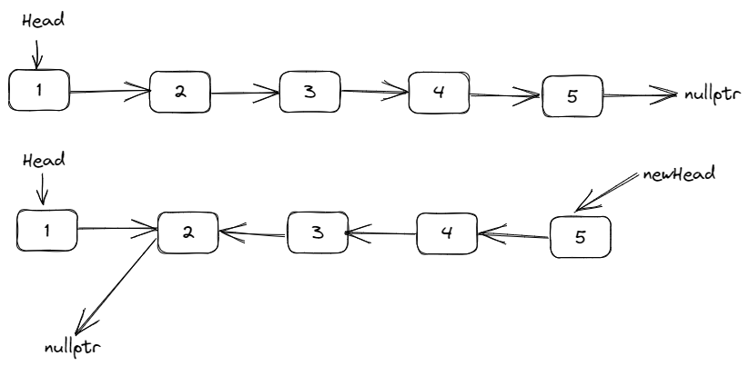

## 前言

这部分是我刷剑指offer简单记录一下解法，不建议参考我这部分的内容，直接打开力扣刷就可以了，遇见不会的官方题解或者前排大佬的题解解释的很详细，我这里只是做个备份使用。。。


## [剑指 Offer 03. 数组中重复的数字](https://leetcode.cn/problems/shu-zu-zhong-zhong-fu-de-shu-zi-lcof/)

找出数组中重复的数字。

在一个长度为 n 的数组 nums 里的所有数字都在 0～n-1 的范围内。数组中某些数字是重复的，但不知道有几个数字重复了，也不知道每个数字重复了几次。请找出数组中任意一个重复的数字。

**示例 1：**

**输入：**  
[2, 3, 1, 0, 2, 5, 3]  
**输出：**2 或 3

**限制：**

`2 <= n <= 100000`

### 解题思路

最简单的想法是利用哈希表记录已经遍历过的数字，当再次遇到哈希表中存在的元素时，说明此时找到了重复的元素，返回即可

```cpp
class Solution {
public:
    int findRepeatNumber(vector<int>& nums) {
        unordered_set<int> st;
        for (auto num : nums) {
            if (st.count(num)) {
                return num;
            }
            st.insert(num);
        }
        return -1;
    }
};
```

时间复杂度：O(n)  
空间复杂度：O(n)

优化空间复杂度的方法是考虑原地交换，题目中说了所有数字在 0 ~ n-1 范围内，所以利用数组本身也可以看成哈希表，交换的时候：
- 如果 $nums[i] == i$，说明已经在正确位置上了，i++；
- 如果 $nums[i] == nums[nums[i]]$，说明找到一个重复的数字；
- 否则交换 $nums[i]$ 和 $nums[nums[i]]$

```cpp
class Solution {
public:
    int findRepeatNumber(vector<int>& nums) {
        for (int i = 0; i < nums.size(); ) {
            if (nums[i] == i) {
                i++;
                continue;
            }
            if (nums[i] == nums[nums[i]]) {
                return nums[i];
            }
            swap(nums[i], nums[nums[i]]);
        }
        return -1;
    }
};
```

时间复杂度：O(n)  
空间复杂度：O(1)

## [剑指 Offer 04. 二维数组中的查找](https://leetcode.cn/problems/er-wei-shu-zu-zhong-de-cha-zhao-lcof/)

在一个 n * m 的二维数组中，每一行都按照从左到右 **非递减** 的顺序排序，每一列都按照从上到下 **非递减** 的顺序排序。请完成一个高效的函数，输入这样的一个二维数组和一个整数，判断数组中是否含有该整数。

**示例:**

现有矩阵 matrix 如下：

```
[
  [1,   4,  7, 11, 15],
  [2,   5,  8, 12, 19],
  [3,   6,  9, 16, 22],
  [10, 13, 14, 17, 24],
  [18, 21, 23, 26, 30]
]
```

给定 target = `5`，返回 `true`。

给定 target = `20`，返回 `false`。

**限制：**  
`0 <= n <= 1000`  
`0 <= m <= 1000`

### 解题思路

把矩阵斜 45°，以菱形形式观察，可以发现对于点 (row, col)，如果 row++，元素在变大，如果 col-- 元素在减小，以此来根据二分查找求得结果是否存在：

```cpp
class Solution {
public:
    bool findNumberIn2DArray(vector<vector<int>>& matrix, int target) {
        if (matrix.size() == 0 || matrix[0].size() == 0) return false;
        int row = 0, col = matrix[0].size() - 1;
        while (row < matrix.size() && col >= 0) {
            if (matrix[row][col] == target) {
                return true;
            } else if (matrix[row][col] < target) {
                row++;
            } else {
                col--;
            }
        }
        return false;
    }
};
```

## [剑指 Offer 06. 从尾到头打印链表](https://leetcode.cn/problems/cong-wei-dao-tou-da-yin-lian-biao-lcof/)

输入一个链表的头节点，从尾到头反过来返回每个节点的值（用数组返回）。

**示例 1：**

输入：head = [1,3,2]  
输出：[2,3,1]

**限制：**`0 <= 链表长度 <= 10000`

### 解题思路
#### 1. 暴力

最暴力直接方法就是遍历一遍链表，然后再反转：

```cpp
/**
 * Definition for singly-linked list.
 * struct ListNode {
 *     int val;
 *     ListNode *next;
 *     ListNode(int x) : val(x), next(NULL) {}
 * };
 */
class Solution {
public:
    vector<int> reversePrint(ListNode* head) {
        vector<int> res;
        while (head != nullptr) {
            res.push_back(head->val);
            head = head->next;
        }
        reverse(res.begin(), res.end());
        return res;
    }
};
```

#### 2. 递归

第二种思路是利用递归，类似于二叉树的后序遍历，递归终点是 head == nullptr。

```cpp
class Solution {
public:
    vector<int> reversePrint(ListNode* head) {
        vector<int> res;
        dfs(head, res);
        return res;
    }

    void dfs(ListNode *head, vector<int> &res) {
        // 递归终点
        if (head == nullptr) {
            return ;
        }
        // 递归下一个节点
        dfs(head->next, res);
        // 将当前节点值放入res中
        res.push_back(head->val);
    }
};
```

#### 3. 栈

第三种方法就是利用栈，和递归思路差不多，因为递归本质就是利用栈的。

```cpp
class Solution {
public:
    vector<int> reversePrint(ListNode* head) {
        stack<int> st;
        // 遍历链表，将数据放入栈中
        while (head != nullptr) {
            st.emplace(head->val);
            head = head->next;
        }
        vector<int> res;
        // 从栈中依次取出元素，放入res当中
        while (!st.empty()) {
            res.push_back(st.top());
            st.pop();
        }
        return res;
    }
};
```

## [剑指 Offer 07. 重建二叉树](https://leetcode.cn/problems/zhong-jian-er-cha-shu-lcof/)

输入某二叉树的前序遍历和中序遍历的结果，请构建该二叉树并返回其根节点。

假设输入的前序遍历和中序遍历的结果中都不含重复的数字。

**示例 1:**


**Input:** preorder = [3,9,20,15,7], inorder = [9,3,15,20,7]  
**Output:** [3,9,20,null,null,15,7]

**示例 2:**

**Input:** preorder = [-1], inorder = [-1]  
**Output:** [-1]

**限制：**

`0 <= 节点个数 <= 5000`

### 解题思路

前序遍历是 【根，左，右】，中序遍历是 【左，根，右】，以此可以知道前序遍历的第一个为根节点，然后在中序遍历中找到根节点对应位置，即可计算出左孩子和右孩子的节点个数，然后分治的递归求解左子树和右子树即可：

```cpp
/**
 * Definition for a binary tree node.
 * struct TreeNode {
 *     int val;
 *     TreeNode *left;
 *     TreeNode *right;
 *     TreeNode(int x) : val(x), left(NULL), right(NULL) {}
 * };
 */
class Solution {
public:
    TreeNode* buildTree(vector<int>& preorder, vector<int>& inorder) {
        return build(preorder, inorder, 0, preorder.size() - 1, 0, inorder.size() - 1);
    }

    TreeNode* build(vector<int>& preorder, vector<int> &inorder, int pre_left, int pre_right, int in_left, int in_right) {
        if (pre_left > pre_right) return nullptr;
        if (in_left > in_right) return nullptr;
        int root = preorder[pre_left];
        int in_root = in_left;
        for (int i = in_left; i <= in_right; ++i) {
            if (inorder[i] == root) {
                in_root = i;
                break;
            }
        }
        int left_cnt = in_root - in_left;
        int right_cnt = in_right - in_root;
        TreeNode *tree = new TreeNode(root);
        tree->left = build(preorder, inorder, pre_left + 1, pre_left + left_cnt, in_left, in_root - 1);
        tree->right = build(preorder, inorder, pre_left + left_cnt + 1, pre_right, in_root + 1, in_right);
        return tree;
    }
};
```

## [剑指 Offer 09. 用两个栈实现队列](https://leetcode.cn/problems/yong-liang-ge-zhan-shi-xian-dui-lie-lcof/)

用两个栈实现一个队列。队列的声明如下，请实现它的两个函数 `appendTail` 和 `deleteHead` ，分别完成在队列尾部插入整数和在队列头部删除整数的功能。(若队列中没有元素，`deleteHead` 操作返回 -1 )

**示例 1：**

**输入：**  
["CQueue","appendTail","deleteHead","deleteHead","deleteHead"]  
[[],[3],[],[],[]]  
**输出：**[null,null,3,-1,-1]

**示例 2：**

**输入：**  
["CQueue","deleteHead","appendTail","appendTail","deleteHead","deleteHead"]  
[[],[],[5],[2],[],[]]  
**输出：**[null,-1,null,null,5,2]

**提示：**

- `1 <= values <= 10000`
- 最多会对 `appendTail、deleteHead` 进行 `10000` 次调用

### 解题思路

基本思路就是一个栈 st1 存放数据，当 deleteHead() 的时候优先从另外一个栈 st2 取数据，如果 st2 为空，则将 st1 的数据都移入到 st2 中，刚好实现了先入先出的队列形式；

```cpp
class CQueue {
public:
    CQueue() {

    }
    
    void appendTail(int value) {
        st1.emplace(value);
    }
    
    int deleteHead() {
        if (st2.empty()) {
            while (!st1.empty()) {
                st2.emplace(st1.top());
                st1.pop();
            }
        }
        if (st2.empty()) {
            return -1;
        }
        int res = st2.top();
        st2.pop();
        return res;
    }

private:
    stack<int> st1;
    stack<int> st2;
};

/**
 * Your CQueue object will be instantiated and called as such:
 * CQueue* obj = new CQueue();
 * obj->appendTail(value);
 * int param_2 = obj->deleteHead();
 */
```

## [剑指 Offer 10- I. 斐波那契数列](https://leetcode.cn/problems/fei-bo-na-qi-shu-lie-lcof/)

写一个函数，输入 `n` ，求斐波那契（Fibonacci）数列的第 `n` 项（即 `F(N)`）。斐波那契数列的定义如下：

F(0) = 0,   F(1) = 1  
F(N) = F(N - 1) + F(N - 2), 其中 N > 1.

斐波那契数列由 0 和 1 开始，之后的斐波那契数就是由之前的两数相加而得出。

答案需要取模 1e9+7（1000000007），如计算初始结果为：1000000008，请返回 1。

**示例 1：**

**输入：**n = 2  
**输出：**1

**示例 2：**

**输入：**n = 5  
**输出：**5

**提示：**

- `0 <= n <= 100`

### 解题思路

用一个数组记录计算得到的中间值，然后递归的计算。

```cpp
class Solution {
    long long f[1000];
    const int mod = 1e9 + 7;
public:
    int fib(int n) {
        if (n == 0) return 0;
        if (n == 1) return 1;
        if (f[n] != 0) return f[n];
        f[n] = fib(n - 1) + fib(n - 2);
        f[n] %= mod;
        return f[n];
    }
};
```

另外一种方法用递推：

```cpp
class Solution {
    long long f[1000];
    const int mod = 1e9 + 7;
public:
    int fib(int n) {
        f[1] = 1;
        for (int i = 2; i <= n; ++i) {
            f[i] = (f[i - 1] + f[i - 2]) % mod;
        }
        return f[n];
    }
};
```

## [剑指 Offer 10- II. 青蛙跳台阶问题](https://leetcode.cn/problems/qing-wa-tiao-tai-jie-wen-ti-lcof/)

一只青蛙一次可以跳上 1 级台阶，也可以跳上 2 级台阶。求该青蛙跳上一个 `n` 级的台阶总共有多少种跳法。

答案需要取模 1e9+7（1000000007），如计算初始结果为：1000000008，请返回 1。

**示例 1：**

**输入：**n = 2  
**输出：**2

**示例 2：**

**输入：**n = 7  
**输出：**21

**示例 3：**

**输入：**n = 0  
**输出：**1

**提示：**

- `0 <= n <= 100`

### 解题思路

和 10-I 几乎一模一样，除了初始值 `f[0] = 1` 外，其他都一样

```cpp
class Solution {
    long long f[1000];
    const int mod = 1e9 + 7;
public:
    int numWays(int n) {
        f[0] = f[1] = 1;
        for (int i = 2; i <= n; ++i) {
            f[i] = (f[i - 1] + f[i - 2]) % mod;
        }
        return f[n];
    }
};
```

## [剑指 Offer 11. 旋转数组的最小数字](https://leetcode.cn/problems/xuan-zhuan-shu-zu-de-zui-xiao-shu-zi-lcof/)

把一个数组最开始的若干个元素搬到数组的末尾，我们称之为数组的旋转。

给你一个可能存在 **重复** 元素值的数组 `numbers` ，它原来是一个升序排列的数组，并按上述情形进行了一次旋转。请返回旋转数组的**最小元素**。例如，数组 `[3,4,5,1,2]` 为 `[1,2,3,4,5]` 的一次旋转，该数组的最小值为 1。  

注意，数组 `[a[0], a[1], a[2], ..., a[n-1]]` 旋转一次 的结果为数组 `[a[n-1], a[0], a[1], a[2], ..., a[n-2]]` 。

**示例 1：**

**输入：**`numbers =` [3,4,5,1,2]  
**输出：**1

**示例 2：**

**输入：**`numbers =` [2,2,2,0,1]  
**输出：**0

**提示：**

- `n == numbers.length`
- `1 <= n <= 5000`
- `-5000 <= numbers[i] <= 5000`
- `numbers` 原来是一个升序排序的数组，并进行了 `1` 至 `n` 次旋转

### 解题思路

这题其实不是很好想，用官方的图来看，旋转后的数组有一个性质，即最小值左侧的数字一定大于等于右侧的数字，考虑二分：
- 如果 `nums[hi] < nums[mi]`，说明此时 mi 在最小值的左侧，令 `lo = mi + 1`；
- 如果 `nums[hi] > nums[mi]`，说明此时 mi 在最小值的右侧，令 `hi = mi`；
- 如果 `nums[hi] == nums[mi]`，此时无法确定 mi 的位置（可以看下图前三个点和后三个点），但是由于 mi 在 hi 的左侧，假如 hi 是最小值，那么 mi 也是最小值；如果 hi 不是最小值那说明最小值在 hi 的左侧，令 hi --，这样一定不会丢失最小值；


```cpp
class Solution {
public:
    int minArray(vector<int>& nums) {
        int lo = 0, hi = nums.size() - 1;
        while (lo < hi) {
            int mi = lo + ((hi - lo) >> 1);
            if (nums[mi] > nums[hi]) {
                lo = mi + 1;
            } else if (nums[mi] < nums[hi]) {
                hi = mi;
            } else {
                hi--;
            }
        }
        return nums[lo];
    }
};
```

## [剑指 Offer 12. 矩阵中的路径](https://leetcode.cn/problems/ju-zhen-zhong-de-lu-jing-lcof/)

给定一个 `m x n` 二维字符网格 `board` 和一个字符串单词 `word` 。如果 `word` 存在于网格中，返回 `true` ；否则，返回 `false` 。

单词必须按照字母顺序，通过相邻的单元格内的字母构成，其中“相邻”单元格是那些水平相邻或垂直相邻的单元格。同一个单元格内的字母不允许被重复使用。

例如，在下面的 3×4 的矩阵中包含单词 "ABCCED"（单词中的字母已标出）。


**示例 1：**

**输入：**board = [["A","B","C","E"],["S","F","C","S"],["A","D","E","E"]], word = "ABCCED"  
**输出：**true

**示例 2：**

**输入：**board = [["a","b"],["c","d"]], word = "abcd"  
**输出：**false

**提示：**

- `m == board.length`
- `n = board[i].length`
- `1 <= m, n <= 6`
- `1 <= word.length <= 15`
- `board` 和 `word` 仅由大小写英文字母组成

### 解题思路

回溯思路，dfs 的时候需要回退状态，用 vis 数组标记的时候，如果当前格子与之前的连不上，要取消已经访问的状态，否则可能出现，饶了一圈回到这个格子，但是却被之前访问的临近格子置为已经访问了

```cpp
class Solution {
    const int dx[4] = {0, 0, -1, 1};
    const int dy[4] = {1, -1, 0, 0};
    int m, n;
public:
    bool exist(vector<vector<char>>& board, string word) {
        m = board.size();
        n = board[0].size();
        for (int i = 0; i < m; ++i) {
            for (int j = 0; j < n; ++j) {
                if (board[i][j] == word[0]) {
                    vector<vector<int>> vis(m, vector<int>(n, 0));
                    if (dfs(board, vis, i, j, word, 1)) {
                        return true;
                    }
                }
            }
        }
        return false;
    }

    bool dfs(vector<vector<char>>& board, vector<vector<int>>& vis, int x, int y, string& word, int id) {
        if (id >= word.size()) {
            return true;
        }
        if (!check(x, y) || vis[x][y] != 0) {
            return false;
        }
        vis[x][y] = 1;
        for (int i = 0; i < 4; ++i) {
            int mx = x + dx[i];
            int my = y + dy[i];
            if (check(mx, my) && vis[mx][my] == 0 && word[id] == board[mx][my]) {
                if (dfs(board, vis, mx, my, word, id + 1)) {
                    return true;
                }
            }
        }
        vis[x][y] = 0; // 需要回溯
        return false;
    }

    bool check(int x, int y) {
        return x >= 0 && x < m && y >= 0 && y < n;
    }
};
```

## [剑指 Offer 13. 机器人的运动范围](https://leetcode.cn/problems/ji-qi-ren-de-yun-dong-fan-wei-lcof/)

地上有一个 m 行 n 列的方格，从坐标 `[0,0]` 到坐标 `[m-1,n-1]` 。一个机器人从坐标 `[0, 0]` 的格子开始移动，它每次可以向左、右、上、下移动一格（不能移动到方格外），也不能进入行坐标和列坐标的数位之和大于 k 的格子。例如，当 k 为 18 时，机器人能够进入方格 [35, 37] ，因为 3+5+3+7=18。但它不能进入方格 [35, 38]，因为 3+5+3+8=19。请问该机器人能够到达多少个格子？

**示例 1：**

**输入：**m = 2, n = 3, k = 1  
**输出：**3

**示例 2：**

**输入：**m = 3, n = 1, k = 0  
**输出：**1

**提示：**

- `1 <= n,m <= 100`
- `0 <= k <= 20`

### 解题思路

DFS，递归枚举所有相邻的点，如何计算总和，需要用 vis 数组标记是否访问过

```cpp
class Solution {
    const int dx[4] = {0, 0, -1, 1};
    const int dy[4] = {1, 1, -1, 0};
public:
    int movingCount(int m, int n, int k) {
        vector<vector<int>> vis(m, vector<int>(n, 0));
        return dfs(0, 0, m, n, k, vis);
    }

    int dfs(int x, int y, int m, int n, int k, vector<vector<int>> &vis) {
        if (!(x >= 0 && x < m && y >= 0 && y < n)) {
            return 0;
        }
        if (check(x, y) > k) {
            return 0;
        }
        int res = 1;
        vis[x][y] = 1;
        for (int i = 0; i < 4; ++i) {
            int mx = x + dx[i];
            int my = y + dy[i];
            if ((mx >= 0 && mx < m && my >= 0 && my < n) && check(mx, my) <= k && vis[mx][my] == 0) {
                res += dfs(mx, my, m, n, k, vis);
            }
        }
        return res;
    }

    int check(int x, int y) {
        int res = 0;
        while (x) {
            res += x % 10;
            x /= 10;
        }
        while (y) {
            res += y % 10;
            y /= 10;
        }
        return res;
    }
};
```

## 剑指 Offer 14- I. 剪绳子

给你一根长度为 n 的绳子，请把绳子剪成整数长度的 m 段（m、n 都是整数，n>1 并且 m>1），每段绳子的长度记为 k[0],k[1]...k[m-1] 。请问 `k[0]*k[1]*...*k[m-1]` 可能的最大乘积是多少？例如，当绳子的长度是 8 时，我们把它剪成长度分别为 2、3、3 的三段，此时得到的最大乘积是 18。

示例 1：

输入: 2  
输出: 1  
解释: 2 = 1 + 1, 1 × 1 = 1  
示例 2:

输入: 10  
输出: 36  
解释: 10 = 3 + 3 + 4, 3 × 3 × 4 = 36  
提示：2 <= n <= 58
### 解题思路

考虑动态规划， dp[i] 表示长度为 i 的绳子切分 m 段得到的乘积最大值。m 需要大于 1。
- 初始化：因为 m 需要大于 1，所以长度为 0 和 1 的不能在分割，dp[0] = dp[1] = 1
- 转移方程：对于长度为 i 的绳子，假设 j <= i：
	- 可以将绳子分成 `[0, j)` 和 `[j, i]` 两段，dp[i] = j * (i - j)
	- 也可以将 `[0, j)` 作为一段继续划分，`[j, i]` 单独作为一段，则 dp[i] = dp[j] * (i - j)
	- 上述两者取大值
- 返回值：dp[n]

```cpp
class Solution {
public:
    int cuttingRope(int n) {
        vector<int> dp(n + 1, 0);
        dp[2] = 1;
        for (int i = 3; i <= n; ++i) {
            for (int j = 1; j <= i; ++j) {
                dp[i] = max(dp[i], max((i - j) * j, dp[j] * (i - j)));
            }
        }
        return dp[n];
    }
};
```

## [剑指 Offer 14- II. 剪绳子 II](https://leetcode.cn/problems/jian-sheng-zi-ii-lcof/)

给你一根长度为 `n` 的绳子，请把绳子剪成整数长度的 `m` 段（m、n 都是整数，n>1 并且 m>1），每段绳子的长度记为 `k[0],k[1]...k[m - 1]` 。请问 `k[0]*k[1]*...*k[m - 1]` 可能的最大乘积是多少？例如，当绳子的长度是 8 时，我们把它剪成长度分别为 2、3、3 的三段，此时得到的最大乘积是 18。

答案需要取模 1e9+7（1000000007），如计算初始结果为：1000000008，请返回 1。

**示例 1：**

**输入:** 2  
**输出:** 1  
**解释:** 2 = 1 + 1, 1 × 1 = 1

**示例 2:**

**输入:** 10  
**输出:** 36  
**解释:** 10 = 3 + 3 + 4, 3 × 3 × 4 = 36

**提示：**

- `2 <= n <= 1000`

### 解题思路

这题范围变大了，不能直接用动态规划，因为哪怕是 long long 也会越界，也不能直接取模比较，一取模最大值就变了。考虑用贪心做法：**最优解就是尽可能地分解出长度为 `3` 的小段。** 剩余 4 的话就不用再分割了。

```cpp
class Solution {
    const int mod = 1e9 + 7;
public:
    int cuttingRope(int n) {
        if (n == 2) return 1;
        if (n == 3) return 2;
        if (n == 4) return 4;
        long long res = 1;
        while (n > 4) {
            n -= 3;
            res = res * 3 % mod;
        }
        res = res * n % mod;
        return (int) res;
    }
};
```

## [剑指 Offer 15. 二进制中1的个数](https://leetcode.cn/problems/er-jin-zhi-zhong-1de-ge-shu-lcof/)

编写一个函数，输入是一个无符号整数（以二进制串的形式），返回其二进制表达式中数字位数为 '1' 的个数（也被称为 [汉明重量](http://en.wikipedia.org/wiki/Hamming_weight)).）。

**提示：**

- 请注意，在某些语言（如 Java）中，没有无符号整数类型。在这种情况下，输入和输出都将被指定为有符号整数类型，并且不应影响您的实现，因为无论整数是有符号的还是无符号的，其内部的二进制表示形式都是相同的。
- 在 Java 中，编译器使用 [二进制补码](https://baike.baidu.com/item/%E4%BA%8C%E8%BF%9B%E5%88%B6%E8%A1%A5%E7%A0%81/5295284) 记法来表示有符号整数。因此，在上面的 **示例 3** 中，输入表示有符号整数 `-3`。

**示例 1：**

**输入：**n = 11 (控制台输入 00000000000000000000000000001011)  
**输出：**3  
**解释：**输入的二进制串 `**00000000000000000000000000001011** 中，共有三位为 '1'。`

**示例 2：**

**输入：**n = 128 (控制台输入 00000000000000000000000010000000)  
**输出：**1  
**解释：**输入的二进制串 **00000000000000000000000010000000** 中，共有一位为 '1'。

**示例 3：**

**输入：**n = 4294967293 (控制台输入 11111111111111111111111111111101，部分语言中 n = -3）  
**输出：**31  
**解释：**输入的二进制串 **11111111111111111111111111111101** 中，共有 31 位为 '1'。

**提示：**

- 输入必须是长度为 `32` 的 **二进制串** 。

### 解题思路

直接按位枚举即可

```cpp
class Solution {
public:
    int hammingWeight(uint32_t n) {
        int res = 0;
        while (n) {
            if (n & 1) res++;
            n >>= 1;
        }
        return res;
    }
};
```

优化：n & (n - 1) 得到的结果是将二进制中最低位的 1 变成 0，由此可以快速的将所有的 1 变成 0，计算得到二进制中 1 的个数

```cpp
class Solution {
public:
    int hammingWeight(uint32_t n) {
        int res = 0;
        while (n) {
            n &= n - 1;
            res++;
        }
        return res;
    }
};
```

## [剑指 Offer 16. 数值的整数次方](https://leetcode.cn/problems/shu-zhi-de-zheng-shu-ci-fang-lcof/)

实现 [pow(_x_, _n_)](https://www.cplusplus.com/reference/valarray/pow/) ，即计算 x 的 n 次幂函数（即，xn）。不得使用库函数，同时不需要考虑大数问题。

**示例 1：**

**输入：**x = 2.00000, n = 10  
**输出：**1024.00000

**示例 2：**

**输入：**x = 2.10000, n = 3  
**输出：**9.26100

**示例 3：**

**输入：**x = 2.00000, n = -2  
**输出：**0.25000  
**解释：**2-2 = 1/22 = 1/4 = 0.25

**提示：**

- `-100.0 < x < 100.0`
- `-231 <= n <= 231-1`
- `n` 是一个整数
- 要么 `x` 不为零，要么 `n > 0` 。
- `-104 <= xn <= 104`

### 解题思路

快速幂模版题，注意负数的时候可能会溢出

```cpp
class Solution {
public:
    double myPow(double x, int n) {
		double res = 1.0;
        long long k = n;
        if (k < 0) {
            k = -k;
            x = 1 / x;
        }
        while (k) {
            if (k & 1) res = res * x;
            x = x * x;
            k >>= 1;
        }
        return res;
    }
};
```

## [剑指 Offer 17. 打印从1到最大的n位数](https://leetcode.cn/problems/da-yin-cong-1dao-zui-da-de-nwei-shu-lcof/)

输入数字 `n`，按顺序打印出从 1 到最大的 n 位十进制数。比如输入 3，则打印出 1、2、3 一直到最大的 3 位数 999。

**示例 1:**

**输入:** n = 1  
**输出:** [1,2,3,4,5,6,7,8,9]

说明：

- 用返回一个整数列表来代替打印
- n 为正整数

### 解题思路

这题好像和书上有出入，题目不考虑大数是可以直接通过的，如果考虑大数的话，需要用字符串表示

```cpp
class Solution {
public:
    vector<int> printNumbers(int n) {
        int mx = 0;
        while (n) {
            mx = mx * 10 + 9;
            --n;
        }
        vector<int> res;
        for (int i = 1; i <= mx; i++) {
            res.emplace_back(i);
        }
        return res;
    }
};
```

考虑大数的话，并且假设返回的是 `vector<string`，用回溯的思路解决：

```cpp
class Solution {
    vector<string> res;
    string cur;
    char NUM[10] = {'0', '1', '2', '3', '4', '5', '6', '7', '8', '9'};
    
    // 生成长度为 len 的数字，正在确定第x位（从左往右）
    void dfs(int x, int len) {
        if(x == len) {
            res.push_back(cur);
            return;
        }
        int start = x == 0? 1 : 0; // X=0表示左边第一位数字，不能为0
        for(int i = start; i < 10; i++) {
            cur.push_back(NUM[i]); // 确定本位数字
            dfs(x + 1, len); // 确定下一位数字
            cur.pop_back(); // 删除本位数字
        }
    }
public:
    vector<string> printNumbers(int n) {
        for(int i = 1; i <= n; i++) // 数字长度：1~n
            dfs(0, i);
        return res;
    }
};
```

## [剑指 Offer 18. 删除链表的节点](https://leetcode.cn/problems/shan-chu-lian-biao-de-jie-dian-lcof/)

给定单向链表的头指针和一个要删除的节点的值，定义一个函数删除该节点。

返回删除后的链表的头节点。

**注意：**此题对比原题有改动

**示例 1:**

**输入:** head = [4,5,1,9], val = 5  
**输出:** [4,1,9]  
**解释:** 给定你链表中值为 5 的第二个节点，那么在调用了你的函数之后，该链表应变为 4 -> 1 -> 9.

**示例 2:**

**输入:** head = [4,5,1,9], val = 1  
**输出:** [4,5,9]  
**解释:** 给定你链表中值为 1 的第三个节点，那么在调用了你的函数之后，该链表应变为 4 -> 5 -> 9.

### 解题思路

引入一个头结点，然后根据 next 指针判断，这样就无需判断第一个节点：

```cpp
class Solution {
public:
    ListNode* deleteNode(ListNode* head, int val) {
        ListNode* dummy = new ListNode(0);
        dummy->next = head;
        ListNode* p = dummy;
        while (p != nullptr && p->next != nullptr) {
            if (p->next->val == val) {
                p->next = p->next->next;
            }
            p = p->next;
        }
        ListNode* res = dummy->next;
        delete dummy;
        return res;
    }
};
```

递归实现：

```cpp
class Solution {
public:
    ListNode* deleteNode(ListNode* head, int val) {
        if (head == nullptr) {
            return head;
        }
        if (head->val == val) {
            return head->next;
        }
        head->next = deleteNode(head->next, val);
        return head;
    }
};
```

## [剑指 Offer 20. 表示数值的字符串](https://leetcode.cn/problems/biao-shi-shu-zhi-de-zi-fu-chuan-lcof/)

请实现一个函数用来判断字符串是否表示**数值**（包括整数和小数）。

**数值**（按顺序）可以分成以下几个部分：

1. 若干空格
2. 一个 **小数** 或者 **整数**
3. （可选）一个 `'e'` 或 `'E'` ，后面跟着一个 **整数**
4. 若干空格

**小数**（按顺序）可以分成以下几个部分：

1. （可选）一个符号字符（`'+'` 或 `'-'`）
2. 下述格式之一：
    1. 至少一位数字，后面跟着一个点 `'.'`
    2. 至少一位数字，后面跟着一个点 `'.'` ，后面再跟着至少一位数字
    3. 一个点 `'.'` ，后面跟着至少一位数字

**整数**（按顺序）可以分成以下几个部分：

1. （可选）一个符号字符（`'+'` 或 `'-'`）
2. 至少一位数字

部分**数值**列举如下：

- `["+100", "5e2", "-123", "3.1416", "-1E-16", "0123"]`

部分**非数值**列举如下：

- `["12e", "1a3.14", "1.2.3", "+-5", "12e+5.4"]`

**示例 1：**

**输入：**s = "0"  
**输出：**true

**示例 2：**

**输入：**s = "e"  
**输出：**false

**示例 3：**

**输入：**s = "."  
**输出：**false

**示例 4：**

**输入：**s = "    .1  "  
**输出：**true

**提示：**

- `1 <= s.length <= 20`
- `s` 仅含英文字母（大写和小写），数字（`0-9`），加号 `'+'` ，减号 `'-'` ，空格 `' '` 或者点 `'.'` 。

### 解题思路

这题说难也不算太难，就是写代码的时候要充分考虑各种情况。

我的思路是先额外封装一个函数来判断一个字符串区间内是否为整数，一个函数来判断区间内是否为小数。这样的话，可以先将字符串前面和后面的空格去除，然后在枚举剩下的区间，这个区间内如果出现空格的话，返回 false，同时需要记录这个区间是否出现过 e/E，e/E 只能出现一次，且需要记录 e/E 的位置。

最后根据 e/E 来做出下面的选择：
- 如果字符串中有 e/E 的话，有两个条件，e/E 前面是整数或者小数，e/E 后面是整数；
- 如果没有 e/E 的话，直接判断整个区间是否为整数或者小数；

```cpp
class Solution {
public:
    bool isNumber(string s) {
        string_view str(s);
        int left = 0, right = str.size() - 1;
        // 去除首尾空格
        while (left < right && str[left] == ' ') left++;
        while (left < right && str[right] == ' ') right--;

        int ecnt = 0, eid = 0;
        // 判断中间是否有空格，以及是否有e/E
        for (int i = left; i <= right; ++i) {
            // 中间出现空格，返回false
            if (str[i] == ' ') { 
                return false;
            } else if (str[i] == 'e' || str[i] == 'E') {
                // 出现2次e/E，返回false
                if (ecnt > 0) return false;
                ecnt++;
                // 记录e的位置
                eid = i; 
            } 
        }
        if (ecnt) {
            // 出现e，e前面需要是一个小数或者整数，e后面需要是整数
            return (isInteger(str, left, eid - 1) || isFractional(str, left, eid - 1)) && isInteger(str, eid + 1, right);
        }
        // 没有e，直接判断整个字符串是整数或者小数
        return isInteger(str, left, right) || isFractional(str, left, right);
    }

    // 检查[left, right]区间内是否为整数
    // （可选）一个符号字符（'+' 或 '-'）
    // 至少一位数字
    bool isInteger(string_view s, int left, int right) {
        bool flag = false; // 判断是否有+-
        int cnt = 0; // 数字个数
        for (int i = left; i <= right; ++i) {
            if (s[i] == '+' || s[i] == '-') {
                if (flag || cnt > 0) return false;
                flag = true;
            } else if (s[i] >= '0' && s[i] <= '9') {
                cnt++;
            } else {
                return false;
            }
        }
        return cnt > 0;
    }

    // 判断小数部分
    bool isFractional(string_view s, int l, int r) {
        bool flag = false; // 判断是否有+-
        bool dot = false; // 判断是否小数点
        int left = 0, right = 0; // 数字个数
        bool noInteger = false; // 出现小数点前面没有数字的情况，后面必须有一个数字
        for (int i = l; i <= r; ++i) {
            if (s[i] == '+' || s[i] == '-') {
                if (flag || (left + right) > 0 || dot > 0) return false;
                flag = true;
            } else if (s[i] >= '0' && s[i] <= '9') {
                if (dot) {
                    right++;
                } else {
                    left++;
                }
            } else if (s[i] == '.') {
                if (dot) return false;
                // 小数点左边没有数字
                if (left == 0) {
                    noInteger = true;
                }
                dot = true;
            } else {
                return false;
            }
        }
        // 没有小数点
        if (!dot) return false;
        // 小数点前面没有数字，后面必须有一个数字
        if (noInteger) return right > 0;
        // 有小数点，小数点前面有数字，则小数点后面数字可有可无，直接返回true
        return true;
    }
};
```

## [剑指 Offer 21. 调整数组顺序使奇数位于偶数前面](https://leetcode.cn/problems/diao-zheng-shu-zu-shun-xu-shi-qi-shu-wei-yu-ou-shu-qian-mian-lcof/)

输入一个整数数组，实现一个函数来调整该数组中数字的顺序，使得所有奇数在数组的前半部分，所有偶数在数组的后半部分。

**示例：**

**输入：**nums = [1,2,3,4]  
**输出：**[1,3,2,4]  
**注：**[3,1,2,4] 也是正确的答案之一。

**提示：**

1. `0 <= nums.length <= 50000`
2. `0 <= nums[i] <= 10000`

### 解题思路

1. 排序

根据奇偶性排序，奇数在前，偶数在后，相同奇偶性的话依据大小排序（这个无要求）

```cpp
class Solution {
public:
    vector<int> exchange(vector<int>& nums) {
        sort(nums.begin(), nums.end(), [](int a, int b) -> bool {
            // 位运算得到最后一位，不同的话说明有奇偶性不一样
            if ((a & 1) != (b & 1)) {
                // 返回a & 1，如果为0说明a是偶数隐式转为false排在后面
                // 如果为1说明a是奇数，隐式转为true排在前面
                return a & 1;
            }
            return a < b;
        });
        return nums;
    }
};
```

2. 双指针

- 两个指针 lo 和 hi 分别指向数组下标 0 和 `nums.size() - 1`;
- 移动指针的时候，根据奇偶性判断：
	- 如果遇见 `nums[lo]` 为奇数，`lo++`
	- 如果 `nums[hi]` 为偶数 `hi--`；
	- 如果 `nums[lo]` 为偶数，且 `nums[hi]` 为奇数，则两者交换；
- 直到两个指针判断，循环结束；

```cpp
class Solution {
public:
    vector<int> exchange(vector<int>& nums) {
        int lo = 0, hi = nums.size() - 1;
        while (lo < hi) {
            if (nums[lo] % 2 == 0 && nums[hi] % 2 == 1) {
                swap(nums[lo], nums[hi]);
                lo++; hi--;
            }
            if (nums[lo] % 2 == 1) {
                lo++;
            }
            if (nums[hi] % 2 == 0) {
                hi--;
            }
        }
        return nums;
    }
};
```

## [剑指 Offer 22. 链表中倒数第k个节点](https://leetcode.cn/problems/lian-biao-zhong-dao-shu-di-kge-jie-dian-lcof/)

输入一个链表，输出该链表中倒数第 k 个节点。为了符合大多数人的习惯，本题从 1 开始计数，即链表的尾节点是倒数第 1 个节点。

例如，一个链表有 `6` 个节点，从头节点开始，它们的值依次是 `1、2、3、4、5、6`。这个链表的倒数第 `3` 个节点是值为 `4` 的节点。

**示例：**

给定一个链表: **1->2->3->4->5**, 和 _k_ **= 2**.

返回链表 **4->5**.

### 解题思路

先引入头结点，然后利用双指针，快指针依次遍历，当已经遍历 k 个节点的时候，慢指针也跟着移动，当快指针到达 nullptr 的时候，慢指针指向的位置就是结果。

```cpp
class Solution {
public:
    ListNode* getKthFromEnd(ListNode* head, int k) {
        ListNode* dummy = new ListNode(0);
        dummy->next = head;
        ListNode *pre = dummy, *cur = dummy;
        int cnt = 0;
        while (cur != nullptr) {
            if (cnt >= k) {
                pre = pre->next;
            }
            cur = cur->next;
            cnt++;
        }
        delete dummy;
        return pre;
    }
};
```

## [剑指 Offer 24. 反转链表](https://leetcode.cn/problems/fan-zhuan-lian-biao-lcof/)

定义一个函数，输入一个链表的头节点，反转该链表并输出反转后链表的头节点。

**示例:**

**输入:** 1->2->3->4->5->NULL  
**输出:** 5->4->3->2->1->NULL

**限制：**

`0 <= 节点个数 <= 5000`

### 解题思路

### 1. 暴力？

一种比较粗暴，但是可能不符合题意的方法是，遍历一下链表，将数据放入数组中，然后反转数组，再将链表中的值修改一下：

```cpp
/**
 * Definition for singly-linked list.
 * struct ListNode {
 *     int val;
 *     ListNode *next;
 *     ListNode(int x) : val(x), next(NULL) {}
 * };
 */
class Solution {
public:
    ListNode* reverseList(ListNode* head) {
        vector<int> nums;
        ListNode *p = head;
        // 1. 遍历链表，将元素放入数组中
        while (p != nullptr) {
            nums.emplace_back(p->val);
            p = p->next;
        }
        // 2. 反转数组中元素
        reverse(nums.begin(), nums.end());
        p = head;
        // 3. 修改链表中元素的值
        for (auto val : nums) {
            p->val = val;
            p = p->next;
        }
        return head;
    }
};
```

### 2. 头插法

第二种方法是创建一个新的头结点，然后遍历原来的链表，每次将节点插入到头结点的下一个位置，先遍历的节点会放到最后的位置，就达成了反转链表：

```cpp
class Solution {
public:
    ListNode* reverseList(ListNode* head) {
        // 1. 创建一个头结点，用来头插法插入数据
        ListNode* dummy = new ListNode(0);
        ListNode* p = head;
        // 2. 遍历链表，每次将节点插入到dummy的后面
        while (p != nullptr) {
            ListNode* next = p->next;
            p->next = dummy->next;
            dummy->next = p;
            p = next;
        }
        ListNode* res = dummy->next;
        delete dummy; // new和delete对应
        return res;
    }
};
```

### 3. 双指针

第三种思路是双指针，一个指针指向前一个节点，一个指针指向当前节点，每次遍历的时候将当前指针指向上一个节点，依次遍历即可反转。

```cpp
class Solution {
public:
    ListNode* reverseList(ListNode* head) {
        if (head == nullptr || head->next == nullptr) {
            return head;
        }
        ListNode *pre = nullptr, *cur = head;
        while (cur != nullptr) {
            ListNode *next = cur->next;
            cur->next = pre;
            pre = cur;
            cur = next;
        }
        return pre;
    }
};
```

### 4. 递归

递归的思路和上面的双指针有点像，都是将当前节点指向上一个节点。

```cpp
class Solution {
public:
    ListNode* reverseList(ListNode* head) {
        return reverseListNode(nullptr, head);
    }

    ListNode* reverseListNode(ListNode *pre, ListNode *cur) {
        if (cur == nullptr) {
            return pre;
        }
        ListNode *next = cur->next;
        cur->next = pre;
        return reverseListNode(cur, next);
    }
};
```

补充：看了官方的递归，稍微有点不太一样

```cpp
class Solution {
public:
    ListNode* reverseList(ListNode* head) {
        if (!head || !head->next) {
            return head;
        }
        ListNode* newHead = reverseList(head->next); // 递归反转下一个节点
        head->next->next = head;
        head->next = nullptr;
        return newHead;
    }
};
```

官方这里得到的 newHead 是指递归反转之后的**头结点**，但是因为此时 head 并没有改变指向，他指向的下一个节点还是原来的节点，所以 `head->next->next = head` 的含义是将 head 的下一个节点指向 head，然后将 head 指向 nullptr，用图示意，如下：  



## [剑指 Offer 25. 合并两个排序的链表](https://leetcode.cn/problems/he-bing-liang-ge-pai-xu-de-lian-biao-lcof/)

输入两个递增排序的链表，合并这两个链表并使新链表中的节点仍然是递增排序的。

**示例 1：**

**输入：**1->2->4, 1->3->4  
**输出：**1->1->2->3->4->4

**限制：**

`0 <= 链表长度 <= 1000`

### 解题思路

1. 递归法：
- 递归终点是两个节点有一个为空的情况，直接返回另外一个节点；
- 否则根据两个节点大小进行判断，并将值大的与小的 next 指针再进行合并；
- 最后返回小的节点；

```cpp
class Solution {
public:
    ListNode* mergeTwoLists(ListNode* p, ListNode* q) {
        if (p == nullptr) {
            return q;
        }
        if (q == nullptr) {
            return p;
        }
        if (p->val < q->val) {
            p->next = mergeTwoLists(p->next, q);
            return p;
        } 
        q->next = mergeTwoLists(p, q->next);
        return q;
    }
};
```

2. 迭代法
- 引入一个头结点，便于操作；
- 遍历链表 p 和 q，循环条件是 p 和 q 都不为 nullptr，每次将值小的插入到新链表上；
- 最后再单独判断 p 和 q 是否不为空，不为空的插入到新链表的结尾；

```cpp
class Solution {
public:
    ListNode* mergeTwoLists(ListNode* p, ListNode* q) {
        ListNode *head = new ListNode(0);
        ListNode *cur = head;
        while (p != nullptr && q != nullptr) {
            if (p->val < q->val) {
                cur->next = p;
                p = p->next;
            } else {
                cur->next = q;
                q = q->next;
            }
            cur = cur->next;
        }
        if (p != nullptr) {
            cur->next = p;
        }
        if (q != nullptr) {
            cur->next = q;
        }
        ListNode *res = head->next;
        delete head;
        return res;
    }
};
```

## [剑指 Offer 26. 树的子结构](https://leetcode.cn/problems/shu-de-zi-jie-gou-lcof/)

输入两棵二叉树 A 和 B，判断 B 是不是 A 的子结构。(约定空树不是任意一个树的子结构)

B 是 A 的子结构， 即 A 中有出现和 B 相同的结构和节点值。

例如:  
给定的树 A:

```
     3       
   / \     
  4   5     
 / \    
1   2  
```

给定的树 B：

```
   4      
  /    
  1  
```

返回 true，因为 B 与 A 的一个子树拥有相同的结构和节点值。

**示例 1：**

**输入：**A = [1,2,3], B = [3,1]  
**输出：**false

**示例 2：**

**输入：**A = [3,4,5,1,2], B = [4,1]  
**输出：**true

**限制：**

`0 <= 节点个数 <= 10000`

### 解题思路

递归判断所有的 A 节点，是否包含 B 的结构，需要单独开个函数进行检查，检查的时候：
- 如果 B == nullptr 说明 B 已经检查完了，返回 true；
- 如果 A == nullptr 说明此时 A 不能包含所有的 B 节点；
- 如果 A->val != B->val 返回 false；
- 然后递归检查每个对应的子节点；

```cpp
/**
 * Definition for a binary tree node.
 * struct TreeNode {
 *     int val;
 *     TreeNode *left;
 *     TreeNode *right;
 *     TreeNode(int x) : val(x), left(NULL), right(NULL) {}
 * };
 */
class Solution {
public:
    bool isSubStructure(TreeNode* A, TreeNode* B) {
        if (A == nullptr || B == nullptr) return false;
        return check(A, B) || isSubStructure(A->left, B) || isSubStructure(A->right, B);
    }

    bool check(TreeNode* A, TreeNode* B) {
        if (B == nullptr) {
            return true;
        }
        if (A == nullptr) {
            return false;
        }
        if (A->val != B->val) {
            return false;
        }
        return (check(A->left, B->left) && check(A->right, B->right));
    }
};
```

## [剑指 Offer 27. 二叉树的镜像](https://leetcode.cn/problems/er-cha-shu-de-jing-xiang-lcof/)

请完成一个函数，输入一个二叉树，该函数输出它的镜像。

例如输入：

```
     `4      
     /   \     
     2     7    
    / \   / \   
   1   3 6   9`
```  

镜像输出：

 ```
`4      
/   \     
7     2    
/ \   / \   
9   6 3   1`
```

**示例 1：**

**输入：**root = [4,2,7,1,3,6,9]  
**输出：**[4,7,2,9,6,3,1]

**限制：**

`0 <= 节点个数 <= 1000`

### 解题思路

反转的时候递归将每个子节点反转即可

```cpp
/**
 * Definition for a binary tree node.
 * struct TreeNode {
 *     int val;
 *     TreeNode *left;
 *     TreeNode *right;
 *     TreeNode(int x) : val(x), left(NULL), right(NULL) {}
 * };
 */
class Solution {
public:
    TreeNode* mirrorTree(TreeNode* root) {
        if (root == nullptr) {
            return root;
        }
        TreeNode* right = mirrorTree(root->left);
        TreeNode* left = mirrorTree(root->right);
        root->left = left;
        root->right = right;
        return root;
    }
};
```

## [剑指 Offer 28. 对称的二叉树](https://leetcode.cn/problems/dui-cheng-de-er-cha-shu-lcof/)

请实现一个函数，用来判断一棵二叉树是不是对称的。如果一棵二叉树和它的镜像一样，那么它是对称的。

例如，二叉树 [1,2,2,3,4,4,3] 是对称的。

```
    `1      
    / \     
    2   2    
    / \ / \   
    3  4 4  3` 
``` 

但是下面这个 [1,2,2,null,3,null,3] 则不是镜像对称的:

```
`1      
/ \     
2   2      
\   \      
3    3`
```

**示例 1：**

**输入：**root = [1,2,2,3,4,4,3]  
**输出：**true

**示例 2：**

**输入：**root = [1,2,2,null,3,null,3]  
**输出：**false

**限制：**

`0 <= 节点个数 <= 1000`

### 解题思路

判断是否为镜像的时候，可以将根节点和根节点自己进行比较，递归比较一个节点的左节点是否和右节点是否相同，以及当前节点的值是否相同

```cpp
/**
 * Definition for a binary tree node.
 * struct TreeNode {
 *     int val;
 *     TreeNode *left;
 *     TreeNode *right;
 *     TreeNode(int x) : val(x), left(NULL), right(NULL) {}
 * };
 */
class Solution {
public:
    bool isSymmetric(TreeNode* root) {
        return helper(root, root);
    }

    bool helper(TreeNode* p, TreeNode* q) {
        if (!p && !q) {
            return true;
        }
        if (!p || !q) {
            return false;
        }
        return p->val == q->val && helper(p->left, q->right) && helper(p->right, q->left);
    }
};
```

可以将上面的递归改为迭代，引入一个队列，根节点加入两次，每次取出两个节点进行判断，然后插入子节点的时候，分别插入一个左节点一个右节点

```cpp
class Solution {
public:
    bool isSymmetric(TreeNode* root) {
        return helper(root, root);
    }

    bool helper(TreeNode* p, TreeNode* q) {
        queue<TreeNode*> que;
        que.push(p); que.push(q);
        while (!que.empty()) {
            p = que.front(); que.pop();
            q = que.front(); que.pop();
            if (!p && !q) continue;
            if (!p || !q) return false;
            if (p->val != q->val) return false;

            que.push(p->left);
            que.push(q->right);

            que.push(p->right);
            que.push(q->left);
        }
        return true;
    }
};
```

## [剑指 Offer 29. 顺时针打印矩阵](https://leetcode.cn/problems/shun-shi-zhen-da-yin-ju-zhen-lcof/)

输入一个矩阵，按照从外向里以顺时针的顺序依次打印出每一个数字。

**示例 1：**

**输入：**matrix = [[1,2,3],[4,5,6],[7,8,9]]  
**输出：**[1,2,3,6,9,8,7,4,5]

**示例 2：**

**输入：**matrix = [[1,2,3,4],[5,6,7,8],[9,10,11,12]]  
**输出：**[1,2,3,4,8,12,11,10,9,5,6,7]

**限制：**

- `0 <= matrix.length <= 100`
- `0 <= matrix[i].length <= 100`

### 解题思路

这题思维难度并不高，但是想写对代码还是稍微有点难度，可能总是遇到越界情况；

考虑给矩阵上下左右设个边界，每次遍历完一行/一列，就调整边界，发现上下边界或者左右边界交叉跳出循环，下面是代码实现：

```cpp
class Solution {
public:
    vector<int> spiralOrder(vector<vector<int>>& matrix) {
        int m = matrix.size();
        if (m == 0) return {};
        int n = matrix[0].size();
        if (n == 0) return {};
        int l = 0, r = n - 1, t = 0, b = m - 1;
        vector<int> res;
        res.reserve(m * n);
        while (l <= r && t <= b) {
            for (int j = l; j <= r; ++j) {
                res.emplace_back(matrix[t][j]);
            }
            if (++t > b) break;
            for (int i = t; i <= b; ++i) {
                res.emplace_back(matrix[i][r]);
            }
            if (--r < l) break;
            for (int j = r; j >= l; --j) {
                res.emplace_back(matrix[b][j]);
            }
            if (--b < t) break;
            for (int i = b; i >= t; --i) {
                res.emplace_back(matrix[i][l]);
            }
            if (++l > r) break;
        }
        return res;
    }
};
```

## [剑指 Offer 30. 包含min函数的栈](https://leetcode.cn/problems/bao-han-minhan-shu-de-zhan-lcof/)

定义栈的数据结构，请在该类型中实现一个能够得到栈的最小元素的 min 函数在该栈中，调用 min、push 及 pop 的时间复杂度都是 O(1)。

**示例:**

MinStack minStack = new MinStack();  
minStack.push(-2);  
minStack.push(0);  
minStack.push(-3);  
minStack.min(); --> 返回 -3.  
minStack.pop();  
minStack.top(); --> 返回 0.  
minStack.min(); --> 返回 -2.

**提示：**

1. 各函数的调用总次数不超过 20000 次

### 解题思路

1. 辅助栈

用一个辅助栈保存最小值，每次加入数据进来的时候，比较辅助栈和加入的 x 大小，将最小值放入辅助栈中。这样辅助栈的顶部将一直是最小值。

```cpp
    class MinStack {
    public:
        /** initialize your data structure here. */
        MinStack() {
            min_st.emplace(INT_MAX);
        }
        
        void push(int x) {
            st.emplace(x);
            min_st.emplace(::min(min_st.top(), x));
        }
        
        void pop() {
            st.pop();
            min_st.pop();
        }
        
        int top() {
            return st.top();
        }
        
        int min() {
            return min_st.top();
        }
    private:
        stack<int> st;
        stack<int> min_st;
    };

    /**
    * Your MinStack object will be instantiated and called as such:
    * MinStack* obj = new MinStack();
    * obj->push(x);
    * obj->pop();
    * int param_3 = obj->top();
    * int param_4 = obj->min();
    */
```

2. 差值存储

差值存储的思路是维护一个最小值 mi，插入栈中数据为 x - mi，当需要 pop 的时候或者 top 的时候需要更新对应的值。

- push
	- 插入 x 的时候，实际在栈中存放的是 x - mi；
	- 然后根据需要更新最小值 mi；
- pop
	- 如果顶部数据为负数，说明之前更新过最小值，此时需要还原之前的最小值；
	- 假设之前的最小值为 pre_min，当前最小值为 cur_min；
	- st.top() = x - pre_min；
	- 而 cur_min = x（因为后面更新了最小值）；
       - 所以 cur_min - st.top() = pre_min；
- top
	- 如果栈顶为负数，此时 top 数据 x 即为 mi（因为更新最小值的时候，mi = x）；
	- 如果栈顶为正数，需要更新栈顶数据（因为插入的是 x - mi），所以返回 st.top() + x；
- min
	- 返回当前的 mi 即可；

```cpp
class MinStack {
public:
    /** initialize your data structure here. */
    MinStack() {

    }
    
    void push(int x) {
        // 插入的数据通过差值插入，即 x - mi
        // 开始插入0，并更新mi = x
        if (st.empty()) {
            st.emplace(0);
            mi = x;
        } else {
            // 之后将差值 x - mi插入
            // 如果x大于mi，插入的数是正数，最小值不需要更新
            // 如果x小于mi，插入的数是负数，最小值需要更新
            st.emplace((long long)x - mi);
            mi = std::min(mi, (long long)x);
        }
    }
    
    void pop() {
        // 如果顶部数据为负数，说明之前更新过最小值
        // 此时需要还原之前的最小值
        // 假设之前的最小值为pre_min，当前最小值为cur_min
        // st.top() = x - pre_min
        // 而cur_min = x（因为后面更新了最小值）
        // 所以cur_min - st.top() = pre_min
        if (st.top() < 0) {
            mi -= st.top();
        }
        st.pop();
    }
    
    int top() {
        // 如果顶部数据为负数，说明当前最小值即为top
        // 否则需要还原顶部数据，因为st.top() = x - mi
        if (st.top() < 0) {
            return mi;
        } else {
            return st.top() + mi;
        }
    }
    
    int min() {
        return mi;
    }

private:
    stack<long long> st;
    long long mi; // 最小值
};
```

## [剑指 Offer 31. 栈的压入、弹出序列](https://leetcode.cn/problems/zhan-de-ya-ru-dan-chu-xu-lie-lcof/)

输入两个整数序列，第一个序列表示栈的压入顺序，请判断第二个序列是否为该栈的弹出顺序。假设压入栈的所有数字均不相等。例如，序列 {1,2,3,4,5} 是某栈的压栈序列，序列 {4,5,3,2,1} 是该压栈序列对应的一个弹出序列，但 {4,3,5,1,2} 就不可能是该压栈序列的弹出序列。

**示例 1：**

**输入：**pushed = [1,2,3,4,5], popped = [4,5,3,2,1]  
**输出：**true  
**解释：**我们可以按以下顺序执行：  
push(1), push(2), push(3), push(4), pop() -> 4,  
push(5), pop() -> 5, pop() -> 3, pop() -> 2, pop() -> 1

**示例 2：**

**输入：**pushed = [1,2,3,4,5], popped = [4,3,5,1,2]  
**输出：**false  
**解释：**1 不能在 2 之前弹出。

**提示：**

1. `0 <= pushed.length == popped.length <= 1000`
2. `0 <= pushed[i], popped[i] < 1000`
3. `pushed` 是 `popped` 的排列。

### 解题思路

用一个辅助栈，遍历 pushed 数组，每次将元素压入栈中，当栈顶元素和 poped 数组元素一样时，模拟出栈过程，最后看栈中是否还有元素。

```cpp
class Solution {
public:
    bool validateStackSequences(vector<int>& pushed, vector<int>& popped) {
        stack<int> st;
        for (int i = 0, j = 0; i < pushed.size(); ++i) {
            st.emplace(pushed[i]);
            while (!st.empty() && st.top() == popped[j]) {
                st.pop();
                j++;
            }
        }
        return st.empty();
    }
};
```

## [剑指 Offer 32 - I. 从上到下打印二叉树](https://leetcode.cn/problems/cong-shang-dao-xia-da-yin-er-cha-shu-lcof/)

从上到下打印出二叉树的每个节点，同一层的节点按照从左到右的顺序打印。

例如: 给定二叉树: `[3,9,20,null,null,15,7]`,

```
    3
   / \
  9  20
    /  \
   15   7
```

返回：

```
[3,9,20,15,7]
```

**提示：** 1. `节点总数 <= 1000`

### 解题思路

这是最简单的一种，直接层序遍历一下，我这里代码稍微复杂了一点，因为可以适配后面两题

```cpp
class Solution {
public:
    vector<int> levelOrder(TreeNode* root) {
        if (root == nullptr) {
            return {};
        }
        vector<int> res;
        queue<TreeNode*> que;
        que.push(root);
        while (!que.empty()) {
            int sz = que.size();
            // 这里不用for循环也没问题
            for (int i = 0; i < sz; ++i) {
                TreeNode *p = que.front(); que.pop();
                if (p->left) {
                    que.push(p->left);
                }
                if (p->right) {
                    que.push(p->right);
                }
                res.push_back(p->val);
            }
        }
        return res;
    }
};
```

## [剑指 Offer 32 - II. 从上到下打印二叉树 II](https://leetcode.cn/problems/cong-shang-dao-xia-da-yin-er-cha-shu-ii-lcof/)

从上到下按层打印二叉树，同一层的节点按从左到右的顺序打印，每一层打印到一行。

例如: 给定二叉树: `[3,9,20,null,null,15,7]`,

```
    3
   / \
  9  20
    /  \
   15   7
```

返回其层次遍历结果：

```
[
  [3],
  [9,20],
  [15,7]
]
```

**提示：** 1. `节点总数 <= 1000`

### 解题思路

比上个题目来说，需要将每层区分出来，上面的模版就能用上了

```cpp
class Solution {
public:
    vector<vector<int>> levelOrder(TreeNode* root) {
        if (root == nullptr) {
            return {};
        }
        vector<vector<int>> res;
        queue<TreeNode*> que;
        que.push(root);
        while (!que.empty()) {
            int sz = que.size();
            vector<int> level; // 保存每层的元素
            for (int i = 0; i < sz; ++i) {
                TreeNode *p = que.front(); que.pop();
                if (p->left) {
                    que.push(p->left);
                }
                if (p->right) {
                    que.push(p->right);
                }
                level.push_back(p->val);
            }
            res.push_back(level);
        }
        return res;
    }
};
```

## [剑指 Offer 32 - III. 从上到下打印二叉树 III](https://leetcode.cn/problems/cong-shang-dao-xia-da-yin-er-cha-shu-iii-lcof/)

请实现一个函数按照之字形顺序打印二叉树，即第一行按照从左到右的顺序打印，第二层按照从右到左的顺序打印，第三行再按照从左到右的顺序打印，其他行以此类推。

例如:  
给定二叉树: `[3,9,20,null,null,15,7]`,

```
    3
   / \
  9  20
    /  \
   15   7
```

返回其层次遍历结果：

```
[
  [3],
  [20,9],
  [15,7]
]
```

**提示：** 1. `节点总数 <= 1000`

### 解题思路

这题和上题区别在于每隔一层输出的顺序为逆序的，可以继续套用上面的模版，然后每个一层将数组反转，再放入的结果中

```cpp
class Solution {
public:
    vector<vector<int>> levelOrder(TreeNode* root) {
        if (root == nullptr) {
            return {};
        }
        vector<vector<int>> res;
        queue<TreeNode*> que;
        que.push(root);
        int cnt = 0;
        while (!que.empty()) {
            int sz = que.size();
            vector<int> level;
            for (int i = 0; i < sz; ++i) {
                TreeNode *p = que.front(); que.pop();                
                if (p->left) que.push(p->left);
                if (p->right) que.push(p->right);
                level.push_back(p->val);
            }
            if (cnt & 1) reverse(level.begin(), level.end());
            res.push_back(level);
            ++cnt;
        }
        return res;
    }
};
```

另外一种方法是，利用双端队列，当下一层需要反转的时候，插入元素插入到队列前面，这样即可实现反转

```cpp
class Solution {
public:
    vector<vector<int>> levelOrder(TreeNode* root) {
        if (root == nullptr) {
            return {};
        }
        vector<vector<int>> res;
        queue<TreeNode*> que;
        que.push(root);
        int cnt = 0;
        while (!que.empty()) {
            int sz = que.size();
            deque<int> level;
            for (int i = 0; i < sz; ++i) {
                TreeNode *p = que.front(); que.pop();
                if (p->left) que.push(p->left);
                if (p->right) que.push(p->right);
                if (cnt & 1) {
                    level.push_front(p->val);
                } else {
                    level.push_back(p->val);
                }
            }
            // if (cnt & 1) reverse(level.begin(), level.end());
            res.push_back(vector<int>{level.begin(), level.end()});
            ++cnt;
        }
        return res;
    }
};
```

## [剑指 Offer 33. 二叉搜索树的后序遍历序列](https://leetcode.cn/problems/er-cha-sou-suo-shu-de-hou-xu-bian-li-xu-lie-lcof/)

输入一个整数数组，判断该数组是不是某二叉搜索树的后序遍历结果。如果是则返回 `true`，否则返回 `false`。假设输入的数组的任意两个数字都互不相同。

参考以下这颗二叉搜索树：

```
     5
    / \
   2   6  
  / \  
 1   3
```

**示例 1：**

**输入:** [1,6,3,2,5]  
**输出:** false

**示例 2：**

**输入:** [1,3,2,6,5]  
**输出:** true

**提示：** 1. `数组长度 <= 1000`

### 解题思路

二叉搜索树的性质是：中序遍历是递增的，所以将后序遍历排序一下即可得到中序遍历。然后利用中序遍历是【左，根，右】，后序遍历是【左，右，根】的顺序可以递归的判断每一颗子树是否满足要求。这里的要求是二叉搜索树的另外一个性质：对于任意的根节点，它的所有左孩子都不大于根节点，它的所有右孩子都不小于根节点；

```cpp
class Solution {
public:
    bool verifyPostorder(vector<int>& postorder) {
        auto inorder = postorder;
        sort(inorder.begin(), inorder.end());
        return check(inorder, postorder, 0, inorder.size() - 1, 0, postorder.size() - 1);
    }

    bool check(vector<int> &inorder, vector<int> &postorder, int in_left, int in_right, int post_left, int post_right) {
        if ((in_left > in_right) || (post_left > post_right)) {
            return true;
        }
        int root = postorder[post_right];
        int in_root = in_left;
        // 在中序遍历中找到根节点，由此可以计算出左子树的个数
        for (int i = in_left; i <= in_right; ++i) {
            if (inorder[i] == root) {
                in_root = i;
                break;
            }
        }
        int left_cnt = in_root - in_left;
        // 检查左子树，是否小于root
        for (int i = post_left; i < post_left + left_cnt; ++i) {
            if (postorder[i] > root) {
                return false;
            }
        }
        // 检查右子树，是否大于root
        for (int i = post_left + left_cnt; i < post_right; ++i) {
            if (postorder[i] < root) {
                return false;
            }
        }
        // 递归判断左右子树是否都满足条件
        return check(inorder, postorder, in_left, in_root - 1, post_left, post_left + left_cnt - 1) && check(inorder, postorder, in_root + 1, in_right, post_left + left_cnt, post_right - 1);
    }
};
```

## [剑指 Offer 34. 二叉树中和为某一值的路径](https://leetcode.cn/problems/er-cha-shu-zhong-he-wei-mou-yi-zhi-de-lu-jing-lcof/)

给你二叉树的根节点 `root` 和一个整数目标和 `targetSum` ，找出所有 **从根节点到叶子节点** 路径总和等于给定目标和的路径。

**叶子节点** 是指没有子节点的节点。

**示例 1：**


**输入：**root = [5,4,8,11,null,13,4,7,2,null,null,5,1], targetSum = 22  
**输出：**[[5,4,11,2],[5,8,4,5]]

**示例 2：**


**输入：**root = [1,2,3], targetSum = 5  
**输出：**[]

**示例 3：**

**输入：**root = [1,2], targetSum = 0  
**输出：**[]

**提示：**

- 树中节点总数在范围 `[0, 5000]` 内
- `-1000 <= Node.val <= 1000`
- `-1000 <= targetSum <= 1000`

### 解题思路

回溯法，递归终点为 root == nullptr 的时候，当 root 为叶子节点的时候，判断 root 的值是否等于 target，此为一条合法的路径；

```cpp
/**
 * Definition for a binary tree node.
 * struct TreeNode {
 *     int val;
 *     TreeNode *left;
 *     TreeNode *right;
 *     TreeNode() : val(0), left(nullptr), right(nullptr) {}
 *     TreeNode(int x) : val(x), left(nullptr), right(nullptr) {}
 *     TreeNode(int x, TreeNode *left, TreeNode *right) : val(x), left(left), right(right) {}
 * };
 */
class Solution {
    vector<int> path;
    vector<vector<int>> res;
public:
    vector<vector<int>> pathSum(TreeNode* root, int target) {
        dfs(root, target);
        return res;
    }

    void dfs(TreeNode* root, int target) {
        if (root == nullptr) {
            return;
        }
        path.emplace_back(root->val);
        if (root->left == nullptr && root->right == nullptr && target == root->val) {
            res.emplace_back(path);
        }
        dfs(root->left, target - root->val);
        dfs(root->right, target - root->val);
        path.pop_back();
    }
};
```

## [剑指 Offer 35. 复杂链表的复制](https://leetcode.cn/problems/fu-za-lian-biao-de-fu-zhi-lcof/)

请实现 `copyRandomList` 函数，复制一个复杂链表。在复杂链表中，每个节点除了有一个 `next` 指针指向下一个节点，还有一个 `random` 指针指向链表中的任意节点或者 `null`。

**示例 1：**


**输入：**`head = [[7,null],[13,0],[11,4],[10,2],[1,0]]`  
**输出：**`[[7,null],[13,0],[11,4],[10,2],[1,0]]`

**示例 2：**


**输入：**`head = [[1,1],[2,1]]  `  
**输出：**`[[1,1],[2,1]]`

**示例 3：**

****

**输入：**`head = [[3,null],[3,0],[3,null]]  `  
**输出：**`[[3,null],[3,0],[3,null]]`

**示例 4：**

**输入：**head = []  
**输出：**[]  
**解释：**给定的链表为空（空指针），因此返回 null。

**提示：**

- `-10000 <= Node.val <= 10000`
- `Node.random` 为空（null）或指向链表中的节点。
- 节点数目不超过 1000 。

### 解题思路
### 1. 哈希表

下面是我的开始的写法，想太复杂了，或者是写的代码很不优雅

基本思路就是创建一个哈希表建立原节点到新节点的映射，每次拷贝的时候，判断是否已经创建了新的节点，没有的话新建立一个节点，有的话直接取出哈希表的节点作为 next 或者 random 指针指向的节点，代码如下：

```cpp
/*
// Definition for a Node.
class Node {
public:
    int val;
    Node* next;
    Node* random;
    
    Node(int _val) {
        val = _val;
        next = NULL;
        random = NULL;
    }
};
*/
// 下面这个可以不用写，开始不知道力扣给实现了
template<>
class hash<Node> {
public:
	size_t operator()(const Node& p)const {
		return hash<int>()(p.val)+ hash<int*>()((int*)p.next)+ hash<int*>()((int*)p.random);
	}
};

class Solution {
public:
    Node* copyRandomList(Node* head) {
        if (head == nullptr) {
            return nullptr;
        }
        Node *newHead = new Node(head->val);
        unordered_map<Node*, Node*> mp;
        mp[head] = newHead; // 建立头结点之间的映射
        Node *p = head, *np = newHead;
        while (p != nullptr) {
            // 1. 考虑复制next节点
            // 判断mp中是否存在np->next对应的节点（因为可能由之前的random新创建）
            if (mp.count(p->next)) {
                np->next = mp[p->next];
            } else {
                if (p->next != nullptr) {
                    np->next = new Node(p->next->val);
                    mp[p->next] = np->next;
                }
            }
            // 2. 复制random节点
            // 判断mp中是否存在np->random对应的节点（因为可能由之前的next新创建）
            if (mp.count(p->random)) {
                np->random = mp[p->random];
            } else {
                if (p->random != nullptr) {
                    np->random = new Node(p->random->val);
                    mp[p->random] = np->random;
                } 
            }
            np = np->next;
            p = p->next;
        }
        return newHead;
    }
};
```

简化写法：也是利用哈希表，先遍历一遍并创建新的节点，用哈希表在两者之间建立映射，之后再考虑通过将 next 和 random 指针连接起来

```cpp
class Solution {
public:
    Node* copyRandomList(Node* head) {
        if (head == nullptr) {
            return nullptr;
        }
        unordered_map<Node*, Node*> mp;
        Node *p = head;
        // 1. 创建所有节点的拷贝
        while (p != nullptr) {
            mp[p] = new Node(p->val);
            p = p->next;
        }
        Node *np = mp[head];
        p = head;
        // 2. 根据哈希表的节点建立连接
        while (p != nullptr) {
            np->next = mp[p->next];
            np->random = mp[p->random];
            np = np->next;
            p = p->next;
        }
        return mp[head];
    }
};
```

### 2. 递归法

递归的思路也是需要一个哈希表，copyRandomList 的语义是拷贝 head 链表，这样的话：“
1. 先判断哈希表中是否对应的映射，有直接返回；
2. 没有映射，说明需要创建新的节点，创建映射之后，在分别通过 copyRandomList 来拷贝 head->next 和 head->random；

```cpp
class Solution {
    unordered_map<Node*, Node*> mp;
public:
    Node* copyRandomList(Node* head) {
        if (head == nullptr) {
            return nullptr;
        }
        if (!mp.count(head)) {
            Node *newHead = new Node(head->val);
            mp[head] = newHead;
            newHead->next = copyRandomList(head->next);
            newHead->random = copyRandomList(head->random);
        } 
        return mp[head];
    }
};
```

### 3. 插入 + 拆分

考虑不用哈希表，复制各个节点，将其插入到原节点的下一个位置，这样的话 random 定位到原节点的下一个节点就是新的节点，所以再修改 random 的指向，最后将链表拆分，即可得到新的拷贝链表；

```cpp
class Solution {
public:
    Node* copyRandomList(Node* head) {
        if(head == nullptr) return nullptr;
        Node* cur = head;
        // 1. 复制各节点，并构建拼接链表
        while(cur != nullptr) {
            Node* tmp = new Node(cur->val);
            tmp->next = cur->next;
            cur->next = tmp;
            cur = tmp->next;
        }
        // 2. 构建各新节点的 random 指向
        cur = head;
        while(cur != nullptr) {
            if(cur->random != nullptr)
                cur->next->random = cur->random->next;
            cur = cur->next->next;
        }
        // 3. 拆分两链表
        cur = head->next;
        Node* pre = head, *res = head->next;
        while(cur->next != nullptr) {
            pre->next = pre->next->next;
            cur->next = cur->next->next;
            pre = pre->next;
            cur = cur->next;
        }
        pre->next = nullptr; // 单独处理原链表尾节点
        return res;      // 返回新链表头节点
    }
};
```

## [剑指 Offer 36. 二叉搜索树与双向链表](https://leetcode.cn/problems/er-cha-sou-suo-shu-yu-shuang-xiang-lian-biao-lcof/)

输入一棵二叉搜索树，将该二叉搜索树转换成一个排序的循环双向链表。要求不能创建任何新的节点，只能调整树中节点指针的指向。

为了让您更好地理解问题，以下面的二叉搜索树为例：


我们希望将这个二叉搜索树转化为双向循环链表。链表中的每个节点都有一个前驱和后继指针。对于双向循环链表，第一个节点的前驱是最后一个节点，最后一个节点的后继是第一个节点。

下图展示了上面的二叉搜索树转化成的链表。“head” 表示指向链表中有最小元素的节点。


特别地，我们希望可以就地完成转换操作。当转化完成以后，树中节点的左指针需要指向前驱，树中节点的右指针需要指向后继。还需要返回链表中的第一个节点的指针。

### 解题思路

二叉搜索树中序遍历得到的结果是按照顺序排序的，所以这题考虑用中序遍历，遍历的时候需要一个 head 指针指向头结点，pre 指针指向当前节点遍历的上一个节点，这样就可以将当前节点指向上一个节点，代码如下：

```cpp
/*
// Definition for a Node.
class Node {
public:
    int val;
    Node* left;
    Node* right;

    Node() {}

    Node(int _val) {
        val = _val;
        left = NULL;
        right = NULL;
    }

    Node(int _val, Node* _left, Node* _right) {
        val = _val;
        left = _left;
        right = _right;
    }
};
*/
class Solution {
public:
    Node* treeToDoublyList(Node* root) {
        if (root == nullptr) {
            return root;
        }
        dfs(root);
        head->left = pre; // 首尾相连
        pre->right = head;
        return head;
    }

private:
    Node *pre, *head;
    
    void dfs(Node* cur) {
        if (cur == nullptr) {
            return;
        }
        dfs(cur->left);
        if (pre != nullptr) pre->right = cur; // 连接上一个节点
        else head = cur; // 记录头结点
        cur->left = pre;
        pre = cur;
        dfs(cur->right);
    }
};
```

## [剑指 Offer 37. 序列化二叉树](https://leetcode.cn/problems/xu-lie-hua-er-cha-shu-lcof/)

请实现两个函数，分别用来序列化和反序列化二叉树。

你需要设计一个算法来实现二叉树的序列化与反序列化。这里不限定你的序列 / 反序列化算法执行逻辑，你只需要保证一个二叉树可以被序列化为一个字符串并且将这个字符串反序列化为原始的树结构。

**提示：**输入输出格式与 LeetCode 目前使用的方式一致，详情请参阅 [LeetCode 序列化二叉树的格式](https://support.leetcode-cn.com/hc/kb/article/1567641/)。你并非必须采取这种方式，你也可以采用其他的方法解决这个问题。

**示例：**


**输入：**root = [1,2,3,null,null,4,5]  
**输出：**[1,2,3,null,null,4,5]

### 解题思路

序列化的时候利用层序遍历，将每层节点输出，以空格为分隔符，# 作为空节点；

反序列化的时候，从字符串中读取每个节点放入数组中，然后根据位置关系建立连接；

```cpp
class Codec {
public:
    // Encodes a tree to a single string.
    string serialize(TreeNode* root) {
        if (root == nullptr) return "";
        ostringstream output;
        queue<TreeNode*>que;
        que.push(root);
        while (!que.empty()) {
            TreeNode *x = que.front(); que.pop();
            if (x == nullptr) output << "# ";
            else {
                output << x->val << " ";
                que.push(x->left);
                que.push(x->right);
            }
        }
        return output.str();
    }

    // Decodes your encoded data to tree.
    TreeNode* deserialize(string data) {
        if (data.empty()) return nullptr;
        vector<TreeNode*> nodes;
        string val;
        istringstream input(data);
        while (input >> val) {
            if (val == "#") nodes.push_back(nullptr);
            else nodes.push_back(new TreeNode(stoi(val)));
        }
        int pos = 1;
        for (int i = 0; i < nodes.size(); ++i) {
            if (nodes[i] == nullptr) continue;
            nodes[i]->left = nodes[pos++];
            nodes[i]->right = nodes[pos++];
        }
        return nodes[0];
    }
};
```

## [剑指 Offer 38. 字符串的排列](https://leetcode.cn/problems/zi-fu-chuan-de-pai-lie-lcof/)

输入一个字符串，打印出该字符串中字符的所有排列。

你可以以任意顺序返回这个字符串数组，但里面不能有重复元素。

**示例:**

**输入：**s = "abc"  
**输出：[**"abc","acb","bac","bca","cab","cba"**]**

**限制：**

`1 <= s 的长度 <= 8`

### 解题思路

回溯，每次从任意位置选取，然后回溯下去，注意需要去重，表现为当 i - 1 没有访问，并且 `s[i] == s[i - 1]` 说明此时不需要再选取 `s[i]`，因为 `s[i - 1]` 已经选取过了；

```cpp
class Solution {
public:
    vector<string> permutation(string s) {
        sort(s.begin(), s.end());
        vector<int> vis(s.length(), 0);
        backtrack(s, 0, vis);
        return res;
    }

private:
    vector<string> res;
    string path;
    void backtrack(string &s, int id, vector<int> &vis) {
        if (id == s.length()) {
            res.push_back(path);
            return;
        }
        for (int i = 0; i < s.length(); ++i) {
            if (!vis[i]) {
                if (i > 0 && vis[i - 1] == false && s[i] == s[i - 1]) continue;
                vis[i] = true;
                path.push_back(s[i]);
                backtrack(s, id + 1, vis);
                path.pop_back();
                vis[i] = false;
            }
        }
    }
};
```

下一个排列：C++ 的 `next_permutation` 函数可以快速得到字典序的下一个排列，这里模拟了一下

```cpp
class Solution {
public:
    bool nextPermutation(string& s) {
        int i = s.size() - 2;
        while (i >= 0 && s[i] >= s[i + 1]) {
            i--;
        }
        if (i < 0) {
            return false;
        }
        int j = s.size() - 1;
        while (j >= 0 && s[i] >= s[j]) {
            j--;
        }
        swap(s[i], s[j]);
        reverse(s.begin() + i + 1, s.end());
        return true;
    }

    vector<string> permutation(string s) {
        vector<string> ret;
        sort(s.begin(), s.end());
        do {
            ret.push_back(s);
        } while (nextPermutation(s));
        return ret;
    }
};
```

## 剑指 Offer 39. 数组中出现次数超过一半的数字

数组中有一个数字出现的次数超过数组长度的一半，请找出这个数字。

你可以假设数组是非空的，并且给定的数组总是存在多数元素。

**示例 1:**

```
输入: [1, 2, 3, 2, 2, 2, 5, 4, 2]
输出: 2
```

**限制：**

$1 <= 数组长度 <= 50000$

注意：本题与主站 169 题相同：[https://leetcode-cn.com/problems/majority-element/](https://leetcode-cn.com/problems/majority-element/)

### 解题思路

暴力一点的做法是用哈希表，直接能对每个数字进行计数，然后找到大于一半的数字即可

```cpp
class Solution {
public:
    int majorityElement(vector<int>& nums) {
        unordered_map<int, int> mp;
        for (auto num : nums) mp[num]++;
        for (auto &[num, cnt] : mp) {
            if (cnt > nums.size() / 2) {
                return num;
            }
        }
        return -1;
    }
};
```

如果要求时间复杂度 O(n)，空间复杂度 O(1) 的话，考虑每次移走 2 个不一样的数字，所有操作完成之后剩余的数一定是最多的那个。

为什么？因为即使每次都会移走最多的那个数字，最后也还是剩下的更多。算法实现上，可以用 res 表示前面次数多的那个，cnt 用来记录这个数字有多少个
- 如果当前 num 等于 res 的话，说明是重复的数字，cnt + 1
- 如果 num 不等于 res 的话，这个时候将 res 和 num 都去除，这两个是不同的数字；
- 当 cnt 小于等于 0 的时候，说明之前没有剩余的数可以去除，将当前的数字作为最多的数字保留；

```cpp
class Solution {
public:
    int majorityElement(vector<int>& nums) {
        int res = -1, cnt = 0;
        for (int num : nums) {
            if (num == res) ++cnt;
            else if (--cnt < 0) {
                res = num;
                cnt = 1;
            }
        }
        return res;
    }
};
```

## [剑指 Offer 42. 连续子数组的最大和](https://leetcode.cn/problems/lian-xu-zi-shu-zu-de-zui-da-he-lcof/)

输入一个整型数组，数组中的一个或连续多个整数组成一个子数组。求所有子数组的和的最大值。

要求时间复杂度为 O(n)。

**示例 1:**

**输入:** nums = [-2,1,-3,4,-1,2,1,-5,4]  
**输出:** 6  
**解释:** 连续子数组 [4,-1,2,1] 的和最大，为 6。

**提示：**

- `1 <= arr.length <= 10^5`
- `-100 <= arr[i] <= 100`

### 解题思路

用动态规划思想：
- 以 dp[i] 表示以 i 结尾，能够组成的连续子数组能的最大值
- 如果 dp[i - 1] < 0，则不加上前面的，nums[i] 单独作为一个数组，因为这样会使值变得更小；
- 如果 dp[i - 1] >= 0，则 dp[i] = dp[i - 1] + nums[i]，即 nums[i] 结尾并且加上前面的最大值；

```cpp
class Solution {
public:
    int maxSubArray(vector<int>& nums) {
        int n = nums.size();
        vector<int> dp(nums.begin(), nums.end());
        for (int i = 1; i < n; ++i) {
            if (dp[i - 1] >= 0) {
                dp[i] += dp[i - 1];
            } else {
                // dp[i] = 0;
            }
        }
        return *max_element(dp.begin(), dp.end());
    }
};
```

## [剑指 Offer 45. 把数组排成最小的数](https://leetcode.cn/problems/ba-shu-zu-pai-cheng-zui-xiao-de-shu-lcof/)

输入一个非负整数数组，把数组里所有数字拼接起来排成一个数，打印能拼接出的所有数字中最小的一个。

**示例 1:**

**输入:** `[10,2]`  
**输出:** "`102"`

**示例 2:**

**输入:** `[3,30,34,5,9]`  
**输出:** "`3033459"`

**提示:**
- `0 < nums.length <= 100`

**说明:**
- 输出结果可能非常大，所以你需要返回一个字符串而不是整数
- 拼接起来的数字可能会有前导 0，最后结果不需要去掉前导 0

### 解题思路

这题考虑直接用排序，将数字转为字符串，然后排序的时候拼接两个数字 x, y，排序规则 x + y < y + x。

```cpp
class Solution {
public:
    string minNumber(vector<int>& nums) {
        vector<string> vec;
        vec.reserve(nums.size());
        for (int &num : nums) {
            vec.emplace_back(to_string(num));
        }
        sort(vec.begin(), vec.end(), [](auto &s1, auto &s2) {
            return s1 + s2 < s2 + s1;
        });
        string res;
        for (auto &s : vec) {
            res += s;
        }
        return res;
    }
};
```

## [剑指 Offer 46. 把数字翻译成字符串](https://leetcode.cn/problems/ba-shu-zi-fan-yi-cheng-zi-fu-chuan-lcof/)

给定一个数字，我们按照如下规则把它翻译为字符串：0 翻译成 “a” ，1 翻译成 “b”，……，11 翻译成 “l”，……，25 翻译成 “z”。一个数字可能有多个翻译。请编程实现一个函数，用来计算一个数字有多少种不同的翻译方法。

**示例 1:**

**输入:** 12258  
**输出:** `5`  
**解释:** 12258 有 5 种不同的翻译，分别是 "bccfi", "bwfi", "bczi", "mcfi" 和 "mzi"

**提示：**

- `0 <= num < 231`

### 解题思路

这题目相当于是判断一个数字能有多少种划分方法，划分的每个数范围在 0 - 25，这样的话考虑使用动态规划。将数字转为字符串形式，长度不会很长，以 dp[i] 表示以 i 结尾的字符串能有多少种翻译的方法。
- 转移方程：dp[i] 有两种方法组成
	- 一种是将 s[i] 单独作为一个数，则 dp[i] = dp[i - 1]
	- 另外是 s[i - 1] 和 s[i] 能够组成一个合法的数（这里合法指的是 s[i - 1] 不为 0，且两个数的大小在 0 - 25 之间），则 dp[i] = dp[i - 2]
- 初始化：考虑 dp 数组大小多加 1，dp[0] 表示什么都没选，可以看作一种方法，dp[1] 表示选第一个数字，也是一种方法，即 `dp[0] = dp[1] = 1`

```cpp
class Solution {
public:
    int translateNum(int num) {
        string s = to_string(num);
        int n = s.length();
        vector<int> dp(n + 1, 0);
        dp[0] = dp[1] = 1;
        for (int i = 2; i <= n; ++i) {
            char cur = s[i - 1];
            char pre = s[i - 2];
            if (((pre - '0') * 10 + (cur - '0') <= 25) && (pre != '0')) {
                dp[i] += dp[i - 2];
			}
            dp[i] += dp[i - 1];
        }
        return dp[n];
    }
};
```

## [剑指 Offer 47. 礼物的最大价值](https://leetcode.cn/problems/li-wu-de-zui-da-jie-zhi-lcof/)

在一个 m\*n 的棋盘的每一格都放有一个礼物，每个礼物都有一定的价值（价值大于 0）。你可以从棋盘的左上角开始拿格子里的礼物，并每次向右或者向下移动一格、直到到达棋盘的右下角。给定一个棋盘及其上面的礼物的价值，请计算你最多能拿到多少价值的礼物？

**示例 1:**

**输入:**  
`[   [1,3,1],   [1,5,1],   [4,2,1] ]`  
**输出:** `12`  
**解释:** 路径 1→3→5→2→1 可以拿到最多价值的礼物

提示：

- `0 < grid.length <= 200`
- `0 < grid[0].length <= 200`

### 解题思路

简单的动态规划，转移方程就是从左边或者上面的格子转移过来，注意边界情况

```cpp
class Solution {
public:
    int maxValue(vector<vector<int>>& grid) {
        int m = grid.size(), n = grid[0].size();
        vector<vector<int>> dp(m + 1, vector<int>(n + 1, 0));
        dp[1][1] = grid[0][0];
        for (int i = 1; i <= m; ++i) {
            for (int j = 1; j <= n; ++j) {
                if (i == 1 && j == 1) continue;
                dp[i][j] = max(dp[i - 1][j], dp[i][j - 1]);
                dp[i][j] += grid[i - 1][j - 1];
            }
        }
        return *max_element(dp[m].begin(), dp[m].end());
    }
};
```

## [剑指 Offer 48. 最长不含重复字符的子字符串](https://leetcode.cn/problems/zui-chang-bu-han-zhong-fu-zi-fu-de-zi-zi-fu-chuan-lcof/)

请从字符串中找出一个最长的不包含重复字符的子字符串，计算该最长子字符串的长度。

**示例 1:**

**输入:** "abcabcbb"  
**输出:** 3  
**解释:** 因为无重复字符的最长子串是 `"abc"，所以其` 长度为 3。

**示例 2:**

**输入:** "bbbbb"  
**输出:** 1  
**解释:** 因为无重复字符的最长子串是 `"b"`，所以其长度为 1。

**示例 3:**

**输入:** "pwwkew"  
**输出:** 3  
**解释:** 因为无重复字符的最长子串是 `"wke"`，所以其长度为 3。  
     请注意，你的答案必须是 **子串** 的长度，`"pwke"` 是一个 _ 子序列，_ 不是子串。

提示：
- `s.length <= 40000`

### 解题思路

滑动窗口，用哈希表维护窗口中的字符，枚举右端点，插入右端点的元素之前，需要移动左端点直到哈希表中没有重复元素出现

```cpp
class Solution {
public:
    int lengthOfLongestSubstring(string s) {
        set<char> st;
        int res = 0, j = 0;
        for (int i = 0; i < s.length(); ++i) {
            while (j < i && st.count(s[i])) {
                st.erase(s[j]);
                ++j;
            }
            st.insert(s[i]);
            res = max(res, i - j + 1);
        }
        return res;
    }
};
```

## [剑指 Offer 50. 第一个只出现一次的字符](https://leetcode.cn/problems/di-yi-ge-zhi-chu-xian-yi-ci-de-zi-fu-lcof/)

在字符串 s 中找出第一个只出现一次的字符。如果没有，返回一个单空格。 s 只包含小写字母。

**示例 1:**

输入：s = "abaccdeff"  
输出：'b'

**示例 2:**

输入：s = ""  
输出：' '

**限制：**

`0 <= s 的长度 <= 50000`

### 解题思路

哈希表的思想，先遍历一遍记录每个字符出现的次数，然后再次遍历找到第一个字符出现次数为 1 的即为结果：

```cpp
class Solution {
public:
    char firstUniqChar(string s) {
        int mp[26] = {0}; // 数组模拟哈希表
        for (auto c : s) {
            mp[c - 'a']++;
        }
        for (auto c : s) {
            if (mp[c - 'a'] == 1) {
                return c;
            }
        }
        return ' ';
    }
};
```

## [剑指 Offer 51. 数组中的逆序对](https://leetcode.cn/problems/shu-zu-zhong-de-ni-xu-dui-lcof/)

在数组中的两个数字，如果前面一个数字大于后面的数字，则这两个数字组成一个逆序对。输入一个数组，求出这个数组中的逆序对的总数。

**示例 1:**

**输入**: [7,5,6,4]  
**输出**: 5

**限制：** `0 <= 数组长度 <= 50000`

### 解题思路

离散化树状数组（详细内容参考其他地方吧），这里只是提供一下模版。

```cpp
class Solution {
public:
    int reversePairs(vector<int>& nums) {
        int n = nums.size();
        int res = 0;
        auto mp = discrete(nums);
        tree.resize(n + 1);
        for (int i = 0; i < n; ++i) {
            int pos = mp[nums[i]];
            res += i - query(pos);
            add(pos, 1);
        }
        return res;
    }
	// 离散化
    unordered_map<int, int> discrete(vector<int> &nums) {
        set<int> st(nums.begin(), nums.end());
        unordered_map<int, int> mp;
        int id = 0;
        for (auto num : st) {
            mp[num] = ++id;
        }
        return mp;
    }
private:
    vector<int> tree;
    // 查询前n项和
    int query(int n) { 
        int ans = 0;
        // 下一个左邻区间和结点下标为i -= lowbit(i)
        for(int i = n; i > 0; i -= lowbit(i)){ 
            ans += tree[i];
        }
        return ans;
    }
	
	// 单点修改: nums[k-1] += x (nums[k-1]是 nums 中的第 k 项)
    void add(int k, int x) { 
	    // 下一个区间和结点下标为i += lowbit(i)
        for(int i = k; i < tree.size(); i += lowbit(i)){
            tree[i] += x; // 包含第k项的区间都加上x
        }
    }

    int lowbit(int i) {
        return i & -i;
    }
};
```

## [剑指 Offer 52. 两个链表的第一个公共节点](https://leetcode.cn/problems/liang-ge-lian-biao-de-di-yi-ge-gong-gong-jie-dian-lcof/)

输入两个链表，找出它们的第一个公共节点。

如下面的两个链表**：**

[](https://assets.leetcode-cn.com/aliyun-lc-upload/uploads/2018/12/14/160_statement.png)  
在节点 c1 开始相交。

**示例 1：**

[](https://assets.leetcode.com/uploads/2018/12/13/160_example_1.png)  
**输入：**intersectVal = 8, listA = [4,1,8,4,5], listB = [5,0,1,8,4,5], skipA = 2, skipB = 3  
**输出：**Reference of the node with value = 8  
**输入解释：**相交节点的值为 8 （注意，如果两个列表相交则不能为 0）。从各自的表头开始算起，链表 A 为 [4,1,8,4,5]，链表 B 为 [5,0,1,8,4,5]。在 A 中，相交节点前有 2 个节点；在 B 中，相交节点前有 3 个节点。

**示例 2：**

[](https://assets.leetcode.com/uploads/2018/12/13/160_example_2.png)

**输入：**intersectVal = 2, listA = [0,9,1,2,4], listB = [3,2,4], skipA = 3, skipB = 1  
**输出：**Reference of the node with value = 2  
**输入解释：**相交节点的值为 2 （注意，如果两个列表相交则不能为 0）。从各自的表头开始算起，链表 A 为 [0,9,1,2,4]，链表 B 为 [3,2,4]。在 A 中，相交节点前有 3 个节点；在 B 中，相交节点前有 1 个节点。

**示例 3：**

[](https://assets.leetcode.com/uploads/2018/12/13/160_example_3.png)

**输入：**intersectVal = 0, listA = [2,6,4], listB = [1,5], skipA = 3, skipB = 2  
**输出：**null  
**输入解释：**从各自的表头开始算起，链表 A 为 [2,6,4]，链表 B 为 [1,5]。由于这两个链表不相交，所以 intersectVal 必须为 0，而 skipA 和 skipB 可以是任意值。  
**解释：**这两个链表不相交，因此返回 null。

**注意：**

- 如果两个链表没有交点，返回 `null`.
- 在返回结果后，两个链表仍须保持原有的结构。
- 可假定整个链表结构中没有循环。
- 程序尽量满足 O(_n_) 时间复杂度，且仅用 O(_1_) 内存。

### 解题思路

1. 哈希表

- 先遍历一个链表，将其每个节点存放到哈希表中；
- 然后遍历另外一个链表，当在哈希表中第一次找到相同的节点时，表明找到了答案；

```cpp
/**
 * Definition for singly-linked list.
 * struct ListNode {
 *     int val;
 *     ListNode *next;
 *     ListNode(int x) : val(x), next(NULL) {}
 * };
 */
class Solution {
public:
    ListNode *getIntersectionNode(ListNode *headA, ListNode *headB) {
        unordered_set<ListNode*> st;
        ListNode *p = headA;
        while (p != nullptr) {
            st.insert(p);
            p = p->next;
        }
        p = headB;
        while (p != nullptr) {
            if (st.count(p)) {
                return p;
            }
            p = p->next;
        }
        return nullptr;
    }
};
```

2. 双指针

用两个指针 p 和 q 分别指向 headA 和 headB，然后遍历一遍，当遇见 nullptr 的时候，p 指向 headB，q 指向 headA 继续遍历，直到找到相同的节点；

```cpp
class Solution {
public:
    ListNode *getIntersectionNode(ListNode *headA, ListNode *headB) {
        ListNode *p = headA, *q = headB;
        while (p != q) {
            p = p == nullptr ? headB : p->next;
            q = q == nullptr ? headA : q->next;
        }
        return p;
    }
};
```

## [剑指 Offer 53 - I. 在排序数组中查找数字 I](https://leetcode.cn/problems/zai-pai-xu-shu-zu-zhong-cha-zhao-shu-zi-lcof/)

统计一个数字在排序数组中出现的次数。

**示例 1:**

**输入:** nums = [`5,7,7,8,8,10]`, target = 8  
**输出:** 2

**示例 2:**

**输入:** nums = [`5,7,7,8,8,10]`, target = 6  
**输出:** 0

**提示：**

- `0 <= nums.length <= 105`
- `-109 <= nums[i] <= 109`
- `nums` 是一个非递减数组
- `-109 <= target <= 109`

### 解题思路

直观的暴力，就不多说了

考虑题目是排序数组，可以利用二分法来找到上下边界，直接调用 C++ 的 lower_bound 函数找到大于等于 target 的位置，upper_bound 找到大于 target 的位置，二者做差即为结果

```cpp
class Solution {
public:
    int search(vector<int>& nums, int target) {
        int lo = lower_bound(nums.begin(), nums.end(), target) - nums.begin();
        int hi = upper_bound(nums.begin(), nums.end(), target) - nums.begin();
        return hi - lo;
    }
};
```

稍微复杂点，就是自己实现二分，我这里的 lower_bound 是查找大于等于 target 的位置，upper_bound 是查找小于等于 target 的位置，注意特殊情况：

```cpp
class Solution {
public:
    int search(vector<int>& nums, int target) {
        if (nums.size() == 0) {
            return 0;
        }
        
        int lo = lower_bound(nums, target);
        int hi = upper_bound(nums, target);
        if (lo == -1 || hi == -1) {
            return 0;
        }
        return hi - lo + 1;
    }

    int lower_bound(vector<int> &nums, int target) {
        int lo = 0, hi = nums.size() - 1;
        while (lo < hi) {
            int mi = lo + ((hi - lo) >> 1);
            if (nums[mi] < target) {
                lo = mi + 1;
            } else {
                hi = mi;
            }
        }
        return nums[lo] == target ? lo : -1;
    }

    int upper_bound(vector<int> &nums, int target) {
        int lo = 0, hi = nums.size() - 1;
        while (lo < hi) {
            int mi = lo + ((hi - lo + 1) >> 1);
            if (nums[mi] <= target) {
                lo = mi;
            } else {
                hi = mi - 1;
            }
        }
        return nums[lo] == target ? lo : -1;
    }
};
```

## [剑指 Offer 53 - II. 0～n-1中缺失的数字](https://leetcode.cn/problems/que-shi-de-shu-zi-lcof/)

一个长度为 n-1 的递增排序数组中的所有数字都是唯一的，并且每个数字都在范围 0～n-1 之内。在范围 0～n-1 内的 n 个数字中有且只有一个数字不在该数组中，请找出这个数字。

**示例 1:**

**输入:** [0,1,3]  
**输出:** 2

**示例 2:**

**输入:** [0,1,2,3,4,5,6,7,9]  
**输出:** 8

**限制：**

`1 <= 数组长度 <= 10000`

### 解题思路

有两种情况：
- 0 ~ n - 1 少了中间某个值，此时 $nums[i] \neq i$；
- 少了最后一个值 n，此时数组中其他数字都是对应的；

```cpp
class Solution {
public:
    int missingNumber(vector<int>& nums) {
        int cnt = 0;
        for (int i = 0; i < nums.size(); ++i) {
	        // 1. 少了中间某个值
            if (i != nums[i]) {
                return i;
            }
            ++cnt;
        }
        // 2. 少了最后一个值
        return cnt;
    }
};
```

## [剑指 Offer 54. 二叉搜索树的第k大节点](https://leetcode.cn/problems/er-cha-sou-suo-shu-de-di-kda-jie-dian-lcof/)

给定一棵二叉搜索树，请找出其中第 `k` 大的节点的值。

**示例 1:**

**输入:** root = [3,1,4,null,2], k = 1  
   3  
  / \  
 1 4  
  \  
   2  
**输出:** 4

**示例 2:**

**输入:** root = [5,3,6,2,4,null,null,1], k = 3  
       5  
      / \  
     3 6  
    / \  
   2 4  
  /  
 1  
**输出:** 4

**限制：**
- 1 ≤ k ≤ 二叉搜索树元素个数

### 解题思路

二叉搜索树的中序遍历是递增的，如果将中序遍历倒过来则是递减的，依据此来找到第 k 大的数

```cpp
/**
 * Definition for a binary tree node.
 * struct TreeNode {
 *     int val;
 *     TreeNode *left;
 *     TreeNode *right;
 *     TreeNode(int x) : val(x), left(NULL), right(NULL) {}
 * };
 */
class Solution {
public:
    int kthLargest(TreeNode* root, int k) {
        dfs(root, k);
        return res;
    }

    int res = 0;
    int cnt = 0;

    void dfs(TreeNode* root, int k) {
        if (root == nullptr) {
            return;
        }
        dfs(root->right, k);
        if (++cnt == k) {
            res = root->val;
        }
        dfs(root->left, k);
    }
};
```

## [剑指 Offer 55 - I. 二叉树的深度](https://leetcode.cn/problems/er-cha-shu-de-shen-du-lcof/)

输入一棵二叉树的根节点，求该树的深度。从根节点到叶节点依次经过的节点（含根、叶节点）形成树的一条路径，最长路径的长度为树的深度。

例如：

给定二叉树 `[3,9,20,null,null,15,7]`，

```
    3
   / \
  9  20
    /  \
   15   7
```

返回它的最大深度 3 。

**提示：** 1. `节点总数 <= 10000`

### 解题思路

递归，没啥好说的

```cpp
/**
 * Definition for a binary tree node.
 * struct TreeNode {
 *     int val;
 *     TreeNode *left;
 *     TreeNode *right;
 *     TreeNode(int x) : val(x), left(NULL), right(NULL) {}
 * };
 */
class Solution {
public:
    int maxDepth(TreeNode* root) {
        if (root == nullptr) {
            return 0;
        }
        int left = maxDepth(root->left);
        int right = maxDepth(root->right);
        return max(left, right) + 1;
    }
};
```

## [剑指 Offer 55 - II. 平衡二叉树](https://leetcode.cn/problems/ping-heng-er-cha-shu-lcof/)

输入一棵二叉树的根节点，判断该树是不是平衡二叉树。如果某二叉树中任意节点的左右子树的深度相差不超过 1，那么它就是一棵平衡二叉树。

**示例 1:**

给定二叉树 `[3,9,20,null,null,15,7]`

```
    3
   / \
  9  20
    /  \
   15   7
```

返回 `true` 。  
  
**示例 2:**

给定二叉树 `[1,2,2,3,3,null,null,4,4]`

```
       1
      / \
     2   2
    / \
   3   3
  / \
 4   4
```

返回 `false` 。

**限制：**

- `0 <= 树的结点个数 <= 10000`

### 解题思路

采用后序遍历思路，递归计算高度，计算高度的同时判断

## [剑指 Offer 56 - I. 数组中数字出现的次数](https://leetcode.cn/problems/shu-zu-zhong-shu-zi-chu-xian-de-ci-shu-lcof/)

一个整型数组 `nums` 里除两个数字之外，其他数字都出现了两次。请写程序找出这两个只出现一次的数字。要求时间复杂度是 O(n)，空间复杂度是 O(1)。

**示例 1：**

**输入：**nums = [4,1,4,6]  
**输出：**[1,6] 或 [6,1]

**示例 2：**

**输入：**nums = [1,2,10,4,1,4,3,3]  
**输出：**[2,10] 或 [10,2]

**限制：** `2 <= nums.length <= 10000`

### 解题思路

这题有时间复杂度和空间复杂度限制，不能直接使用哈希表等。考虑如果只有一个数是一个，其他都是两个的话，可以将所有的数字都进行异或，最终得到的就是那一个单独的数字。而这题是有两个数只出现一次，如果有办法能进行分组，假设这两个为 a 和 b，如果能分组使得 a 和其他一些出现两次的一组，b 和剩下出现两次的一组，每组分别异或就可以分别得到 a 和 b 的值。

考虑 a ^ b = x，如果 x 的某一位为 0 的话，对于 a,b 中这个位是相同的（要不都为 0，要不都为 1），如果 x 的某一位为 1 的话，对于 a,b 中这个位是不同的（0 和 1 异或得到 1）；

尤其考虑将所有的数先异或得到 x，然后从 x 中找到一个二进制位是 1 的，来进行分组。因为 a 和 b 在这位上是不同的，是可以区分开来的，对于其他的数字相同的肯定是可以分在一组的；

```cpp
class Solution {
public:
    vector<int> singleNumbers(vector<int>& nums) {
        int res = 0;
        // 所有元素进行异或
        for (int num : nums) {
            res ^= num;
        }
        // 找到res中二进制是1的位
        int div = 1;
        while ((div & res) == 0) {
            div <<= 1;
        }
        // 根据div进行分组
        int a = 0, b = 0;
        for (int num : nums) {
            if (div & num) {
                a ^= num;
            } else {
                b ^= num;
            }
        }
        return {a, b};
    }
};
```

上面的 div 可以按照树状数组思路直接求得：

```cpp
int div = res & -res; // 取出最后一个位是1的
```

## [剑指 Offer 56 - II. 数组中数字出现的次数 II](https://leetcode.cn/problems/shu-zu-zhong-shu-zi-chu-xian-de-ci-shu-ii-lcof/)

在一个数组 `nums` 中除一个数字只出现一次之外，其他数字都出现了三次。请找出那个只出现一次的数字。

**示例 1：**

**输入：**nums = [3,4,3,3]  
**输出：**4

**示例 2：**

**输入：**nums = [9,1,7,9,7,9,7]  
**输出：**1

**限制：**

- `1 <= nums.length <= 10000`
- `1 <= nums[i] < 2^31`

### 解题思路

哈希表暴力遍历（比较不讲武德）

```cpp
class Solution {
public:
    int singleNumber(vector<int>& nums) {
        unordered_map<int, int> mp;
        for (auto num : nums) {
            mp[num]++;
        }
        for (auto& [key, cnt] : mp) {
            if (cnt == 1) {
                return key;
            }
        }
        return -1;
    }
};
```

考虑每个二进制位，因为除了只出现一次的数外，其他都出现 3 次，所以这个二进制中 1 的个数肯定是 3 的倍数，如果有多的说明单独的那一个数这个二进制位也是有的，所以根据此来计算得到最终的结果。可以用一个大小 32 的数组，记录每一位 1 的个数。

```cpp
class Solution {
public:
    int singleNumber(vector<int>& nums) {
        int cnt[32] = {0};
        for (auto num : nums) {
            for (int i = 0; i < 31; ++i) {
                cnt[i] += (num >> i) & 1; // 记录第 i 位 1 的个数
            }
        }
        int res = 0;
        for (int i = 0; i < 31; ++i) {
            if (cnt[i] % 3 == 1) { // 如果不是3的倍数，说明单独的数这位也是 1
                res |= (1 << i); 
            }
        }
        return res;
    }
};
```

## [剑指 Offer 57 - II. 和为s的连续正数序列](https://leetcode.cn/problems/he-wei-sde-lian-xu-zheng-shu-xu-lie-lcof/)

输入一个正整数 `target` ，输出所有和为 `target` 的连续正整数序列（至少含有两个数）。

序列内的数字由小到大排列，不同序列按照首个数字从小到大排列。

**示例 1：**  
**输入：** target = 9  
**输出：**`[[2,3,4],[4,5]]`

**示例 2：**  
**输入：** target = 15  
**输出：**`[[1,2,3,4,5],[4,5,6],[7,8]]`

**限制：**
- `1 <= target <= 10^5`

### 解题思路

考虑用数学方法，需要计算 i + (i + 1) + (i + 2) + ... + (i + m) == target，如果 m 是个整数解的话，说明区间 [i, i + m] 是能构成 target 的，符合题目要求。

进一步上面公式推导为 i * (m + 1) + (m + 1) * m / 2 == target，即 $m^2 + (2 * i + 1) * m + 2i - 2 target == 0$

利用求根公式可知 $m = \frac{\sqrt{(2i + 1)^2 + 8(t - i)} - (2i + 1)}{2}$ (另外一个解为负数，直接去除)

根据求根公式需要根号下的结果为整数，同时分子要能够整除 2，这样就能求出 m 了，最后将符合条件的区间返回即可（还要考虑整数溢出的情况，可以转为 long long 类型）

```cpp
class Solution {
public:
    vector<vector<int>> findContinuousSequence(int target) {
        vector<vector<int>> res;
        for (int i = 1; i <= (target - 1) / 2; ++i) {
            int left = (int)sqrt(1LL * (2 * i + 1) * (2 * i + 1) + 8 * (target - i));
            if (1LL * left * left == 1LL * (2 * i + 1) * (2 * i + 1) + 8 * (target - i)) {
                int m = left - (2 * i + 1);
                if (m % 2 == 0) {
                    m /= 2;
                    vector<int> tmp;
                    for (int j = i; j <= m + i; ++j) {
                        tmp.push_back(j);
                    }
                    res.push_back(tmp);
                }
            }
        }
        return res;
    }
};
```

第二种方法：对于 target =15 ，结果为 `[[1,2,3,4,5],[4,5,6],[7,8]]`，可以发现每个区间的右边界一定比前一个区间的右边界大，所以用 i, j 分别指向左右边界：
- 当区间和 sum < target 的时候移动右边界，即 j++；
- 当区间和 sum > target 的时候移动左边界，即 i++；
- 当 sum == target 的时候即找到一组答案，将区间 [i, j] 的值放到答案中，然后移动左边界；

```cpp
class Solution {
public:
    vector<vector<int>> findContinuousSequence(int target) {
        vector<vector<int>> res;
        int i = 1, j = 1, n = (target - 1) / 2;
        int sum = 0;
        while (i <= n) {
            if (sum < target) {
                sum += j;
                ++j;               
            } else if (sum > target) {
                sum -= i;
                ++i;
            } else {
                vector<int> tmp;
                for (int k = i; k < j; ++k) {
                    tmp.push_back(k);
                }
                res.push_back(tmp);
                sum -= i;
                ++i;
            }
        }
        return res;
    }
};
```

## [剑指 Offer 57. 和为s的两个数字](https://leetcode.cn/problems/he-wei-sde-liang-ge-shu-zi-lcof/)

输入一个递增排序的数组和一个数字 s，在数组中查找两个数，使得它们的和正好是 s。如果有多对数字的和等于 s，则输出任意一对即可。

**示例 1：**

**输入：**nums = [2,7,11,15], target = 9  
**输出：**[2,7] 或者 [7,2]

**示例 2：**

**输入：**nums = [10,26,30,31,47,60], target = 40  
**输出：**[10,30] 或者 [30,10]

**限制：**

- `1 <= nums.length <= 10^5`
- `1 <= nums[i] <= 10^6`

### 解题思路

1. 哈希表

哈希表存放数组中所有元素，然后遍历数组，在哈希表表中查找是否有 target - x 的值

```cpp
class Solution {
public:
    vector<int> twoSum(vector<int>& nums, int target) {
        unordered_set<int> st(nums.begin(), nums.end());
        for (int x : nums) {
            if (st.count(target - x)) {
                return {x, target - x};
            }
        }
        return {};
    }
};
```

2. 双指针

- 两个指针 lo 和 hi 分别指向数组的头和尾；
- 如果 `nums[lo] + nums[hi] > target` 左移 hi 指针；
- 如果 `nums[lo] + nums[hi] < target` 右移 lo 指针；
- 如果 `nums[lo] + nums[hi] ==<== target` 返回结果；

```cpp
class Solution {
public:
    vector<int> twoSum(vector<int>& nums, int target) {
        int lo = 0, hi = nums.size() - 1;
        while (lo < hi) {
            if (nums[lo] + nums[hi] > target) {
                --hi;
            } else if (nums[lo] + nums[hi] < target) {
                ++lo;
            } else {
                return {nums[lo], nums[hi]};
            }
        }
        return {};
    }
};
```

## [剑指 Offer 58 - I. 翻转单词顺序](https://leetcode.cn/problems/fan-zhuan-dan-ci-shun-xu-lcof/)

输入一个英文句子，翻转句子中单词的顺序，但单词内字符的顺序不变。为简单起见，标点符号和普通字母一样处理。例如输入字符串 "I am a student. "，则输出 "student. a am I"。

**示例 1：**

**输入:** "`the sky is blue`"  
**输出:** "`blue is sky the`"

**示例 2：**

**输入:** "  hello world!  "  
**输出:** "world! hello"  
**解释:** 输入字符串可以在前面或者后面包含多余的空格，但是反转后的字符不能包括。

**示例 3：**

**输入:** "a good   example"  
**输出:** "example good a"  
**解释:** 如果两个单词间有多余的空格，将反转后单词间的空格减少到只含一个。

**说明：**

- 无空格字符构成一个单词。
- 输入字符串可以在前面或者后面包含多余的空格，但是反转后的字符不能包括。
- 如果两个单词间有多余的空格，将反转后单词间的空格减少到只含一个。

### 解题思路

最开始没注意到有多余空格的存在，思路是利用双指针将每个单词进行反转，然后再整体反转一下即可；

有多余空格需要预处理一下，预处理的思路是用一个标记位 flag，只有当 falg 为 false 的时候才会在遇见空格的时候加上一个空格，什么时候为 false 呢？就是在空格前遇见其他字符的时候，标记位置为 false，最后需要特殊判断一下末尾的空格；

（感觉这样写起来，看着还挺复杂的）

```cpp
class Solution {
public:
    string reverseWords(string s) {
        int n = s.length();
        string str;
        bool flag = true;
        for (int i = 0; i < n; ++i) {
            if (s[i] != ' ') {
                str.push_back(s[i]);
                flag = false;
            } else {
                if (!flag) {
                    str.push_back(' ');
                    flag = true;
                }
            }
        }
        if (str.back() == ' ') {
            str.pop_back();
        }
        int i = 0;
        n = str.length();
        while (i < n) {
            int j = i;
            while (j < n && str[j] != ' ') {
                j++;
            }
            reverse(str, i, j - 1);
            i = j + 1;
        }
        reverse(str, 0, n - 1);
        return str;
    }

    void reverse(string &s, int lo, int hi) {
        while (lo < hi) {
            swap(s[lo], s[hi]);
            lo++; hi--;
        }
    }    
};
```

## [剑指 Offer 59 - I. 滑动窗口的最大值](https://leetcode.cn/problems/hua-dong-chuang-kou-de-zui-da-zhi-lcof/)

给定一个数组 `nums` 和滑动窗口的大小 `k`，请找出所有滑动窗口里的最大值。

**示例:**

```
输入: nums = [1,3,-1,-3,5,3,6,7], 和 k = 3
输出: [3,3,5,5,6,7]  解释: 
  滑动窗口的位置                最大值
---------------               -----
[1  3  -1] -3  5  3  6  7       3
 1 [3  -1  -3] 5  3  6  7       3
 1  3 [-1  -3  5] 3  6  7       5
 1  3  -1 [-3  5  3] 6  7       5
 1  3  -1  -3 [5  3  6] 7       6
 1  3  -1  -3  5 [3  6  7]      7
```

**提示：**

你可以假设 _k_ 总是有效的，在输入数组 **不为空** 的情况下，`1 ≤ k ≤ nums.length`。

### 解题思路

1. 有序哈希表

一种比较容易想到的是利用有序的哈希表，维护区间所有的数，然后根据反向迭代器得到最大值；

```cpp
class Solution {
public:
    vector<int> maxSlidingWindow(vector<int>& nums, int k) {
        vector<int> res;
        map<int, int> mp;
        for (int i = 0; i < k; ++i) {
            mp[nums[i]]++;
        }
        for (int i = k; i < nums.size(); ++i) {
            res.push_back(mp.rbegin()->first);
            mp[nums[i]]++;
            mp[nums[i - k]]--;
            if (mp[nums[i - k]] == 0) {
                mp.erase(nums[i - k]);
            }
        }
        res.push_back(mp.rbegin()->first);
        return res;
    }
};
```

这种方法用优先队列好像也可以，这里没有尝试，另外一种比较好的思路是利用单调队列。

2. 单调队列

单调队列最终实现的目的是队列 front 为最大值，队尾为最小值。具体维护的时候，插入数据 x 的时候，如果 x 比队尾元素大，将队尾的数字移除，直到遇见队尾比 x 大的元素，然后 x 插入队尾；移除头部数据的时候，只有当待移除的 x 和队头元素相等的时候，才移除队头元素，否则可以认为 x 之前已经在插入的时候被移除了；

```cpp
class Queue {
public:
    void push(int x) {
        while (!que.empty()) {
            if (que.back() < x) {
                que.pop_back();
            } else {
                break;
            }
        }
        que.push_back(x);
    }

    void pop(int x) {
        if (!que.empty() && que.front() == x) {
            que.pop_front();
        }
    }

    int top() {
        return que.front();
    }

private:
    deque<int> que;
};

class Solution {
public:
    vector<int> maxSlidingWindow(vector<int>& nums, int k) {
        vector<int> res;
        Queue que;
        for (int i = 0; i < k; ++i) {
            que.push(nums[i]);
        }
        res.push_back(que.top());
        for (int i = k; i < nums.size(); ++i) {
            que.pop(nums[i - k]);
            que.push(nums[i]);
            res.push_back(que.top());
        }
        return res;
    }
};
```

## [剑指 Offer 59 - II. 队列的最大值](https://leetcode.cn/problems/dui-lie-de-zui-da-zhi-lcof/)

请定义一个队列并实现函数 `max_value` 得到队列里的最大值，要求函数 `max_value`、`push_back` 和 `pop_front` 的**均摊**时间复杂度都是 O(1)。

若队列为空，`pop_front` 和 `max_value` 需要返回 -1

**示例 1：**

**输入:**  
["MaxQueue","push_back","push_back","max_value","pop_front","max_value"]  
[[],[1],[2],[],[],[]]  
**输出:** [null,null,null,2,1,2]

**示例 2：**

**输入:**  
["MaxQueue","pop_front","max_value"]  
[[],[],[]]  
**输出:** [null,-1,-1]

**限制：**

- `1 <= push_back,pop_front,max_value的总操作数 <= 10000`
- `1 <= value <= 10^5`

### 解题思路

这题可以直接复用上题 [剑指 Offer 59 - I. 滑动窗口的最大值](剑指Offer/剑指%20Offer%2059%20-%20I.%20滑动窗口的最大值.md) 实现的单调队列

```cpp
class Queue {
public:
    void push(int x) {
        while (!que.empty()) {
            if (que.back() < x) {
                que.pop_back();
            } else {
                break;
            }
        }
        que.push_back(x);
    }

    void pop(int x) {
        if (!que.empty() && que.front() == x) {
            que.pop_front();
        }
    }

    int top() {
        return que.front();
    }

    bool empty() {
        return que.empty();
    }

private:
    deque<int> que;
};

class MaxQueue {
public:
    MaxQueue() {

    }
    
    int max_value() {
        return mx_que.empty() ? -1 : mx_que.top();
    }
    
    void push_back(int value) {
        que.push(value);
        mx_que.push(value);
    }
    
    int pop_front() {
        if (que.empty()) {
            return -1;
        }
        int x = que.front(); que.pop();
        mx_que.pop(x);
        return x;
    }
private:
    queue<int> que;
    Queue mx_que;
};

/**
 * Your MaxQueue object will be instantiated and called as such:
 * MaxQueue* obj = new MaxQueue();
 * int param_1 = obj->max_value();
 * obj->push_back(value);
 * int param_3 = obj->pop_front();
 */
```

## 剑指 Offer 60. n 个骰子的点数

把 n 个骰子扔在地上，所有骰子朝上一面的点数之和为 s。输入 n，打印出 s 的所有可能的值出现的概率。

你需要用一个浮点数数组返回答案，其中第 i 个元素代表这 n 个骰子所能掷出的点数集合中第 i 小的那个的概率。

**示例 1:**

```
输入: 1
输出: [0.16667,0.16667,0.16667,0.16667,0.16667,0.16667]
```

**示例 2:**

```
输入: 2
输出: [0.02778,0.05556,0.08333,0.11111,0.13889,0.16667,0.13889,0.11111,0.08333,0.05556,0.02778]
```

**限制：**

$1 <= n <= 11$

### 解题思路

- dp[j] 假设为上一轮有 i - 1 个骰子构成的点数 j 的概率；
- 当到下一轮 i 个骰子，构成的点数有 5 * i + 1 种，此时另外开辟一个数组 tmp，它的点数可有上一轮点数之后推导而来，具体来说：
- 假如 i - 1 个骰子组成了点数 j，第 i 个骰子有 6 种可能的结果即为 k，则 $tmp[j + k] = dp[j] * (1.0 / 6)$ ，相当于是组成 j 的概念为 dp[j]，组成 k 的概念为 1/6;

```cpp
class Solution {
public:
    vector<double> dicesProbability(int n) {
        vector<double> dp(6, 1.0 / 6.0);
        for (int i = 2; i <= n; ++i) {
            vector<double> tmp(5 * i + 1, 0);
            for (int j = 0; j < dp.size(); ++j) {
                for (int k = 0; k < 6; ++k) {
                    tmp[j + k] += dp[j] / 6.0;
                }
            }
            dp = tmp;
        }
        return dp;
    }
};
```

## [剑指 Offer 61. 扑克牌中的顺子](https://leetcode.cn/problems/bu-ke-pai-zhong-de-shun-zi-lcof/)

从**若干副扑克牌**中随机抽 `5` 张牌，判断是不是一个顺子，即这 5 张牌是不是连续的。2～10 为数字本身，A 为 1，J 为 11，Q 为 12，K 为 13，而大、小王为 0 ，可以看成任意数字。A 不能视为 14。

**示例 1:**

**输入:** [1,2,3,4,5]  
**输出:** True

**示例 2:**

**输入:** [0,0,1,2,5]  
**输出:** True

**限制：**

数组长度为 5 

数组的数取值为 [0, 13] .

### 解题思路

暴力一点的做法是，用个数组模拟哈希桶，存放下所有数字，另外记录 0 的个数，然后按照区间 5 来统计缺少的牌数量是否和大小王数量一致

```cpp
class Solution {
public:
    bool isStraight(vector<int>& nums) {
        int zero = 0;
        int mp[15] = {0};
        for (auto num : nums) {
            if (num == 0) zero++;
            mp[num]++;
            // 除了大小王有重复的，直接返回false
            if (num && mp[num] > 1) return false; 
        }
        for (int i = 1; i <= 8; ++i) {
            int cnt = 0; // 记录缺少的牌
            for (int j = i; j < i + 5; ++j) {
                if (mp[j] == 0) {
                    cnt++;
                }
            }
            // 和大小王数量相同，可以构成顺子
            if (cnt == zero) return true;
        }
        return false;
    }
};
```

优化一下的话，可以直接判断除大小王的最大牌和最小牌差值是否小于 5

```cpp
class Solution {
public:
    bool isStraight(vector<int>& nums) {
        int zero = 0;
        int mp[15] = {0};
        int mx = -1, mi = 20;
        for (auto num : nums) {
            if (num == 0) zero++;
            else {
                mp[num]++;
                // 除了大小王有重复的，直接返回false
                if (num && mp[num] > 1) return false;
                mx = max(mx, num);
                mi = min(mi, num);
            }
        }
        return mx - mi < 5;
    }
};
```

## [剑指 Offer 62. 圆圈中最后剩下的数字](https://leetcode.cn/problems/yuan-quan-zhong-zui-hou-sheng-xia-de-shu-zi-lcof/)

0,1,···,n-1 这 n 个数字排成一个圆圈，从数字 0 开始，每次从这个圆圈里删除第 m 个数字（删除后从下一个数字开始计数）。求出这个圆圈里剩下的最后一个数字。

例如，0、1、2、3、4 这 5 个数字组成一个圆圈，从数字 0 开始每次删除第 3 个数字，则删除的前 4 个数字依次是 2、0、4、1，因此最后剩下的数字是 3。

**示例 1：**

**输入:** n = 5, m = 3  
**输出:** 3

**示例 2：**

**输入:** n = 10, m = 17  
**输出:** 2

**限制：**
- `1 <= n <= 10^5`
- `1 <= m <= 10^6`

### 解题思路

这题是约瑟夫环问题，感觉有点不明所以，看下下面几个题解吧：

[剑指 Offer 62. 圆圈中最后剩下的数字 - 力扣（LeetCode）](https://leetcode.cn/problems/yuan-quan-zhong-zui-hou-sheng-xia-de-shu-zi-lcof/solutions/177639/javajie-jue-yue-se-fu-huan-wen-ti-gao-su-ni-wei-sh/?envType=study-plan-v2&envId=coding-interviews)  
[剑指 Offer 62. 圆圈中最后剩下的数字 - 力扣（LeetCode）](https://leetcode.cn/problems/yuan-quan-zhong-zui-hou-sheng-xia-de-shu-zi-lcof/solutions/607638/jian-zhi-offer-62-yuan-quan-zhong-zui-ho-dcow/?envType=study-plan-v2&envId=coding-interviews)

```cpp
class Solution {
public:
    int lastRemaining(int n, int m) {
        int ans = 0;
        for (int i = 2; i <= n; ++i) {
            ans = (ans + m) % i;
        }
        return ans;
    }
};
```

## [剑指 Offer 63. 股票的最大利润](https://leetcode.cn/problems/gu-piao-de-zui-da-li-run-lcof/)

假设把某股票的价格按照时间先后顺序存储在数组中，请问买卖该股票一次可能获得的最大利润是多少？

**示例 1:**

**输入:** [7,1,5,3,6,4]  
**输出:** 5  
**解释:** 在第 2 天（股票价格 = 1）的时候买入，在第 5 天（股票价格 = 6）的时候卖出，最大利润 = 6-1 = 5 。  
     注意利润不能是 7-1 = 6, 因为卖出价格需要大于买入价格。

**示例 2:**

**输入:** [7,6,4,3,1]  
**输出:** 0  
**解释:** 在这种情况下, 没有交易完成, 所以最大利润为 0。

**限制：**

`0 <= 数组长度 <= 10^5`

### 解题思路

用一个变量记录历史最小值，然后每次将当前股票价格减去历史最小值就是能获得的最大价值

```cpp
class Solution {
public:
    int maxProfit(vector<int>& prices) {
        int n = prices.size();
        if (n == 0) return 0;
        int mi = prices[0], res = 0;
        for (int i = 1; i < n; ++i) {
            mi = min(mi, prices[i]);
            res = max(res, prices[i] - mi);
        }
        return res;
    }
};
```

## [剑指 Offer 64. 求1+2+…+n](https://leetcode.cn/problems/qiu-12n-lcof/)

求 `1+2+...+n` ，要求不能使用乘除法、for、while、if、else、switch、case 等关键字及条件判断语句（A?B:C）。

**示例 1：**

**输入:** n = 3  
**输出:** 6

**示例 2：**

**输入:** n = 9  
**输出:** 45

**限制：**

- `1 <= n <= 10000`

### 解题思路

感觉这题目有点 ntr，用&&短路计算的特点，递归求解

```cpp
class Solution {
public:
    int sumNums(int n) {
        n && (n += sumNums(n - 1));
        return n;
    }
};
```

## [剑指 Offer 65. 不用加减乘除做加法](https://leetcode.cn/problems/bu-yong-jia-jian-cheng-chu-zuo-jia-fa-lcof/)

写一个函数，求两个整数之和，要求在函数体内不得使用 “+”、“-”、“*”、“/” 四则运算符号。

**示例:**

**输入:** a = 1, b = 1  
**输出:** 2

**提示：**

- `a`, `b` 均可能是负数或 0
- 结果不会溢出 32 位整数

### 解题思路

两个二进制位相加的四种情况如下：

```lisp
0 + 0 = 0
0 + 1 = 1
1 + 0 = 1
1 + 1 = 0 (进位)
```

在不考虑进位的情况下，其无进位加法结果为 $a⊕b$。

而所有需要进位的位为 a & b，进位后的进位结果为 (a & b) << 1。

所以整数 a + b 的和拆分为为 a 和 b 的**无进位加法结果**与**进位结果**的和。

可以用递归计算

```cpp
class Solution {
public:
    int add(int a, int b) {
        if (b == 0) return a;
        return add(a ^ b, (a & b) << 1);
    }
};
```

官方的 while 循环求解：

```cpp
class Solution {
public:
    int add(int a, int b) {
        while (b != 0) {
            unsigned int carry = (unsigned int)(a & b) << 1;
            a = a ^ b;
            b = carry;
        }
        return a;
    }
};
```

## [剑指 Offer 66. 构建乘积数组](https://leetcode.cn/problems/gou-jian-cheng-ji-shu-zu-lcof/)

给定一个数组 `A[0,1,…,n-1]`，请构建一个数组 `B[0,1,…,n-1]`，其中 `B[i]` 的值是数组 `A` 中除了下标 `i` 以外的元素的积, 即 `B[i]=A[0]×A[1]×…×A[i-1]×A[i+1]×…×A[n-1]`。不能使用除法。

**示例:**

**输入:** [1,2,3,4,5]  
**输出:** [120,60,40,30,24]

**提示：**

- 所有元素乘积之和不会溢出 32 位整数
- `a.length <= 100000`

### 解题思路

如果可以用乘法的话，可以将所有的数字都乘起来，然后除 A[i] 即是 B[i] 的值。但是题目限定不能用除法，考虑其他的思路，如果能将 A[i - 1] 之前的数字都乘起来，A[i + 1] 之后的数字都乘起来，这样这两部分就能构成 B[i] 了，考虑使用前缀和思路，分别计算前缀乘积和后缀乘积。

```cpp
class Solution {
public:
    vector<int> constructArr(vector<int>& a) {
        int n = a.size();
        vector<int> prev(n + 1, 1);
        for (int i = 0; i < n; ++i) {
            prev[i + 1] = prev[i] * a[i];
        }
        vector<int> suff(n + 1, 1);
        for (int i = n - 1; i >= 0; --i) {
            suff[i] = suff[i + 1] * a[i];
        }
        vector<int> res(n);
        for (int i = 0; i < n; ++i) {
            res[i] = prev[i] * suff[i + 1];
        }
        return res;
    }
};
```

上面时间复杂度和空间复杂度都是 O(n)，考虑优化空间复杂度，用滚动变量的思想，来计算前缀乘积和后缀乘积

```cpp
class Solution {
public:
    vector<int> constructArr(vector<int>& a) {
        int n = a.size();
        if (n == 0) return {};
        vector<int> res(n, 1);
        res[0] = 1;
        for (int i = 1; i < n; ++i) {
            res[i] = res[i - 1] * a[i - 1];
        }
        int right = 1;
        for (int i = n - 1; i >= 0; --i) {
            res[i] = res[i] * right;
            right *= a[i];
        }
        return res;
    }
};
```

## [剑指 Offer 68 - I. 二叉搜索树的最近公共祖先](https://leetcode.cn/problems/er-cha-sou-suo-shu-de-zui-jin-gong-gong-zu-xian-lcof/)

给定一个二叉搜索树, 找到该树中两个指定节点的最近公共祖先。

[百度百科](https://baike.baidu.com/item/%E6%9C%80%E8%BF%91%E5%85%AC%E5%85%B1%E7%A5%96%E5%85%88/8918834?fr=aladdin) 中最近公共祖先的定义为：“对于有根树 T 的两个结点 p、q，最近公共祖先表示为一个结点 x，满足 x 是 p、q 的祖先且 x 的深度尽可能大（**一个节点也可以是它自己的祖先**）。”

例如，给定如下二叉搜索树:  root = [6,2,8,0,4,7,9,null,null,3,5]


**示例 1:**

**输入:** root = [6,2,8,0,4,7,9,null,null,3,5], p = 2, q = 8  
**输出:** 6  
**解释:** 节点 `2` 和节点 `8` 的最近公共祖先是 `6。`

**示例 2:**

**输入:** root = [6,2,8,0,4,7,9,null,null,3,5], p = 2, q = 4  
**输出:** 2  
**解释:** 节点 `2` 和节点 `4` 的最近公共祖先是 `2`, 因为根据定义最近公共祖先节点可以为节点本身。

**说明:**

- 所有节点的值都是唯一的。
- p、q 为不同节点且均存在于给定的二叉搜索树中。

### 解题思路

题目中是二叉搜索树，可以根据性质：当前节点的左孩子一定都小于当前节点值，右孩子一定都大于当前节点值。这样的话，可以判断 p, q 是否在同一侧，在同一侧递归计算即可

```cpp
class Solution {
public:
    TreeNode* lowestCommonAncestor(TreeNode* root, TreeNode* p, TreeNode* q) {
        if (p->val < root->val && q->val < root->val) { // p,q 在左侧
            return lowestCommonAncestor(root->left, p, q);
        } else if (p->val > root->val && q->val > root->val) { // p,q 在右侧
            return lowestCommonAncestor(root->right, p, q);
        } 
        // 递归基
        return root;
    }
};
```

## [剑指 Offer 68 - II. 二叉树的最近公共祖先](https://leetcode.cn/problems/er-cha-shu-de-zui-jin-gong-gong-zu-xian-lcof/)

给定一个二叉树, 找到该树中两个指定节点的最近公共祖先。

[百度百科](https://baike.baidu.com/item/%E6%9C%80%E8%BF%91%E5%85%AC%E5%85%B1%E7%A5%96%E5%85%88/8918834?fr=aladdin) 中最近公共祖先的定义为：“对于有根树 T 的两个结点 p、q，最近公共祖先表示为一个结点 x，满足 x 是 p、q 的祖先且 x 的深度尽可能大（**一个节点也可以是它自己的祖先**）。”

例如，给定如下二叉树:  root = [3,5,1,6,2,0,8,null,null,7,4]


**示例 1:**

**输入:** root = [3,5,1,6,2,0,8,null,null,7,4], p = 5, q = 1  
**输出:** 3  
**解释:** 节点 `5` 和节点 `1` 的最近公共祖先是节点 `3。`

**示例 2:**

**输入:** root = [3,5,1,6,2,0,8,null,null,7,4], p = 5, q = 4  
**输出:** 5  
**解释:** 节点 `5` 和节点 `4` 的最近公共祖先是节点 `5。` 因为根据定义最近公共祖先节点可以为节点本身。

**说明:**

- 所有节点的值都是唯一的。
- p、q 为不同节点且均存在于给定的二叉树中。

### 解题思路

`lowestCommonAncestor` 函数返回值定义为节点 p 和 q 的公共祖先，但是我们可以多给它一层含义：

1. 若树里面存在 p，也存在 q，则返回他们的公共祖先。
2. 若树里面只存在 p，或只存在 q，则返回存在的那一个。
3. 若树里面即不存在 p，也不存在 q，则返回 null。

递归的时候，后序遍历思路，分别得到左右子树的结果，如果 l, r 任一为空，说明答案在另外一棵子树或祖先中；如果 l, r 都不空，说明 p, q 位于 root 两侧，返回 root

```cpp
class Solution {
public:
    TreeNode* lowestCommonAncestor(TreeNode* root, TreeNode* p, TreeNode* q) {
        if (root == nullptr || p == root || q == root) {
            return root;
        }
        // l、r 非空时，说明 p、q 分居 root 的两侧，root 就是 LCA
        // l、r 任一为空，说明 LCA 位于另一子树或其祖先中
        TreeNode* l = lowestCommonAncestor(root->left, p, q);
        TreeNode* r = lowestCommonAncestor(root->right, p, q);
        return l == nullptr ? r : (r == nullptr ? l : root);
    }
};
```
