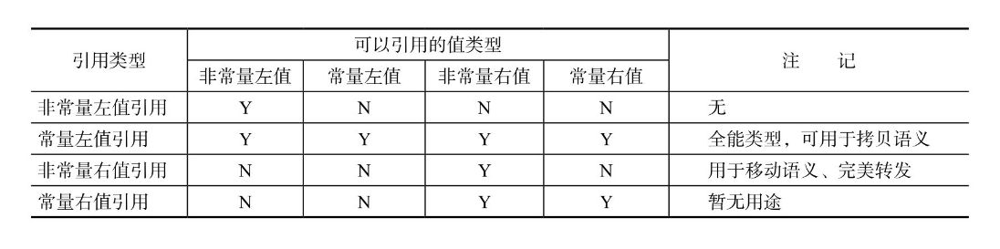

#! https://zhuanlan.zhihu.com/p/642484704
# 右值引用：移动语义和完美转发
## 引用

C++ 中的引用一般指的是为对象起了另外一个名字，引用类型引用另外一种类型。引用变量类型在声明的时候，形如 `T &d`，则 d 表示引用类型，下面是简单的例子：

```cpp
// ref.cpp
int ival = 1024;
int &ref = ival;  // ref指向ival（是ival的另外一个名字）
int &ref2;        // 引用类型必须初始化，这里会报错
```

报错结果如下：

```cpp
$ g++ ref.cpp 
ref.cpp: In function ‘int main()’:
ref.cpp:7:10: error: ‘ref2’ declared as reference but not initialized
    7 |     int &ref2;        // 引用类型必须初始化，这里会报错
      |          ^~~~
```

- 引用类型在定义的时候，必须将引用和初始值绑定在一起，所以上面 ref2，编译器会报错；
- 引用本身不是对象，**它只是为一个已经存在的对象起了别名**，因此也不能定义引用的引用；

```cpp
// ref2.cpp
#include <iostream>
using namespace std;

int main() {
    int ival = 1024;
    int &ref = ival;   // 对引用进行修改，相当于对原来的数据进行修改
    
    ref = 1000;
    cout << "ival = " << ival << endl;

	// int &&rref = ref; // 这里代码会报错，&&不是引用的引用，而是另外一种引用类型
    return 0;
}

/*
$ g++ ref2.cpp && ./a.out
ival = 1000
*/
```

## 右值引用
### 左值/右值

首先需要区分一下左值和右值，一般来说**可以取地址的、有名字的是左值**，**不能取地址、没有名字的是右值**，例如下面的示例；

```cpp
int a = 100;   // a能取地址，a是左值，100不能取地址，100是右值
int b = 200;   // 和a同理
int c = a + b; // c是左值，a + b这个表达式是右值，因为不能对a+b取地址
// &(a + b)    // 这行代码会报错
```

在 C++11 中右值又分为**将亡值（xvalue，eXpiring Value）**，和**纯右值（prvalue，Pure Rvalue）**

纯右值就是 C++98 的右值，用于辨识临时变量和一些不跟对象关联的值：
- 非引用返回的函数返回的临时变量值就是一个纯右值；
- 一些运算表达式，比如 1 + 3 产生的临时变量值，也是纯右值；
- 而不跟对象关联的字面量值，比如：2、‘c’、true，也是纯右值；
- 类型转换函数的返回值、lambda 表达式等，也都是右值；

将亡值则与 C++11 新增的跟右值引用相关的表达式，这样表达式通常是将要被移动的对象（移为他用），比如：
- 返回右值引用 T&& 的函数返回值；
- std::move 的返回值；
- 转换为 T&& 的类型转换函数的返回值；

注：上面三种都可以看成是使用类型转换将左值转为右值引用，在 C++17 之后引入一种**临时量实质化**，指的是纯右值转换到临时对象的过程，下面是一个示例：

```cpp
struct X {
  int a;
};

int main() {
  int b = X().a;
}
```

- 在上面的代码中，X() 是一个纯右值，访问其成员变量 a 却需要一个左值，所以这里会发生一次临时量实质化，将 X() 转换为将亡值，最后再访问其成员变量 a；
- 在 C++17 标准之前临时变量是纯右值，只有转换为右值引用的类型才是将亡值；

除了纯右值和将亡值外，可以标识函数、对象的值都属于左值。在 C++11 的程序中，所有的值必属于左值、将亡值、纯右值三者之一，实际上一般只需要区分左值和右值即可。

### 右值引用

所谓右值引用就是**必须绑定到右值的引用**，通过 && 来获得右值引用，例如：

```cpp
T &&a = ReturnRvalue(); // 假设ReturnRvalue()函数返回一个右值
```

上面就声明了一个名为 a 的右值引用，它的值就是 `ReturnRvalue()` 函数返回的临时变量的值。

为了区别于 C++98 中的引用类型，我们称 C++98 中的引用为“**左值引用**”（lvalue reference）

- 左值引用和右值引用都是引用类型，它们声明的时候都必须初始化；
- 引用类型本身并不拥有所绑定对象的内存，只是为该对象起了别名：
	- 左值引用相对于是一个有变量值的别名；
	- 右值引用则是一个没有名字（匿名）变量的别名；

上面的 `T &&a = ReturnRvalue();` 代码中，ReturnRvalue 函数返回的右值，在这条语句结束后，生命周期应该结束了，但是通过右值引用，这个右值的生命周期延长了。只要变量 a 一直存活，这个右值也会一直存活下去。


### 常量左值引用

前面提到过，右值引用只能绑定到右值上，如果试图将一个左值绑定到右值上就会报错，如下：

```cpp
// ref3.cpp
#include <iostream>
using namespace std;

int ReturnRvalue() {
    return 100; // 返回一个右值
}

int main() {
    // 下面代码正常运行，右值引用绑定到右值上，没有问题
    int &&rval = ReturnRvalue(); 
    
    int lval = 200; // lval是个左值
    // 下面代码会报错，不能将左值绑定到右值上
    int &&rval2 = lval;
    return 0;
}
```

编译运行结果如下，会提示不能将左值绑定到右值引用上：

```shell
$ g++ ref3.cpp && ./a.out
ref3.cpp: In function ‘int main()’:
ref3.cpp:15:19: error: cannot bind rvalue reference of type ‘int&&’ to lvalue of type ‘int’
   15 |     int &&rval2 = lval;
```

那么左值引用能否绑定右值呢？答案是可以的，通过**常量左值引用**，但是有一定限制：

- 常量左值引用可以接受非常量左值、常量左值以及右值的类型，它就像是一个万能的引用类型一样；
- 在对右值进行引用的时候，也会像右值引用一样，将右值的生命周期延长；
- 但是常量左值引用的右值，在此之后只能是可读的；

```cpp
// ref4.cpp
#include <iostream>
using namespace std;

int main() {
    int a = 20;
    const int ca = 30;
    const int &cval1 = 100; // 常量左值引用可以绑定到右值上
    const int &cval2 = a;   // 常量左值引用可以绑定到非常量左值上
    const int &cval3 = ca;  // 常量左值引用可以绑定到常量左值上
    
    cout << "cval1 = " << cval1 << " cval2 = " << cval2 << " cval3 = " << cval3 << endl;
    return 0;
}
/*
$ g++ ref4.cpp && ./a.out
cval1 = 100 cval2 = 20 cval3 = 30
*/
```

常量左值引用可以用来减少临时对象的开销，例如：

```cpp
// copyable.cpp
#include <iostream>
using namespace std;

struct Copyable {
    Copyable() {}
    Copyable(const Copyable &o) {
        cout << "Copied" << endl;
    }
};

Copyable ReturnRvalue() { 
    return Copyable(); 
}

void AcceptVal(Copyable) {}

void AcceptRef(const Copyable & ) {}

int main() {
    cout << "Pass by value: " << endl;
    AcceptVal(ReturnRvalue()); // 临时值被拷贝传入
    cout << "Pass by reference: " << endl;
    AcceptRef(ReturnRvalue()); // 临时值被作为引用传递
}
```

编译运行结果：

```shell
$ g++ copyable.cpp -fno-elide-constructors && ./a.out 
Pass by value: 
Copied
Copied
Pass by reference: 
Copied
```

可以看到当参数是传值的时候，调用了两次拷贝构造函数，说明有临时对象生成，但是用常量引用就只调用了一次拷贝构造函数。

除了常量左值引用外，还有常量右值引用，如下：

```cpp
const T&& crvalueref = ReturnRvalue();
```

但是一般而言常量右值引用并没有多大用处：
- 右值引用本身时为了实现移动语义而产生的，移动语义需要右值是可以被修改的，而常量右值引用在移动语义中没有太大作用；
- 如果想要引用右值，且右值不可以改变，用常量左值引用就可以了；

**C++ 中引用类型和其可引用的值类型表：**

<!--  -->


## std::move()

C++11 标准库在 `<utility>` 中提供了一个有用的函数 `std::move`，但其实它并移动任何东西，它的唯一功能是**将一个左值强制转化为右值引用，继而我们可以通过右值引用使用该值，以用于移动语义。**

它的一种近乎标准库的实现如下：

```cpp
template<typename T>
typename remove_reference<T>::type&&
move(T&& param)
{
    using ReturnType = typename remove_reference<T>::type&&;
    return static_cast<ReturnType>(param);
}
```

可以看到基本上等同于利用 `static<T&&>(lval)` 进行类型转换，**但是原本被转换的左值的生命周期，并没有发生变化**。

`std::move()` 可以用在实现移动构造函数上，一般来说需要转换成为右值引用的是一个生命周期即将结束的对象，下面是个代码示例：

```cpp
// move.cpp
#include <iostream>
using namespace std;

class HugeMem {
public:
    HugeMem(int size) : sz(size > 0 ? size : 1) {
        c = new int[sz];
    }
    
    ~HugeMem() { delete[] c; }

    HugeMem(HugeMem&& hm) : sz(hm.sz), c(hm.c) {
        hm.c = nullptr;
    }
    int* c;
    int sz;
};

class Moveable {
public:
    Moveable() : i(new int(3)), h(1024) {}
    ~Moveable() { delete i; }
    Moveable(Moveable&& m) : i(m.i), h(std::move(m.h)) {  // 强制转为右值，以调用移动构造函数
        m.i = nullptr;
    }
    int* i;
    HugeMem h;
};

Moveable GetTemp() {
    Moveable tmp = Moveable();
    cout << hex << "Huge Mem from " << __func__
         << " @" << tmp.h.c << endl;  // Huge Mem from GetTemp @0x603030
    return tmp;
}

int main() {
    Moveable a(GetTemp());
    cout << hex << "Huge Mem from " << __func__
         << " @" << a.h.c << endl;  // Huge Mem from main @0x603030
}
/*
$ g++ move.cpp -fno-elide-constructors && ./a.out 
Huge Mem from GetTemp @0x5648a9038ed0
Huge Mem from main @0x5648a9038ed0
*/
```

HugeMem 类中有一个数组指针，Moveable 类在移动构造函数中，使用 std::move 将 m.h 强制转换为右值，这样也调用了 HuggMem 的移动构造函数，从而实现了正确的移动语义。

注：
- 如果上面将的 `std::move` 去掉的话，这里会报错，因为会调用 HugeMem 的拷贝构造函数，而上面的代码中是没有实现的；
- 一般来说移动构造函数，应该总是使用 `std::move` 来移动如堆内存、文件句柄等资源；

## 完美转发

**转发**：是指将一个函数形参传递给另外一个函数，第二个函数接收到的对象要和第一个函数接收到的完全相同；

**完美转发**：是值不仅需要转发对象，还需要转发对象的特征，比如说类型是左值还是右值，是否为 const，是否为 volatile；
- 因为需要转发的对象和原来的完全相同，不能使用按值传递的形参，因为按值传递会将原来的对象拷贝一份；
- 指针类型一般也被排除在外，因为我们想使用原来传进来的那些对象，所以这里只能考虑用引用类型；

因为第二个函数可能既接受左值引用，又接受右值引用，如果只能接受部分，称不上完美，如果考虑使用常量左值引用，可能存在问题如下：

```cpp
void RealFunction(int t) {

}

template <typename T>
void ForwordingFunction(const T& t) {
	RealFunction(t);
}
```

常量左值引用可以接受左值/右值，以及常量/非常量四种类型，但是目标函数是非常量左值引用类型，不能接受常量左值引用作为参数，所以上面不能称为完美转发。

想要实现完美转发，需要引入下面的语言规则——**引用折叠**。

### 引用折叠

C++11 之前，下面的代码会编译错误：

```cpp
typedef const int T;
typedef T& TR;
TR& v = 1;     // 该声明在C++98中会导致编译错误
```

而在 C++11 之后，这里会发生引用折叠，即将复杂的多个引用表达式折叠为简单的引用表达式，具体规则如下：

| TR 类型定义 | 声明 v 的类型 | v 实际类型 |
| --- | --- | --- |
| T& | TR | A& |
| T& | TR& | A& |
| T& | TR&& | A& |
| T&& | TR | A&& |
| T&& | TR& | A& |
| T&& | TR&& | A&& |

上面的规则也比较好记，**只要出现左值引用（即一个 &），引用折叠总是优先左值引用**。

有了这个规则可以将上面的转发函数写成下面形式：

```cpp
template <typename T>
void ForwordingFunction(T&& t) {
	RealFunction(static_cast<T&&>(t));
}
```

这样的话，加入传入了一个 X 类型的左值引用，转发函数实例化如下形式：

```cpp
void ForwordingFunction(X& && t) {
	RealFunction(static_cast<X& &&>(t));
}
```

引用折叠规则可知，实际情况如下：

```cpp
void ForwordingFunction(X& t) {
	RealFunction(static_cast<X&>(t));
}
```

这样传递左值没有任何问题，这里的 static_cast 并未起到任何作用。如果传递的 X 是右值引用的话：

```cpp
void ForwordingFunction(X&& && t) {
	RealFunction(static_cast<X&& &&>(t));
}
```

实际结果为：

```cpp
void ForwordingFunction(X&& t) {
	RealFunction(static_cast<X&&>(t));
}
```

因为传入函数的形参一定是个左值，即 t 本身是个左值，这里将其转为右值再传递，就没有任何问题。

在 C++11 中用于完美转发的函数为 `std::forward`，转发函数可以写成：

```cpp
template <typename T>
void ForwordingFunction(T&& t) {
	RealFunction(std::forward<T>(t));
}
```

下面是一个完美转发的例子：

```cpp
// forward.cpp
#include <iostream>
using namespace std;

void RunCode(int &&m) { cout << "rvalue ref" << endl; }
void RunCode(int &m) { cout << "lvalue ref" << endl; }
void RunCode(const int &&m) { cout << "const rvalue ref" << endl; }
void RunCode(const int &m) { cout << "const lvalue ref" << endl; }

template <typename T>
void PerfectForward(T &&t) { RunCode(forward<T>(t)); }

int main() {
    int a;
    int b;
    const int c = 1;
    const int d = 0;
    
    PerfectForward(a);        // lvalue ref
    PerfectForward(move(b));  // rvalue ref
    PerfectForward(c);        // const lvalue ref
    PerfectForward(move(d));  // const rvalue ref
}
/*
$ g++ forward.cpp && ./a.out 
lvalue ref
rvalue ref
const lvalue ref
const rvalue ref
*/
```

编译运行后可以看出，所有类型都正确的转发到了目标函数，完美转发的一个作用是作为**包装函数**。

## 判断引用类型

标准库在 `<type_traits>` 头文件中提供了 3 个模板类：`is_rvalue_reference`、`is_lvalue_reference`、`is_reference`，可供我们进行判断一个类型是否是引用类型，以及是左值引用还是右值引用：

```cpp
// is_reference.cpp
#include <iostream>
#include <utility>

class A {};

int main() {
    std::cout << std::boolalpha;
    std::cout << std::is_rvalue_reference<A>::value << std::endl;      // false
    std::cout << std::is_rvalue_reference<A&>::value << std::endl;     // false
    std::cout << std::is_rvalue_reference<A&&>::value << std::endl;    // true
    std::cout << std::is_rvalue_reference<int>::value << std::endl;    // false
    std::cout << std::is_rvalue_reference<int&>::value << std::endl;   // false
    std::cout << std::is_rvalue_reference<int&&>::value << std::endl;  // true
    return 0;
}
```

通过 `std::is_rvalue_reference<T>` 可以判断 T 类型是否为右值引用。

## 补充：函数返回值优化（RVO）

gcc 使用 -fno-elide-constructors 选项可以关闭函数返回值优化（RVO）

## 参考资料

- 《深入理解 C++11：C++ 新特性解析与应用》 3.6 节
- 《现代 C++ 语言核心特性解析》 第 6 章
- 《Effective Modern C++》第 5 章