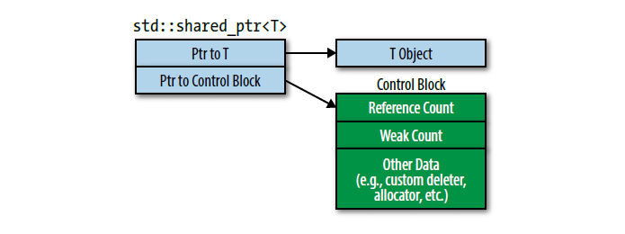
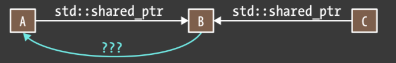

## 00 C++ 新特性概述
### C++11 新特性了解多少

一些关键特性：
- auto 和 decltype，auto 可以用来自动类型推导，decltype 可以获得一个表达式的类型，但是不执行这个表达式；
- default 和 delete 关键字，default 让编译器生成构造函数/析构函数的默认版本，delete 显示定义函数为删除的，这样可以某个构造函数的使用，也可以禁止某些重载的函数；
- final 和 override 关键字，final 修饰函数之后这个函数不可以被派生类重载，override 则是告诉编译器这个虚函数需要重写基类的虚函数，一旦编译器发现不符合重写规则，就会给出错误提示；
- constexpr 关键字，即常量表达式，修饰的函数或变量可以在编译时期进行求值；
- nullptr 代表空指针字面量，相较于 NULL，更加的安全；
- long long 类型，目标类型将有至少 64 位的宽度。
- lambda 表达式，创建闭包类型，能够捕获作用域中的变量的无名函数对象。
- 右值引用和移动语义的引入，包括移动构造函数，和移动赋值运算符，std::move, std::forward，完美转发等等；
- 多线程相关的库：std::thread, std::mutex, std::condition_variable, thread_local 即线程局部存储等等
- 一些 STL 库：std::initializer_list, std::unordered_map, std::unordered_set, std::tuple 等等
- 智能指针的引入，std::unique_ptr, std::shared_ptr, std::weak_ptr。

参考：[C++11 - cppreference.com](https://en.cppreference.com/w/cpp/11)

### C++14 一些小改进

- lambda 表达式可以使用 auto 进行自动类型推导；
- constexpr 的限制减少；
- decltype(auto)，它告诉编译器用 decltype 的推导规则来推导 auto，`decltype(auto)` 必须单独声明，不能和引用、指针、cv 限定符一起使用；
- 添加了 std::make_unique 函数；

### C++17 特性

C++17 新特性用的比较少了，一些用过的如下：
- 结构化绑定，方便地从元组、数组和其他类似的数据结构中提取元素的语法糖。形式为：`auto [binding1, binding2, ...] = expression;`
- if 和 switch 语句中的初始化器，即在 if 和 switch 前面可以声明一个变量，类似于 `if (int i = 0; i < 10) {}` 这种；
- std::optional 和 std::string_view 库；

其他的感觉基本上没怎么用过了，再往后 C++20 就更没接触过了；

参考：[C++17 - cppreference.com](https://zh.cppreference.com/w/cpp/17)

## 01 右值引用 & 移动语义 & 完美转发

### 什么是右值？

首先需要区分一下左值和右值，一般来说**可以取地址的、有名字的是左值**，**不能取地址、没有名字的是右值**，例如下面的示例；

```cpp
int a = 100;   // a能取地址，a是左值，100不能取地址，100是右值
int b = 200;   // 和a同理
int c = a + b; // c是左值，a + b这个表达式是右值，因为不能对a+b取地址
// &(a + b)    // 这行代码会报错
```

在 C++11 中右值又分为**将亡值（xvalue，eXpiring Value）**，和**纯右值（prvalue，Pure Rvalue）**

纯右值就是 C++98 的右值，用于辨识临时变量和一些不跟对象关联的值：
- 非引用返回的函数返回的临时变量值就是一个纯右值；
- 一些运算表达式，比如 1 + 3 产生的临时变量值，也是纯右值；
- 而不跟对象关联的字面量值，比如：2、‘c’、true，也是纯右值；
- 类型转换函数的返回值、lambda 表达式等，也都是右值；

将亡值则与 C++11 新增的跟右值引用相关的表达式，这样表达式通常是将要被移动的对象（移为他用），比如：
- 返回右值引用 T&& 的函数返回值；
- std::move 的返回值；
- 转换为 T&& 的类型转换函数的返回值；

### 什么是右值引用？

所谓右值引用就是**必须绑定到右值的引用**，通过 && 来获得右值引用，例如：

```cpp
T &&a = ReturnRvalue(); // 假设ReturnRvalue()函数返回一个右值
```

上面就声明了一个名为 a 的右值引用，它的值就是 `ReturnRvalue()` 函数返回的临时变量的值。

为了区别于 C++98 中的引用类型，我们称 C++98 中的引用为“**左值引用**”（lvalue reference），注意：
- 左值引用和右值引用都是引用类型，它们**声明的时候都必须初始化**；
- 引用类型本身并不拥有所绑定对象的内存，只是为该对象起了别名：
	- 左值引用相对于是一个有变量值的别名；
	- 右值引用则是一个没有名字（匿名）变量的别名；
- 引用类型本身也是一个左值（引用类型本身是有名字的）；

右值引用的作用：
- 1）**右值引用可以延长右值变量的生命周期**，上面的 `T &&a = ReturnRvalue();` 代码中，ReturnRvalue 函数返回的右值，在这条语句结束后，生命周期应该结束了，但是通过右值引用，这个右值的生命周期延长了。**只要变量 a 一直存活，这个右值也会一直存活下去**。
- 2）**实现移动语义**：使用右值引用，可以将资源（如动态分配的内存）从一个对象 " 移动 " 到另一个对象，避免了不必要的数据复制。在处理较大的数据结构的时候，大大提高了性能。在 C++ 当中对象的移动语义的实现主要是
- 3）**实现完美转发**：见下

### 什么是完美转发？

**转发**：是指将一个函数形参传递给另外一个函数，第二个函数接收到的对象要和第一个函数接收到的完全相同；

**完美转发**：是指不仅需要转发对象，还需要转发对象的特征，比如说类型是左值还是右值，是否为 const，是否为 volatile；

- 因为需要转发的对象和原来的完全相同，不能使用按值传递的形参，因为按值传递会将原来的对象拷贝一份；
- 指针类型一般也被排除在外，因为我们想使用原来传进来的那些对象，所以这里只能考虑用引用类型；

为了实现完美转发，C++ 引入了**引用折叠**，所谓引用折叠就是将复杂的多个引用表达式折叠为简单的引用表达式，例如：

```cpp
typedef const int T;
typedef T& TR;
TR& v = 1;     // 该声明在C++98中会导致编译错误，在C++11当中v的类型是const int &，两个左值引用折叠为一个左值引用
```

引用折叠的规则比较好记：
- 只有右值引用折叠到右值引用上面，结果才是右值引用，比如 T&& && 折叠结果为 T &&；
- 而只要和左值引用折叠的，不管是是左值引用、右值引用、还是普通类型结果都是左值引用；

有了引用折叠规则，下面就可以实现完美转发函数了：

```cpp
template <typename T>
void ForwordingFunction(T&& t) {
	RealFunction(static_cast<T&&>(t));
}
```

- 如果这里传入 T 类型为&&，则 T && && 引用折叠为 T &&，即实际接受函数收到的参数仍然为右值引用类型；
- 如果传入 T 类型为 &，则 T & &&引用折叠为 T&，则实际接受函数仍为左值引用类型；
- 从上面来看就实现了完美转发

下面补充一个完美转发的例子：

```cpp
// forward.cpp
#include <iostream>
using namespace std;

void RunCode(int &&m) { cout << "rvalue ref" << endl; }
void RunCode(int &m) { cout << "lvalue ref" << endl; }
void RunCode(const int &&m) { cout << "const rvalue ref" << endl; }
void RunCode(const int &m) { cout << "const lvalue ref" << endl; }

template <typename T>
void PerfectForward(T &&t) { RunCode(std::forward<T>(t)); }

int main() {
    int a;
    int b;
    const int c = 1;
    const int d = 0;
    
    PerfectForward(a);        // lvalue ref
    PerfectForward(move(b));  // rvalue ref
    PerfectForward(c);        // const lvalue ref
    PerfectForward(move(d));  // const rvalue ref
}
/*
$ g++ forward.cpp && ./a.out 
lvalue ref
rvalue ref
const lvalue ref
const rvalue ref
*/
```

编译运行后可以看出，所有类型都正确的转发到了目标函数，完美转发的一个作用是作为**包装函数**

补充面经问题：右值在模板编程中有哪些应用？——即上面提到的完美转发
### std::move() & std::forward()

C++11 标准库在 `<utility>` 中提供了一个有用的函数 `std::move`，但其实它并移动任何东西，它的唯一功能是**将一个左值强制转化为右值引用，继而我们可以通过右值引用使用该值，以用于移动语义。**

它的一种近乎标准库的实现如下：

```cpp
template<typename T>
typename remove_reference<T>::type&& move(T&& param) {
    using ReturnType = typename remove_reference<T>::type&&;
    return static_cast<ReturnType>(param);
}
```

可以看到基本上等同于利用 `static<T&&>(lval)` 进行类型转换，**但是原本被转换的左值的生命周期，并没有发生变化**。

`std::forward()` 是用来实现转发函数的，它的标准库实现大致如下，可以看到本质上就是调用 `static_cast<T&&>(t)` ：

```cpp
// 转发左值引用版本
template <typename T>
constexpr T&& forward(typename std::remove_reference<T>::type &t) noexcept {
  return static_cast<T &&>(t);
}
// 转发右值引用版本
template <typename T>
constexpr T&& forward(typename std::remove_reference<T>::type &&t) noexcept {
  return static_cast<T &&>(t);
}
```

补充：move 的实现以及使用场景？
## 02 智能指针
### 什么是 RAII？

RAII（Resource Acquisition Is Initialization）中文名叫**资源获取即初始化**，它的核心思想是：**资源的获取应该在对象的构造函数中进行，而资源的释放应该在对象的析构函数中进行**。这里的资源包括内存、文件句柄、网络连接等等。通过对象的生命周期，可以确保资源在合适的时机被正确管理。哪怕在异常的情况下，也能正确的保证资源的释放。

RAII 的一个经典使用场景是智能指针（如 `std::unique_ptr`、`std::shared_ptr`）来管理动态分配的内存。

### 什么是智能指针？

智能指针是 C++ 中的一种资源管理工具，用于管理动态分配的内存，避免内存泄漏和提供更方便的内存管理方式。与传统的裸指针（raw pointers）相比，智能指针提供了一些额外的功能，包括自动内存管理、所有权的传递、生命周期管理等。（from gpt）

### 有哪些智能指针，区别是什么？

1. **auto_ptr**：C++98 实现的智能指针，它被弃用的原因是它的拷贝赋值函数采用的是移动语义，即将原来的对象的所有权进行转移，这就导致 auto_ptr 不能存放在容器中。另外在函数传参的时候，

```cpp
void do_somthing(std::auto_ptr<People> people){
    // 该函数内不对people变量执行各种隐式/显示的所有权转移和释放
    ...
}

std::auto_ptr<People> people(new People("jony"));
do_something(people);
...

std::cout << people->get_name() << std::endl; 
```

执行 do_something 函数的时候，传参导致所有权已经转移了，即 people 变量已经为空，而后面再调用 people->get_name()，相当于是调用了空指针，会报错。

2. **unique_ptr**：一个 `unique_ptr` 拥有它所指向的对象，任意时刻只能有一个 `unique_ptr` 指向一个给定的对象，当 `unique_ptr` 被销毁时，它所指向的对象也被销毁。

3. **shared_ptr**：`shared_ptr` 强调的是共享所有权，即有多个指针指向同一个对象资源，它的内部采用的是引用计数原理，引用计数关联资源并跟踪有多少个 `shared_ptr` 指向该资源。

4. **weak_ptr**：`weak_ptr` 并不控制所指向对象的生命周期，它指向一个由 `shared_ptr` 管理的对象。将 `weak_ptr` 绑定到一个 `shared_ptr` 并不会改变 `shared_ptr` 的引用计数。一旦最后一个指向对象的 `shared_ptr` 销毁，对象会被释放，此时 `weak_ptr` 是悬空的。

### unique_ptr 是如何实现的？

unique_ptr 实现原理：

- `unique_ptr` 体现的是专有所有权语义，一个非空的 `unique_ptr` 始终拥有它指向的对象；
- 移动一个 `unique_ptr`，会将所有权进行转移（原指针被设为 null）；
- 拷贝一个 `unique_ptr` 是被禁止的，即 `unique_ptr` 是一种只可移动类型（_move-only type_）；
- 析构时，一个 non-null 的  `std::unique_ptr` 销毁它指向的资源；
- 默认情况下，资源析构通过对 `std::unique_ptr` 里原始指针调用 `delete` 来实现；

问：unique_ptr 在项目哪里用到，什么时候用裸指针更好？
### shared_ptr 是如何实现的？

shared_ptr 的实现是采用引用计数的原理，它除了有一个指向数据的原始指针外，还有一个指向**资源控制块**（包括引用计数值，次级引用计数，删除器等）的指针，所以一般来说 shared_ptr 是原始指针的 2 倍大小，下面是图示：



这里也可以看到引用计数本身是存放在**堆**上面的，多个 shared_ptr 对象指向同一个资源的时候，它们也都指向这一个堆资源。

关于引用计数：
- `shared_ptr` 的构造函数会增加引用计数，析构函数会减少引用计数（注：移动构造函数并不增加引用计数值）；
- 拷贝赋值运算符做前面这两个工作（ `sp1` 和 `sp2` 是 `shared_ptr` 并且指向不同对象，赋值 `sp1 = sp2;` 会使 `sp1` 指向 `sp2` 指向的对象。 `sp1` 指向原资源的引用计数减一，`sp2` 引用计数加一）；
- 如果 `shared_ptr` 在计数值递减后发现引用计数值为零，此时没有其他 `shared_ptr` 指向该资源，它就会销毁资源；

问题：如果有一个对 shared_ptr 的引用会不会增加引用计数？  
答：不会，对 shared_ptr 对象本身进行引用，没有调用任何的构造函数，不会增加引用计数。

### weak_ptr 是如何实现的？

weak_ptr 的实现，它和 shared_ptr 一样也有一个控制块，前面提到 shared_ptr 的控制块除了引用计数这个值外，还有一个次级引用计数（或弱引用计数），weak_ptr 是通过增加这个次级引用技术的，但是它并不会增加引用计数。

为什么要这个设计？

我们知道对于 weak_ptr 来说是不能直接通过 `*` 或 `->` 来操作原始指针的，它只能通过 `lock` 函数返回 shared_ptr 对象，然后再进行操作，而可能存在的情况是 shared_ptr 指向的对象已经销毁了（即引用计数为 0 的时候），但是这个时候 weak_ptr 仍然存在，它需要通过控制块当中的引用计数来判断 shared_ptr 指向的对象有没有销毁，所以对于控制块来说，它本身也是一个资源，不能 shared_ptr 指向的资源销毁了的时候，控制块也一并的删除。

而当次级引用计数也为 0 的时候，表示这个控制块也没有 weak_ptr 指向了，也就意味着可以将这个控制块资源回收了。

以上是我个人对 weak_ptr 的理解（可能不完全正确）

### shared_ptr 是否是线程安全的？

首先谈论 shared_ptr 是否是线程安全的，需要考虑两种情况：
- 1）shared_ptr 的引用控制块，即引用计数是否是线程安全的；
- 2）多线程对 shared_ptr 指向的资源进行读写，是否是线程安全的；

关于第一点，多线程对同一个引用计数增加或减少是线程安全的，因为 C++ 标准关于引用计数是采用原子操作实现的，这保证了对引用计数的递增和递减操作是原子的。

关于第二点，shared_ptr 管理的资源不是线程安全的，因为 std::shared_ptr 内部并没有任何同步原语对它进行保护，多线程环境下读写，不安全。

参考：[c++ 11 的shared_ptr多线程安全？ - 知乎 (zhihu.com)](https://www.zhihu.com/question/56836057)

问题：多线程下 shared_ptr 会被析构两次吗？
- 这个问题实际考查的是引用计数为 0 的时候，引用计数的增加和减少是原子操作进行的，所以多线程当中最多只有一个线程将引用计数减为 0，然后在析构相应的对象资源，也就是说不会导致析构两次。
### weak_ptr 如何解决循环引用问题的？

`weak_ptr` 的作用是为了解决 `shared_ptr` 循环引用问题，考虑下面是个例子：

现在有三个对象 A、B 和 C，假设 A 和 C 共享 B 的所有权，因此持有 `shared_ptr`：


如果 B 指向 A 的指针也很有用，应该使用哪种指针？



三种选择：

- 1. **原始指针**：如果 A 销毁了，C 继续指向 B，B 会有一个指向 A 的悬空指针。B 不知道指针是否悬空，此时 B 访问 A 会导致未定义行为；
- 2. **shared_ptr**：A 和 B 都持有对方的 `shared_ptr`，当 C 不指向 B 的时候，包括也没有其他结构指向 A 和 B，但是 A 和 B 互相阻止对方销毁，每个引用计数都为 1，此时 A 和 B 都被泄露；
- 3. **weak_ptr**：如果 A 被销毁，B 指向它的指针悬空，此时通过 `weak_ptr` 的 `lock` 方法能够检测到悬空。另外 B 虽然也有指针指向 A，但是不会影响 A 的引用计数，不会导致 A 无法被销毁；

### enable_shared_from_this 作用

[C++11中enable_shared_from_this的用法解析-CSDN博客](https://blog.csdn.net/breadheart/article/details/112451022)

智能指针相关问题：
1. shared_ptr 是否是线程安全的？或者说哪些部分是线程安全的（引用计数）？
2. 那引用计数的线程安全性怎么实现的（可能一般人说原子类型）？
3. 如果有一个场景需要用到线程安全的 shared_ptr，一般你会怎么做？开放性问题
4. 说到线程安全性，在语言层面，你一般使用什么手段？
5. 如何在代码角度来避免死锁呢？是否用过相关的 API？原理了解吗？
6. C++ 提供的 shared_mutex 是否了解？主要用于什么场景？
7. 我们刚才也提到了线程安全版本的 shared_ptr，那你是否知道 shared_ptr 有特化的原子操作？
8. 那提到原子操作，atomic 有了解吗？一般特化了哪几种类型的模板呢？
9. unique_ptr 有哪两种版本呢？（管理单个对象和数组）怎么实现的？
10. unique_ptr 可以直接用于布尔语境，那你觉得是怎么实现的？
11. 问一些使用上的拓展，vector 的元素可以是 unique_ptr 类型么？那 unique_ptr 可以实现虚派发么？（虚函数调用）
12. 对比 unique_ptr，shared_ptr 更适合在哪些场景呢？
13. shared_ptr 什么时候销毁对象并解分配内存呢？
14. 在典型的实现中，shared_ptr 是怎么布局的？讲讲数据成员的组成？
15. (老问题...)make_shared 和 shared_ptr 构造函数创建 shared_ptr 的区别？
16. 如果构造函数传入同一个裸指针构造两个 shared_ptr 对象，会发生什么现象？
17. 还是上面的问题，你觉得对于所谓的智能指针，为什么会出现这样的现象？
18. 有没有了解过 enable_shared_from_this？它是用来解决什么问题的？具体怎么使用？
19. 有没有研究过 enable_shared_from_this 的原理呢？为什么可以它可以通过 shared_from_this 返回 shared_ptr 对象呢？（可能会回答 weak_ptr 的存在）
20. 很多人说到 weak_ptr 就会说是为了解决循环引用，你觉得这是关键的因素吗？

---
