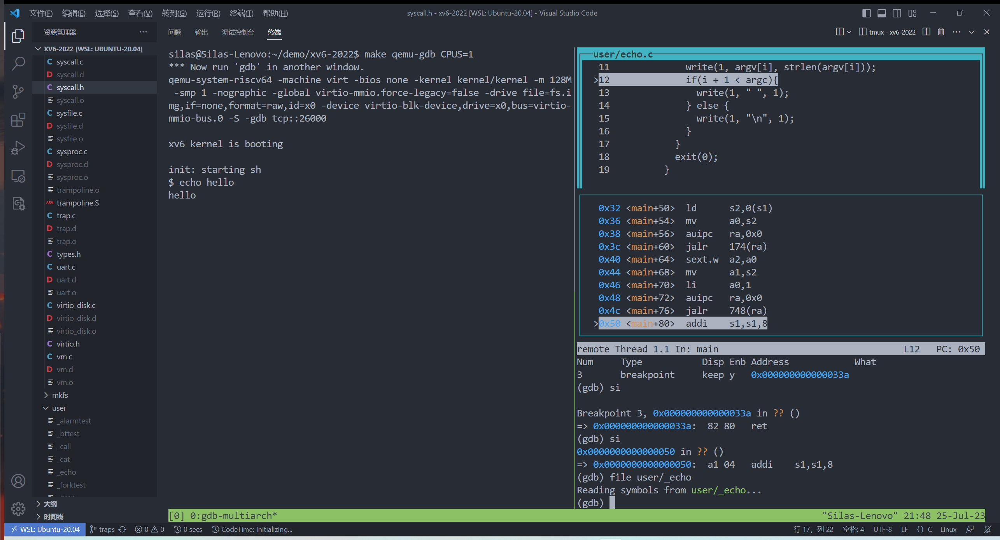

#! https://zhuanlan.zhihu.com/p/646033464
# xv6 trap 和系统调用
## RISC-V 异常处理

### 异常类型

RISC-V 中一般有三种事件会导致 CPU 停止运行当前的指令，而将控制权转移到处理该事件的代码上，这三种事件也是异常控制流的一种形式。

**1. 中断**

处理器内部会有一个中断控制器，外部设备的引脚会连接到中断控制器。当外设发生事件后，会通过中断控制器发射信号通知处理器。

<!--  -->


**2. 异常**

异常一般是用户或内核指令执行一些非法操作，主要有指令访问异常和数据访问异常两种：  
1）指令访问异常：
- 引起异常的原因：试图执行一个无效的指令或者在一个非法的地址处尝试执行指令。
- 示例：当程序计数器（PC）包含一个无效的地址或者指向只读存储区域时，尝试从这些地址处执行指令就会触发指令访问异常。  

2） 数据访问异常：
- 引起异常的原因：试图读取或写入一个无效的内存地址或者在没有读写权限的内存区域进行读写操作。
- 示例：在访问一个未初始化的内存地址、超过数组范围进行读写、或者尝试在只读内存区域写入数据等情况都可能引起数据访问异常。

**3. 系统调用**

系统调用允许软件主动通过特殊指令来请求更高特权模式的程序所提供的服务。例如，运行在 U 模式下的应用程序可以通过系统调用请求 S 模式的操作系统提供的服务，运行在 S 模式的操作系统可以通过系统调用请求 M 模式的 SBI 固件提供的服务。RISC-V 中是通过 ecall 指令来触发系统调用的。

补充：RISC-V 提供了 4 种特权级：

|级别|编码|名称|
|---|---|---|
|0|00|用户/应用模式 (U, User/Application)|
|1|01|监督模式 (S, Supervisor)|
|2|10|虚拟监督模式 (H, Hypervisor)|
|3|11|机器模式 (M, Machine)|

级别越高，掌控硬件的能力越强。xv6 好像只用到了 U 模式和 S 模式（有没有使用 M 模式，暂时还没看见），操作系统内核运行在 S 模式下，用户程序运行在 U 模式下，而 S 模式为 U 模式提供的服务就是系统调用的一种。推荐阅读：[特权级机制 - rCore-Tutorial-Book-v3](http://rcore-os.cn/rCore-Tutorial-Book-v3/chapter2/1rv-privilege.html)

前面说的三种事件可以统称为 trap（xv6 book 统称的，这里就不翻译为陷入了），对于 trap 来说分为同步和异步两种：
- 同步：处理器执行到某条指令后发生 trap，此时需要等异常处理程序处理完该异常后，处理器才继续执行，上面的异常和系统调用都属于同步异常；
- 异步：trap 触发的原因和当前正在执行指令无关，中断属于这种；

## S 模式相关的异常寄存器

默认情况下所有的异常和中断都发生在 M 模式下，但是 RISC-V 提供了一种委托机制，即可以把部分或全部的异常中断委托给 S 模式来处理，这可以消除额外模式切换带来的性能损失。

RISC-V 委托寄存器定义了两个寄存器 mideleg 用来设置中断委托，medeleg 寄存器用来设置异常委托（具体设置字段的含义，这里不再阐述）。在 xv6 中，`kernel/stat.c` 中设置了这两个委托寄存器：

```c
// entry.S jumps here in machine mode on stack0.
void
start()
{
  ... 

  // delegate all interrupts and exceptions to supervisor mode.
  // 将medeleg寄存器设置为0xffff，将所有的异常（exceptions）委托给Supervisor模式处理
  w_medeleg(0xffff);
  // 将mideleg寄存器设置为0xffff，将所有的中断（interrupts）委托给Supervisor模式处理
  w_mideleg(0xffff);
  // 设置sie寄存器的值，使得Supervisor模式开启外部中断、时钟中断和软件中断
  w_sie(r_sie() | SIE_SEIE | SIE_STIE | SIE_SSIE);

  ...
}
```

下面简要介绍 S 模式相关的异常寄存器：

**1. sstatus 寄存器**

sstatus 寄存器记录了处理器内核当前的运行状态

| 字段 | 位 | 说明 |  
| --- | --- | --- |  
| SIE | Bit[1] | 打开 S 模式的中断 |  
| SPIE | Bit[5] | 之前的中断开关状态 (S 模式下) |  
| SPP | Bit[8] | 中断之前的特权模式 (S 模式下的中断) |

对于 SPP 字段，如果 trap 发生在 U 模式下的话，SPP 会被设为 0，其他模式设为 1；

**2. sie 寄存器**

sie 寄存器用来单独打开或关闭 S 模式下的中断

| 字段 | 位 | 说明 |  
| --- | --- | --- |  
| SSIE | Bit[1] | 打开 S 模式下的软件中断 |  
| STIE | Bit[5] | 打开 S 模式下的时钟中断 |  
| SEIE | Bit[9] | 打开 S 模式下的外部中断 |

对于 sstatus 寄存器来说 SIE 字段是控制整个 S 模式的中断开关，而 sie 寄存器控制具体某一类中断开关。打开中断时，可以先打开 sie 寄存器，再设置 sstatus 的 SIE 字段；

**3. sip 寄存器**

sip 寄存器用来指示哪些中断处理响应状态，即已经发生中断但是还没进行处理：

| 字段 | 位 | 说明 |  
| --- | --- | --- |  
| SSIP | Bit[1] | S 模式下的软件中断处于等待状态 |  
| STIP | Bit[5] | S 模式下的时钟中断处于等待状态 |  
| SEIP | Bit[9] | S 模式下的外部中断处于等待状态 |

**4. scause 寄存器**

scause 寄存器用来查看 S 模式下发生异常的具体原因，它的图示如下：

<!--  -->


SXLEN 的值是根据 RISC-V 是 32 位还是 64 位决定的，RV32 来说 SXLEN 即为 32，RV64 来说 SXLEN 即为 64，它的高位 Interrupt 字段为 1 的时候表示触发异常类型为中断，否则位异常；

下面是具体的异常错误码：

<!--  -->


**5. stvec 寄存器**

stvec 寄存器是用来管理异常向量表的基地址，它的图示如下：

<!--  -->


BASE 字段是异常向量表的基地址，MODE 字段用来设置异常向量表的访问模式：
- 0：直接访问模式，即所有 trap 会跳转到 BASE 字段设置的基地址中
- 1：向量访问模式，会跳转到以 BASE 字段对应的异常向量表中，每个向量占 4 字节，即 `BASE + 4 * (exception code)`，exception code 通过上面 scause 寄存器得到；

对于直接访问模式，异常向量的基地址必须按 4 字节对齐，而向量访问模式必须按 256 字节对齐。

**6. stval 寄存器**

S 模式发生 trap 的时候，stval 寄存器会记录发生异常的虚拟地址。

**7. sepc 寄存器**

S 模式发生 trap 的时候，sepc 寄存器会记录发生异常之前的 PC 指令的虚拟地址；

## 异常处理过程

当发生异常/中断的时候，一般会有 3 个步骤（这里以 S 模式为例）：  

1）CPU 自动做的事情：
- 保存当前 PC 值到 sepc 寄存器中；
- 将异常的类型更新到 scause 寄存器中；
- 把发生异常时虚拟地址保存到 stval 寄存器中；
- 保存异常发生前的中断状态，即把异常发生前的 SIE 字段保存到 sstatus 寄存器的 SPIE 字段中；
- 保存异常处理发生前的处理器模式（如 S 模式、U 模式），即把异常处理发生前的处理器模式保存到 sstatus 寄存器的 SPP 字段中；
- 关闭本地中断，即设置 sstatus 寄存器中的 SIE 字段为 0；
- 设置处理器模式为 S 模式；
- 跳转到异常向量表，即将 stvec 寄存器的值设置到 PC 寄存器中；

2）操作系统做的事情
- 保存异常发生的上下文，包括所有通用寄存器的值和部分 S 模式下的寄存器的值，上下文需要保存到栈中；
- 查询 scause 寄存器的异常或中断编号，跳转到合适的异常处理程序中；
- 执行 sret 指令，返回异常现场；

3）异常返回，操作系统的异常处理完成后，执行 sret 指令，CPU 会做一下事情：
- 恢复设置 SIE 字段。将 sstatus 寄存器的 SPIE 字段设置到 sstatus 寄存器的 SIE 字段，相当于恢复了触发异常前中断状态；
- 将处理器模式设置为之前保存到 SPP 字段的处理器模式；
- 将 sepc 寄存器保存的值设置到 PC 寄存器中，此时相当于返回异常触发的现场；

## 异常上下文

前面说到异常处理的时候，对于操作系统来说需要保存异常发生的上下文，关于上下文的含义这里推荐阅读 [操作系统抽象 - rCore-Tutorial-Book-v3](http://rcore-os.cn/rCore-Tutorial-Book-v3/chapter0/3os-hw-abstract.html)，简单说就是发生异常之后，需要保存原来进程/内核的状态，而这个状态是由通用寄存器和部分 S 模式寄存器决定的，异常处理完成之后，需要再恢复这些寄存器的状态，这样就能继续执行发生异常之前的正常执行流。

在 xv6 中关于 trap 有两种上下文，一种是针对内核状态的上下文，一种是针对于用户进程的上下文。

对于内核来说，只需要保存通用寄存器，因为 xv6 将 trap 全部委托给 S 模式的内核来完成的，所以内核发生中断的时候不需要切换模式，也就不需要保存一些其他的寄存器，可以查看内核的异常向量表 `kernel/kernelvec.S`：

```asm
.globl kerneltrap
.globl kernelvec
.align 4
kernelvec:
        # make room to save registers.
        addi sp, sp, -256

        # save the registers.
        sd ra, 0(sp)
        sd sp, 8(sp)
        sd gp, 16(sp)
        sd tp, 24(sp)
        sd t0, 32(sp)
        sd t1, 40(sp)
        sd t2, 48(sp)
        sd s0, 56(sp)
        sd s1, 64(sp)
        sd a0, 72(sp)
        sd a1, 80(sp)
        sd a2, 88(sp)
        sd a3, 96(sp)
        sd a4, 104(sp)
        sd a5, 112(sp)
        sd a6, 120(sp)
        sd a7, 128(sp)
        sd s2, 136(sp)
        sd s3, 144(sp)
        sd s4, 152(sp)
        sd s5, 160(sp)
        sd s6, 168(sp)
        sd s7, 176(sp)
        sd s8, 184(sp)
        sd s9, 192(sp)
        sd s10, 200(sp)
        sd s11, 208(sp)
        sd t3, 216(sp)
        sd t4, 224(sp)
        sd t5, 232(sp)
        sd t6, 240(sp)

        # call the C trap handler in trap.c
        call kerneltrap

        # restore registers.
        ld ra, 0(sp)
        ld sp, 8(sp)
        ld gp, 16(sp)
        # not tp (contains hartid), in case we moved CPUs
        ld t0, 32(sp)
        ld t1, 40(sp)
        ld t2, 48(sp)
        ld s0, 56(sp)
        ld s1, 64(sp)
        ld a0, 72(sp)
        ld a1, 80(sp)
        ld a2, 88(sp)
        ld a3, 96(sp)
        ld a4, 104(sp)
        ld a5, 112(sp)
        ld a6, 120(sp)
        ld a7, 128(sp)
        ld s2, 136(sp)
        ld s3, 144(sp)
        ld s4, 152(sp)
        ld s5, 160(sp)
        ld s6, 168(sp)
        ld s7, 176(sp)
        ld s8, 184(sp)
        ld s9, 192(sp)
        ld s10, 200(sp)
        ld s11, 208(sp)
        ld t3, 216(sp)
        ld t4, 224(sp)
        ld t5, 232(sp)
        ld t6, 240(sp)

        addi sp, sp, 256

        # return to whatever we were doing in the kernel.
        sret
        ...
```

可以发现这里只保存了通用寄存器，而且是保存到内核栈中的。当内核发生 trap 的时候，会跳转到这里的内核异常向量表。在 main 函数中，能看见调用了 `trapinit` 和 `trapinithard` 两个函数，定义如下：

```c
void
trapinit(void)
{
  initlock(&tickslock, "time");
}

// set up to take exceptions and traps while in the kernel.
void
trapinithart(void)
{
  w_stvec((uint64)kernelvec);
}
```

可以发现 `w_stvec((uint64)kernelvec);` 这行代码设置了内核的异常向量表。跳转到异常向量表之后，先存储当前内核的寄存器状态，然后执行 `call kerneltrap` 这条指令，此时跳转到 `kerneltrap` 这个函数，可以看下这个函数：

```c
// interrupts and exceptions from kernel code go here via kernelvec,
// on whatever the current kernel stack is.
void 
kerneltrap()
{
  int which_dev = 0;
  // 取出当前内核sepc、sstatus、scause寄存器的值
  uint64 sepc = r_sepc();
  uint64 sstatus = r_sstatus();
  uint64 scause = r_scause();
  // 判断是否是S模式下的中断
  if((sstatus & SSTATUS_SPP) == 0)
    panic("kerneltrap: not from supervisor mode");
  // 判断中断是否打开
  if(intr_get() != 0)
    panic("kerneltrap: interrupts enabled");

  // 检查是否是外部中断或时钟中断，如果都不是报错
  if((which_dev = devintr()) == 0){
    printf("scause %p\n", scause);
    printf("sepc=%p stval=%p\n", r_sepc(), r_stval());
    panic("kerneltrap");
  }

  // give up the CPU if this is a timer interrupt.
  // 如果是时钟中断，放弃当前的CPU
  if(which_dev == 2 && myproc() != 0 && myproc()->state == RUNNING)
    yield();

  // the yield() may have caused some traps to occur,
  // so restore trap registers for use by kernelvec.S's sepc instruction.
  // 恢复sepc和sstatus寄存器
  w_sepc(sepc);
  w_sstatus(sstatus);
}
```

这里关于 `devintr()` 函数暂时不详细解释了，涉及到外设和时钟中断，知道这里会进行相关的异常处理就好。

下面重点介绍一下进程的发现异常时的上下文，对于进程来说有一个结构体变量 `struct trapframe`，trapframe 除了保存通用寄存器外，还保存了内核页表寄存器 satp，内核栈指针 sp，异常向量表，内核的 hartid，以及用户指针 epc，可以在 `kernel/proc.h` 中查看该结构体的定义：

```c
struct trapframe {
  /*   0 */ uint64 kernel_satp;   // kernel page table
  /*   8 */ uint64 kernel_sp;     // top of process's kernel stack
  /*  16 */ uint64 kernel_trap;   // usertrap()
  /*  24 */ uint64 epc;           // saved user program counter
  /*  32 */ uint64 kernel_hartid; // saved kernel tp
  /*  40 */ uint64 ra;
  /*  48 */ uint64 sp;
  /*  56 */ uint64 gp;
  /*  64 */ uint64 tp;
  /*  72 */ uint64 t0;
  /*  80 */ uint64 t1;
  /*  88 */ uint64 t2;
  /*  96 */ uint64 s0;
  /* 104 */ uint64 s1;
  /* 112 */ uint64 a0;
  /* 120 */ uint64 a1;
  /* 128 */ uint64 a2;
  /* 136 */ uint64 a3;
  /* 144 */ uint64 a4;
  /* 152 */ uint64 a5;
  /* 160 */ uint64 a6;
  /* 168 */ uint64 a7;
  /* 176 */ uint64 s2;
  /* 184 */ uint64 s3;
  /* 192 */ uint64 s4;
  /* 200 */ uint64 s5;
  /* 208 */ uint64 s6;
  /* 216 */ uint64 s7;
  /* 224 */ uint64 s8;
  /* 232 */ uint64 s9;
  /* 240 */ uint64 s10;
  /* 248 */ uint64 s11;
  /* 256 */ uint64 t3;
  /* 264 */ uint64 t4;
  /* 272 */ uint64 t5;
  /* 280 */ uint64 t6;
};
```

当进程通过系统调用（即 ecall 指令）请求操作系统内核提供的一些服务的时候，需要从用户态切换到内核态（即 U 模式切换到 S 模式），这里有一个问题在于切换模式的时候，关于进程的异常上下文即 trapframe 存放在哪里？内核发生异常的时候，是存放在内核栈的，xv6 中将在进程的虚拟地址空间上单独开了一个页面来存放进程的异常上下文，即 trapframe，它是在 trampoline 页面下方。

<!--  -->


关于 trampoline 页面，它存放的内容就是用户的异常向量表内容，这里 xv6 做了一个巧妙的处理，进程和内核虚拟地址空间有一个同样地址的 trampoline 页面，它们映射的物理地址也是一样的，看下内核的内存布局图：

<!--  -->


可以看到在 MAXVA 下面定义了 trampoline 这个页面，可以查看下 `kernel/memlayout.h` 中的定义：

```c
// riscv.h
#define PGSIZE 4096 // bytes per page 每个页面大小为4KB
...
#define MAXVA (1L << (9 + 9 + 9 + 12 - 1))

// memlayout.h
#define TRAMPOLINE (MAXVA - PGSIZE) // 计算结果为 0x3F FFFF F000
```

`TRAMPOLINE` 的大小即为 `0x3f fff f000`，这个数后面会看到。这个地址是虚拟地址，那映射的物理地址在哪呢？物理地址是存放在 .text 段，可以查看内核链接脚本文件 `kernel/kernel.ld`：

```ld
  .text : {
    *(.text .text.*)
    . = ALIGN(0x1000);
    _trampoline = .;  
    *(trampsec)        /* 异常向量表*/
    . = ALIGN(0x1000);
    ASSERT(. - _trampoline == 0x1000, "error: trampoline larger than one page");
    PROVIDE(etext = .);
  }
```

其中 trampsec 段是定义在 `kernel/trampoline.S` 汇编文件中：

```asm
#include "riscv.h"
#include "memlayout.h"

.section trampsec 
.globl trampoline
trampoline:
.align 4
.globl uservec
uservec:      
	#
	# trap.c sets stvec to point here, so
	# traps from user space start here,
	# in supervisor mode, but with a
	# user page table.
	#

	# save user a0 in sscratch so
	# a0 can be used to get at TRAPFRAME.
	csrw sscratch, a0

	# each process has a separate p->trapframe memory area,
	# but it's mapped to the same virtual address
	# (TRAPFRAME) in every process's user page table.
	li a0, TRAPFRAME
	
	# save the user registers in TRAPFRAME
	sd ra, 40(a0)
	sd sp, 48(a0)
	sd gp, 56(a0)
	sd tp, 64(a0)
	sd t0, 72(a0)
	sd t1, 80(a0)
	sd t2, 88(a0)
	sd s0, 96(a0)
	sd s1, 104(a0)
	sd a1, 120(a0)
	sd a2, 128(a0)
	sd a3, 136(a0)
	sd a4, 144(a0)
	sd a5, 152(a0)
	sd a6, 160(a0)
	sd a7, 168(a0)
	sd s2, 176(a0)
	sd s3, 184(a0)
	sd s4, 192(a0)
	sd s5, 200(a0)
	sd s6, 208(a0)
	sd s7, 216(a0)
	sd s8, 224(a0)
	sd s9, 232(a0)
	sd s10, 240(a0)
	sd s11, 248(a0)
	sd t3, 256(a0)
	sd t4, 264(a0)
	sd t5, 272(a0)
	sd t6, 280(a0)

	# save the user a0 in p->trapframe->a0
	csrr t0, sscratch
	sd t0, 112(a0)

	# initialize kernel stack pointer, from p->trapframe->kernel_sp
	ld sp, 8(a0)

	# make tp hold the current hartid, from p->trapframe->kernel_hartid
	ld tp, 32(a0)

	# load the address of usertrap(), from p->trapframe->kernel_trap
	ld t0, 16(a0)


	# fetch the kernel page table address, from p->trapframe->kernel_satp.
	ld t1, 0(a0)

	# wait for any previous memory operations to complete, so that
	# they use the user page table.
	sfence.vma zero, zero

	# install the kernel page table.
	csrw satp, t1

	# flush now-stale user entries from the TLB.
	sfence.vma zero, zero

	# jump to usertrap(), which does not return
	jr t0

.globl userret
userret:
    # ...省略

```

这里还定义了一些全局符号 `trampoline` 、`uservec` 和 `userret`，注意到 `.align 4` 这条命令是将全局符号 `trampoline` 的地址对齐到 4 个字节。为什么这样做？前面提到 stvec 寄存器存放的是异常向量表的基地址，4 字节对齐是为了采用直接访问模式，即发生 trap 的时候会直接跳转到 `trampoline` 这个地址上。

`uservec` 就是用来响应用户模式下 trap 的异常向量表，它首先将一些通用寄存器存放到 TRAPFRAME 页面中，然后保存了内核相关的一些寄存器和函数地址，然后切换成内核页表，开始执行内核的 `usertrap()` 函数来相应用户模式下的 trap；

```c
void
usertrap(void)
{
  int which_dev = 0;

  // 判断是否是来自用户模式的trap
  if((r_sstatus() & SSTATUS_SPP) != 0)
    panic("usertrap: not from user mode");

  // send interrupts and exceptions to kerneltrap(),
  // since we're now in the kernel.
  // 设置内核异常向量表，此时代码运行在内核空间中
  w_stvec((uint64)kernelvec);

  struct proc *p = myproc();
  
  // save user program counter.保存用户程序计数器PC
  p->trapframe->epc = r_sepc();
  
  // 根据scause寄存器的值来判断发生trap的原因
  // scause为8的时候表示发生了系统调用
  if(r_scause() == 8){
    // system call

    if(killed(p))
      exit(-1);

    // sepc points to the ecall instruction,
    // but we want to return to the next instruction.
    // sepc指向调用ecall指令的地址，系统调用返回的是ecall下一条指令的地址
    p->trapframe->epc += 4;

    // an interrupt will change sepc, scause, and sstatus,
    // so enable only now that we're done with those registers.
    intr_on(); // 打开中断，此时可以相应内核的trap

    syscall(); // 进行系统调用
  } else if((which_dev = devintr()) != 0){ // 判断是否发生了设备中断或时钟中断
    // ok
  } else {
    printf("usertrap(): unexpected scause %p pid=%d\n", r_scause(), p->pid);
    printf("            sepc=%p stval=%p\n", r_sepc(), r_stval());
    setkilled(p);
  }

  if(killed(p))
    exit(-1);

  // give up the CPU if this is a timer interrupt.
  if(which_dev == 2)
    yield();

  // 调用usertrapret做一些收尾工作，然后返回到用户空间
  usertrapret();
}
```

`usertrap` 函数大致的注释如上，有一些地方要注意的是，因为此时进入了内核模式下，所以需要重新设置异常向量表 `stvec` 寄存器，这样在内核中如果再发生 trap 就可以正常响应了；

下面来看下 `usertrapret`：

```c
void
usertrapret(void)
{
  struct proc *p = myproc();

  // we're about to switch the destination of traps from
  // kerneltrap() to usertrap(), so turn off interrupts until
  // we're back in user space, where usertrap() is correct.
  intr_off(); // 关中断

  // send syscalls, interrupts, and exceptions to uservec in trampoline.S
  // 计算得到uservec的地址，设置异常向量表
  uint64 trampoline_uservec = TRAMPOLINE + (uservec - trampoline);
  w_stvec(trampoline_uservec);

  // set up trapframe values that uservec will need when
  // the process next traps into the kernel.
  // 设置内核页表，内核栈，内核trap地址，cpuid
  p->trapframe->kernel_satp = r_satp();         // kernel page table
  p->trapframe->kernel_sp = p->kstack + PGSIZE; // process's kernel stack
  p->trapframe->kernel_trap = (uint64)usertrap;
  p->trapframe->kernel_hartid = r_tp();         // hartid for cpuid()

  // set up the registers that trampoline.S's sret will use
  // to get to user space.
  
  // set S Previous Privilege mode to User.
  // 设置sstatus寄存器，清空SPP字段，表示接下来要返回到用户模式
  // 设置SPIE字段是打开用户模式的中断
  // 这里这样设置的原因是，进入usertrap的时候，还可能继续发生内核的trap
  // 这样的话sstatus寄存器的内容就被修改了，所以返回用户模式的话，要设置成对应的情况
  unsigned long x = r_sstatus();
  x &= ~SSTATUS_SPP; // clear SPP to 0 for user mode
  x |= SSTATUS_SPIE; // enable interrupts in user mode
  w_sstatus(x);

  // set S Exception Program Counter to the saved user pc.
  // 设置sepc寄存器指向保存的用户PC
  w_sepc(p->trapframe->epc);

  // tell trampoline.S the user page table to switch to.
  // 用户进程页表
  uint64 satp = MAKE_SATP(p->pagetable);

  // jump to userret in trampoline.S at the top of memory, which 
  // switches to the user page table, restores user registers,
  // and switches to user mode with sret.
  // 计算得到userret地址，并进行调用
  uint64 trampoline_userret = TRAMPOLINE + (userret - trampoline);
  ((void (*)(uint64))trampoline_userret)(satp);
}
```

在返回到用户模式之前，需要保存内核页表、内核栈等参数到进程控制块中，这样当用户模式的进程再次发生 trap 的时候，又能正常使用这些参数；另外发现这里重新设置了 sstatus 寄存器，是因为处理 `usertrap` 函数的时候，仍然可能发生内核的 trap，如果这样的话，sstatus 就会被修改，所以当返回到用户模式的时候，需要重新设置一下 sstatus 寄存器的值；

下面看下 userret 函数，定义在 `kernel/trampoline.S` 中：

```asm
.globl userret
userret:
	# userret(pagetable)
	# called by usertrapret() in trap.c to
	# switch from kernel to user.
	# a0: user page table, for satp.

	# switch to the user page table.
	sfence.vma zero, zero
	csrw satp, a0
	sfence.vma zero, zero

	li a0, TRAPFRAME

	# restore all but a0 from TRAPFRAME
	ld ra, 40(a0)
	ld sp, 48(a0)
	ld gp, 56(a0)
	ld tp, 64(a0)
	ld t0, 72(a0)
	ld t1, 80(a0)
	ld t2, 88(a0)
	ld s0, 96(a0)
	ld s1, 104(a0)
	ld a1, 120(a0)
	ld a2, 128(a0)
	ld a3, 136(a0)
	ld a4, 144(a0)
	ld a5, 152(a0)
	ld a6, 160(a0)
	ld a7, 168(a0)
	ld s2, 176(a0)
	ld s3, 184(a0)
	ld s4, 192(a0)
	ld s5, 200(a0)
	ld s6, 208(a0)
	ld s7, 216(a0)
	ld s8, 224(a0)
	ld s9, 232(a0)
	ld s10, 240(a0)
	ld s11, 248(a0)
	ld t3, 256(a0)
	ld t4, 264(a0)
	ld t5, 272(a0)
	ld t6, 280(a0)

	# restore user a0
	ld a0, 112(a0)
	
	# return to user mode and user pc.
	# usertrapret() set up sstatus and sepc.
	sret
```

`usertrapret` 做的事情是切换到用户页表，然后恢复之前 `uservec` 存放在 TRAPFRAME 页面的寄存器，最后调用 sret 指令，此时 pc 指令会设置为 sepc 寄存器的内容，即返回到用户模式；

## 系统调用

下面用 gdb 调试，来看下发生系统调用的时候，发生的整个 trap 流程，我们以 `user/echo.c` 为例：

```c
#include "kernel/types.h"
#include "kernel/stat.h"
#include "user/user.h"

int
main(int argc, char *argv[])
{
  int i;

  for(i = 1; i < argc; i++){
    write(1, argv[i], strlen(argv[i]));
    if(i + 1 < argc){
      write(1, " ", 1);
    } else {
      write(1, "\n", 1);
    }
  }
  exit(0);
}
```

echo 的代码比较简单，就是将命令行参数打印到标准输出中，他调用了 write 系统调用，我们来调试这个过程；

首先开两个终端，一个执行 `make qemu-gdb CPUS=1` （为了方便观察，只开一个 CPU）启动 gdb 服务，另外执行 `gdb-multiarch` 就进入 gdb 了，从下面可以看到停留到 0x1000 位置，这部分这篇文章 [xv6 内核启动](https://zhuanlan.zhihu.com/p/641859088) 有解释，这里不赘述；

<!--  -->


然后输入 `file user/_echo` 这样就加载了 echo 的代码，打断点到 main 函数上，再一直输入 c，直到另外一个终端停留在 Shell，等待输入；

<!--  -->


此时在 Shell 中输入 `echo hello`，这个时候 gdb 停留在 main 函数中；

<!--  -->


这个时候在 gdb 中输入 list，可以看到后面的几行代码就是 `echo.c` 中的；

<!--  -->


我们输入 s 一行一行执行到第 11 行（或者也可以 `b 11`，然后在 c ），执行到第 11 行之后，需要在 gdb 中输入 `layout split` 这行命令作用是打开图形化窗口，方便观察代码和汇编，最后结果显示如下：

<!--  -->


接下来一直在 gdb 中输入 si，一行一行汇编执行，这样会进入 strlen 函数，不用管，直到进入到 `usys.S` 文件，就是下面这样子：

<!--  -->


这个时候说明准备调用 ecall 指令发生系统调用了， `usys.S` 是 `usys.pl` 脚本生成的，可以看到在调用 ecall 的时候，将 `SYS_write` 的值写入到 a7 寄存器中；

接下来再输入一次 si，会停留到 ecall 指令，**这个时候注意！！！** 不能继续输入 si，因为可能无法跳转到内核模式，我们需要先查看 stvec 寄存器的值，然后在这个地址上打断点，之后在输入 c 即可成功跳转到这个地址上，如下：

<!--  -->


`0x3ffffff000` 这个地址？有没有很熟悉，前面说过它就是 TRAMPOLINE 的地址，再对比一下这里的汇编代码，就能发现其实就是 `kernel/trampoline.S` 的内容；

之后一直输入 si，就会跳转到 `usertrap` 函数上，此时地址为 `0x80001cba`（这个地址可能不太一样），现在应该是看不到上面的代码，输入 `file kernel/kernel` 加载一下内核代码就能看见此时是停留在 `usertrap` 函数上了；

<!--  -->


下面就不需要输入 si 一行一行汇编代码执行了，可以用 s 或 n 执行一行 C 代码，停留到 `if(r_scause() == 8){ ` 这行，我们可以通过 `p/x $scause` 查看 scause 寄存器的值，发现是 8，说明是系统调用，一直执行到 `syscall()` 这样再进入 `syscall()` 函数中，执行到 num 赋值的下一行，`p num` 打印 num 的值，会发生是 16，和预期一致；

<!--  -->


具体的 sys_write 过程就不看了，执行到 `usertrapret()` 这行，我们能发现左边的终端已经显示 hello 字符了；

<!--  -->


进入 `usertrapret()` 函数之后停留到 `((void (*)(uint64))trampoline_userret)(satp); ` 这里，通过 si 来跳转到 trampoline 页面中的 userret 函数

<!--  -->


然后一直执行到 sret 指令，这个时候也不能继续 si（和上面一样可能还是没法跳回用户空间），先查看 sepc 寄存器的内容，在这个地址上打断点，然后再执行 si，就会发现回到用户空间下了：

<!--  -->


再输入一次 si，执行 ret 指令，然后 `file user/_echo` 就会发现停留在 write 系统调用的下一行位置上了，至此整个系统调用的流程走了一遍；

<!--  -->


gdb 调试的时候可能会不经意输入错了命令，多尝试几次就好了。

关于 trap 这部分在 6.1810/6.S081 课程中，老师讲的比较清晰，可以看下课程相关内容：[# 6.S081 Fall 2020 Lecture 6: Isolation & System Call Entry/Exit](
https://youtu.be/T26UuauaxWA)

## 参考资料

- 《RISC-V 体系结构编程与实践》 第 8 章