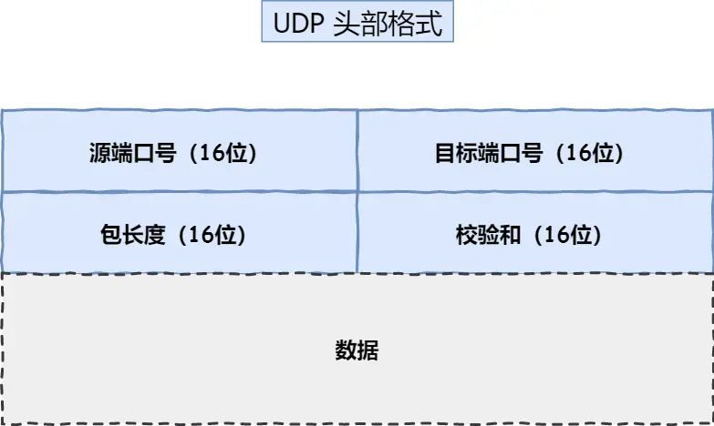

## 0. TCP

### 0.1 TCP 报文格式 


- **序列号**：在建立连接时由计算机生成的随机数作为其初始值，通过 SYN 包传给接收端主机，每发送一次数据，就「累加」一次该「数据字节数」的大小。**用来解决网络包乱序问题。**
- **确认应答号**：指下一次「期望」收到的数据的序列号，发送端收到这个确认应答以后可以认为在这个序号以前的数据都已经被正常接收。**用来解决丢包的问题。**
- **控制位：**
	- _ACK_：该位为 `1` 时，「确认应答」的字段变为有效，TCP 规定除了最初建立连接时的 `SYN` 包之外该位必须设置为 `1` 。
	- _RST_：该位为 `1` 时，表示 TCP 连接中出现异常必须强制断开连接。
	- _SYN_：该位为 `1` 时，表示希望建立连接，并在其「序列号」的字段进行序列号初始值的设定。
	- _FIN_：该位为 `1` 时，表示今后不会再有数据发送，希望断开连接。当通信结束希望断开连接时，通信双方的主机之间就可以相互交换 `FIN` 位为 1 的 TCP 段。

### 0.2 什么 TCP？ 

TCP 是**面向连接的、可靠的、基于字节流**的传输层通信协议。
- **面向连接**：一定是「一对一」才能连接，不能像 UDP 协议可以一个主机同时向多个主机发送消息，也就是一对多是无法做到的；
- **可靠的**：无论的网络链路中出现了怎样的链路变化，TCP 都可以保证一个报文一定能够到达接收端；
- **字节流**：用户消息通过 TCP 协议传输时，消息可能会被操作系统「分组」成多个的 TCP 报文，如果接收方的程序如果不知道「消息的边界」，是无法读出一个有效的用户消息的。并且 TCP 报文是「有序的」，当「前一个」TCP 报文没有收到的时候，即使它先收到了后面的 TCP 报文，那么也不能扔给应用层去处理，同时对「重复」的 TCP 报文会自动丢弃。

### 0.3 什么是 TCP 连接？ 

**用于保证可靠性和流量控制维护的某些状态信息，这些信息的组合，包括 Socket、序列号和窗口大小称为连接。** 所以建立一个 TCP 连接是需要客户端与服务端达成上述三个信息的共识。
- **Socket**：由 IP 地址和端口号组成
- **序列号**：用来解决乱序问题等
- **窗口大小**：用来做流量控制

### 0.4 如何确定一个 TCP 连接？ 

系统用四元组 {Local IP，Local Port，Remote IP，Remote Port} 来唯一标识 TCP 连接。  
- Client 发起 TCP 连接时，系统通常会选取一个空闲本地端口（Local Port），该端口，类型是 Unsigned short，最大 65536，端口 0 有特殊含义，因此最大可用端口，即最大 TCP 连接数只有 65535。
- Server 部分的 Remote IP 和 Remote Port 可变，因此最大 TCP 连接为**客户端 IP 数 * 客户端 Port 数**，IPV4 简单情况（不考虑地址分类） 最大连接数为 2^32（IP 数）* 2^16（Port 数） ，也就是 Server 端单机最大 TCP 连接数约为 2^48 。

#### 服务端最大并发 TCP 连接数远不能达到理论上限，会受以下因素影响： 

- **文件描述符限制**，每个 TCP 连接都是一个文件，如果文件描述符被占满了，会发生 Too many open files。Linux 对可打开的文件描述符的数量分别作了三个方面的限制：
    - **系统级**：当前系统可打开的最大数量，通过 `cat /proc/sys/fs/file-max` 查看；
    - **用户级**：指定用户可打开的最大数量，通过 `cat /etc/security/limits.conf` 查看；
    - **进程级**：单个进程可打开的最大数量，通过 `cat /proc/sys/fs/nr_open` 查看；
- **内存限制**，每个 TCP 连接都要占用一定内存，操作系统的内存是有限的，如果内存资源被占满后，会发生 OOM。

## 1. TCP 三次握手/四次挥手

1. TCP 三次握手、四次挥手的流程及状态变化


2. TCP 为什么要三次握手？
- TCP 连接是指：用于保证可靠性和流量控制维护的某些状态信息，这些信息的组合，包括 **Socket、序列号和窗口大小**称为连接。
- 三次握手的作用：
	- 1）**防止历史连接**：三次握手的**首要原因是为了防止旧的重复连接初始化造成混乱**，在网络拥堵的情况下，一个旧的 SYN 报文比新的 SYN 报文先到达服务端，此时服务器返回 ACK+SYN，确认号为 x + 1。但是对于客户端来说它期望的是 y + 1（新的 SYN 报文序列号），这个时候客户端会发送 RST 报文。服务器收到 RST 报文就会释放这个连接。后续新的 SYN 报文再抵达服务端就可以正常通信了。
	- 2）**同步双方的初始序列号**：客户端发送携带「初始序列号」的 `SYN` 报文的时候，需要服务端回一个 `ACK` 应答报文，表示客户端的 SYN 报文已被服务端成功接收，那当服务端发送「初始序列号」给客户端的时候，依然也要得到客户端的应答回应，**这样一来一回，才能确保双方的初始序列号能被可靠的同步。**
	- 3）**避免资源浪费**：由于没有第三次握手，服务端不清楚客户端是否收到了自己回复的 `ACK` 报文，所以服务端每收到一个 `SYN` 就只能先主动建立一个连接，如果客户端的 SYN 报文阻塞了，会重复发送多次 SYN 报文，服务端接收到请求的时候就会建立冗余的无效连接，造成资源的浪费。

3. TCP 为什么握手三次，不是两次？ 不是四次？

不使用「两次握手」和「四次握手」的原因：
- 「两次握手」：无法防止历史连接的建立，会造成双方资源的浪费，也无法可靠的同步双方序列号；
- 「四次握手」：三次握手就已经理论上最少可靠连接建立，所以不需要使用更多的通信次数。

4. TCP 为什么有第四次挥手？

- 关闭连接时，客户端向服务端发送 `FIN` 时，仅仅表示客户端不再发送数据了但是还能接收数据。
- 服务端收到客户端的 `FIN` 报文时，先回一个 `ACK` 应答报文，而服务端可能还有数据需要处理和发送，等服务端不再发送数据时，才发送 `FIN` 报文给客户端来表示同意现在关闭连接。

从上面过程可知，服务端通常需要等待完成数据的发送和处理，所以服务端的 `ACK` 和 `FIN` 一般都会分开发送，因此是需要四次挥手。

5. TCP 为什么挥手比握手多一次？

因为服务端收到客户端的 `FIN` 报文的时候，服务端想回一个 `ACK` 报文，这个时候服务端可能还有数据需要处理和发送，等服务器处理完了之后，再发送 `FIN` 报文给客户端表示同意关闭连接。所以挥手比握手多一次的关键在于**服务器可能还有需要处理的数据**，如果服务器收到 `FIN` 报文的时候没有相应的数据需要处理，此时可以将 `ACK` 和 `FIN` 报文结合成一个包发送回去，这样也变成三次挥手了。

6. 四次挥手中，TIME-WAIT 状态是在哪一步？为什么 2 * MSL（转到下一个大问题）

## 2. TCP 的 TIME_WAIT 状态

1. TCP 的 TIME_WAIT 状态的作用，CLOSE_WAIT 状态（来自上面四次挥手的状态变化）

1）**防止连接关闭时四次挥手中的最后一次 ACK 丢失**
- 如果没有 TIME_WAIT 状态，主动关闭一方（客户端）就会在收到对端（服务器）的 FIN 并回复 ACK 后直接从 FIN_WAIT_2 进入 CLOSED 状态，并释放连接。此时如果最后一条 ACK 丢失，那么服务器重传的 FIN 将无人处理，最后导致服务器长时间的处于 LAST_ACK 状态而无法正常关闭（服务器只能等到达到 FIN 的最大重传次数后关闭）
- 如果此时新建一个连接，源随机端口如果被复用，在 connect 发送 SYN 包后，由于被动方仍认为这条连接【五元组】还在等待 ACK，但是却收到了 SYN，则被动方会回复 RST；造成主动创建连接的一方，由于收到了 RST，则连接无法成功；  

2）**防止新连接收到旧链接的 TCP 报文：**
- TCP 使用四元组区分一个连接（源端口、目的端口、源 IP、目的 IP），如果新、旧连接的 IP 与端口号完全一致，则内核协议栈无法区分这两条连接。在关闭“前一个连接”之后，马上又重新建立起一个相同的 IP 和端口之间的“新连接”，“前一个连接”的迷途重复分组在“前一个连接”终止后到达，而被“新连接”收到了。2MSL 的时间足以保证两个方向上的数据都被丢弃，使得原来连接的数据包在网络中都自然消失，再出现的数据包一定是新连接上产生的。

2. TIME_WAIT 状态下的等待时间是多少？为何是 2MSL? 1MSL 不行吗？
- MSL 就是 maximum segment lifetime(**报文最大生存时间**），这是一个 IP 数据包能在互联网上生存的最长时间，超过这个时间 IP 数据包将在网络中消失 。MSL 在 RFC 1122 上建议是 2 分钟，而源自 berkeley 的 TCP 实现传统上使用 30 秒。
- TIME_WAIT 等待 2 倍的 MSL，比较合理的解释是： 网络中可能存在来自发送方的数据包，当这些发送方的数据包被接收方处理后又会向对方发送响应，所以**一来一回需要等待 2 倍的时间**。
- 比如，如果被动关闭方没有收到断开连接的最后的 ACK 报文，就会触发超时重发 `FIN` 报文，另一方接收到 FIN 后，会重发 ACK 给被动关闭方， 一来一去正好 2 个 MSL。
- 可以看到 **2MSL 时长** 这其实是相当于**至少允许报文丢失一次**。比如，若 ACK 在一个 MSL 内丢失，这样被动方重发的 FIN 会在第 2 个 MSL 内到达，TIME_WAIT 状态的连接可以应对。
- 如果主动关闭的一方**跳过 TIME_WAIT 直接进入 CLOSED 状态**，或者**在 TIME_WAIT 停留的时长不足 2MSL**，那么当被动关闭的一方早先发出的延迟包（数据包 or FIN 包）到达后，就可能出现类似下面的问题：
	- **旧的 TCP 连接已经不存在了，收到延迟包后，系统此时只能返回 RST 包**
	- **新的 TCP 连接被建立起来了，收到延迟包后，可能会干扰新连接**

不管是哪种情况都会让 TCP 不再可靠，所以 TIME_WAIT 状态的存在是极其必要的。

3. 服务器上 TIME_WAIT 的连接很多会怎么样？怎么解决？

过多的 TIME_WAIT 状态主要会导致下面的问题：
- 1）**占用系统资源**，比如文件描述符、内存资源、CPU 资源、线程资源等；
- 2）**占用端口号**，端口资源也是有限的，一般可以开启的端口为 `32768～61000`，也可以通过 `net.ipv4.ip_local_port_range` 参数指定范围。

客户端出现大量 TIME_WAIT 会导致端口号被占用，这个时候就无法对「目的 IP+ 目的 PORT」都一样的服务端发起连接了，但是被使用的端口，还是可以继续对另外一个服务端发起连接的。  

服务端出现大量 TIME_WAIT，并不会导致端口资源受限，因为服务端只监听一个端口，而且由于一个四元组唯一确定一个 TCP 连接，因此理论上服务端可以建立很多连接，但是 TCP 连接过多，会占用系统资源，比如文件描述符、内存资源、CPU 资源、线程资源等。  

4. TIME_WAIT 状态如何解决？

1）**修改内核参数 tcp_tw_reuse：**

```          
net.ipv4.tcp_tw_reuse = 1; //1表示开启，默认是0
net.ipv4.tcp_timestamp = 1; // 这个是表示time_wait的时间超过了timstamp就可以重用该端口了
```           

注意： tcp_tw_reuse 内核参数只在调用 connect() 函数时起作用，所以只能用于客户端（主动连接的一端）。

tcp_tw_reuse 的作用是：在调用 connect() 函数时，内核会随机找一个处于 TIME_WAIT 状态 超过 1 秒 的连接给新连接复用。（超时时间由 tcp_timestamp 设置，默认为 1 秒）

这种方式可以缩短 TIME_WAIT 的等待时间。

2） **修改内核参数 tcp_max_tw_buckets：**

`net.ipv4.tcp_max_tw_buckets` 参数的默认值为 18000，当系统中处于 TIME_WAIT 状态的连接数量超过阈值，系统会将后面的 TIME_WAIT 连接重置。

3）**程序中使用 SO_LINGER**

我们可以通过设置 socket 选项，来设置调用 close 关闭连接行为。

```
struct linger so_linger;
so_linger.l_onoff = 1;
so_linger.l_linger = 0;
setsockopt(s, SOL_SOCKET, SO_LINGER, &so_linger,sizeof(so_linger));
```

如果 `l_onoff` 为非 0， 且 `l_linger` 值为 0，那么调用 `close` 后，会立该发送一个 `RST` 标志给对端，该 TCP 连接将跳过四次挥手，也就跳过了 `TIME_WAIT` 状态，直接关闭。

但这为跨越 `TIME_WAIT` 状态提供了一个可能，不过是一个非常危险的行为，不值得提倡。

前面介绍的方法都是试图越过 `TIME_WAIT` 状态的，这样其实不太好。虽然 TIME_WAIT 状态持续的时间是有一点长，显得很不友好，但是它被设计来就是用来避免发生乱七八糟的事情。

《UNIX 网络编程》一书中说道：**TIME_WAIT 是我们的朋友，它是有助于我们的，不要试图避免这个状态，而是应该弄清楚它**。

**如果服务端要避免过多的 TIME_WAIT 状态的连接，就永远不要主动断开连接，让客户端去断开，由分布在各处的客户端去承受 TIME_WAIT**。

5. 服务器出现大量 TIME_WAIT 状态的原因有哪些？

- TIME_WAIT 状态是主动关闭连接方才会出现的状态，所以如果服务器出现大量的 TIME_WAIT 状态的 TCP 连接，就是说明服务器主动断开了很多 TCP 连接。
- 服务器在以下场景下会断开连接：
	- 1）**HTTP 没有使用长连接**：服务器和客户端任意一方没有开启 HTTP Keep-Alive，都会导致服务端在处理完一个 HTTP 请求后，就主动关闭连接，此时服务端上就会出现大量的 TIME_WAIT 状态的连接。
	- 2）**HTTP 长连接超时**：使用 HTTP 长连接的时候，如果客户端完成一次请求之后，没有新的请求，这个时候 TCP 连接会一直占用，浪费资源。所以一般服务器软件会设置相应的定时器，超过这个时间之后就会将 TCP 连接释放。可能是因为网络问题，导致客户端建立连接之后，发送的数据一直没有被服务器接收到，这个时候会出现 HTTP 长连接超时，然后服务器主动关闭连接，从而导致大量的 TIME_WAIT 状态出现。
	- 3）**HTTP 长连接的请求数量达到上限**：Web 服务端通常会有个参数，来定义一条 HTTP 长连接上最大能处理的请求数量，当超过最大限制时，就会主动关闭连接。比如 nginx 的 keepalive_requests 这个参数，这个参数是指一个 HTTP 长连接建立之后，nginx 就会为这个连接设置一个计数器，记录这个 HTTP 长连接上已经接收并处理的客户端请求的数量。**如果达到这个参数设置的最大值时，则 nginx 会主动关闭这个长连接**，那么此时服务端上就会出现 TIME_WAIT 状态的连接。

6. 服务器出现大量的 CLOSE_WAIT 状态的原因有哪些？

CLOSE_WAIT 状态是「被动关闭方」才会有的状态，而且如果「被动关闭方」没有调用 close 函数关闭连接，那么就无法发出 FIN 报文，从而无法使得 CLOSE_WAIT 状态的连接转变为 LAST_ACK 状态。所以，**当服务端出现大量 CLOSE_WAIT 状态的连接的时候，说明服务端的程序没有调用 close 函数关闭连接**。一般这个时候需要排查代码，分析是因为那种情况导致服务器程序没有调用 close 函数。

## 3. TCP 重传机制

1. 什么 TCP 重传机制？为什么需要重传？

- TCP 实现可靠传输之一是通过，序列号和确认应答。发送端的数据到达对端主机的时候，接收端主机会发送一个确认应答消息，表示这条消息已经收到了；
- 如果发送端的数据，在网络传输过程中丢失了，接收端一直没收到数据，发送端这边需要相应的机制来进行重传数据包。

2. 重传机制有哪些？
- **1）超时重传**：发送数据的时候，会启动一个定时器，当定时器超时的时候，如果没有接收到对方的 ACK 确认应答，此时就会进行重传数据包。
- **2）快速重传**：当收到三个相同的 ACK 报文时，会在定时器过期之前，重传丢失的报文段。连续收到三个相同 ACK 报文，可以认为这个报文丢失了，但是后续的其他报文接收到了，所以此时会进行重传。
- **3）SACK 重传**：在 TCP 头部「选项」字段里加一个 `SACK` 的东西，它**可以将已收到的数据的信息发送给「发送方」**，这样发送方就可以知道哪些数据收到了，哪些数据没收到，知道了这些信息，就可以**只重传丢失的数据**。
- **4）Duplicate SACK**：主要**使用了 SACK 来告诉「发送方」有哪些数据被重复接收了。**  

3. 超时重传  
什么时候会发生超时重传？
- 数据包丢失；
- 确认应答丢失；

超时时间设置成多少？

- `RTT`（Round-Trip Time 往返时延）指的是**数据发送时刻到接收到确认的时刻的差值**，也就是包的往返时间；
- 超时重传时间是以 `RTO` （Retransmission Timeout 超时重传时间）表示；
	- RTO 时间较长会导致重发较慢，丢包很久了才重传，效率低下；
	- RTO 时间较短会导致可能包还没传输完就认为包丢失了，重发的速度快，阻塞网络，导致更多的重传；
- **超时重传时间 RTO 的值应该略大于报文往返 RTT 的值**，这个值是通过采样计算出来的，也是在动态变化的；
- 如果超时重发的数据，再次超时的时候，又需要重传的时候，TCP 的策略是**超时间隔加倍。**也就是**每当遇到一次超时重传的时候，都会将下一次超时时间间隔设为先前值的两倍。两次超时，就说明网络环境差，不宜频繁反复发送。**

4. 快速重传


超时重传的问题：重传的时候是重传一个数据包，还是所有的数据包？
- 如果重传一个数据包的话，效率太低，比如说丢失了 Seq2 和 Seq3 数据包，收到三个 ACK2 确认应答的时候，会重传 Seq2 数据包，但是 Seq3 会在后续再次收到三个 ACK3 才会进行重传；
- 如果重传多个数据包的话，后续已经接收到的数据包也会重传，效率低下；

5. SACK 重传机制？

SACK 重传就是为了解决超时重传重传哪些数据包的问题。在 TCP 头部选项加上 `SACK` 字段，可以将已经收到的数据包信息返回给发送方，此时发送方知道哪些数据接收了，哪些丢失了，这样可以只重传丢失的数据包。


6. `D-SACK` 有这么几个好处：

- 1. 可以让「发送方」知道，是发出去的包丢了，还是接收方回应的 ACK 包丢了;
- 2. 可以知道是不是「发送方」的数据包被网络延迟了;
- 3. 可以知道网络中是不是把「发送方」的数据包给复制了;

## 4. TCP 滑动窗口 & 流量控制
### 4.1 滑动窗口

1. 什么是 TCP 的滑动窗口？

- TCP 的滑动窗口是一种用于流量控制的机制，它允许发送方在一定条件下持续向对方发送数据，而无需等待接收方的确认。
- 窗口的大小即**无需等待确认应答，而可以继续发送数据的最大值**。
- TCP 会在发送方和接收方都维护一个窗口大小：
	- **发送窗口**：发送方发送数据时候，会维护一个窗口，表示允许发送的数据范围。
	- **接受窗口**：接收方接受数据的时候，也会维护一个窗口，表示运行接受的数据范围。

2. 窗口的大小如何确定的？

- TCP 报文当中有一个字段窗口大小，这个字段是**接收方告诉发送方自己还有多少缓冲区可以接收数据，于是发送方就会根据这个接受能力来发送数据，而不会导致接收端处理不过来。
- 所以窗口大小是由**接收方的窗口大小**来决定的。发送方发送的数据大小不能超过接收方的窗口大小，否则接收方就无法正常接收到数据。

3. 发送方的滑动窗口？  


发送方的窗口分成了四个部分：
- 1）是已发送并收到 ACK 确认的数据：1~31 字节
- 2）是已发送但未收到 ACK 确认的数据：32~45 字节
- 3）是未发送但总大小在接收方处理范围内（接收方还有空间）：46~51 字节
- 4）是未发送但总大小超过接收方处理范围（接收方没有空间）：52 字节以后

TCP 会维护三个指针来跟踪四种类型的对应的字节：
- `SND.WND`：表示发送窗口的大小（大小是由接收方指定的）；
- `SND.UNA`（_Send Unacknoleged_）：是一个绝对指针，它指向的是已发送但未收到确认的第一个字节的序列号，也就是 #2 的第一个字节。
- `SND.NXT`：也是一个绝对指针，它指向未发送但可发送范围的第一个字节的序列号，也就是 #3 的第一个字节。
- 指向 #4 的第一个字节是个相对指针，它需要 `SND.UNA` 指针加上 `SND.WND` 大小的偏移量，就可以指向 #4 的第一个字节了。

4. 接收方的滑动窗口？

  
其中三个接收部分，使用两个指针进行划分:

- `RCV.WND`：表示接收窗口的大小，它会通告给发送方。
- `RCV.NXT`：是一个指针，它指向期望从发送方发送来的下一个数据字节的序列号，也就是 #3 的第一个字节。
- 指向 #4 的第一个字节是个相对指针，它需要 `RCV.NXT` 指针加上 `RCV.WND` 大小的偏移量，就可以指向 #4 的第一个字节了。

5. 接收窗口和发送窗口的大小是相等的吗？
- 并不完全相等，接收窗口的大小是**约等于**发送窗口的大小的。
- 因为滑动窗口会发生变化，如果接收方接受数据比较快，窗口此时可能会空缺，但是发送方因为需要收到接收方的确认报文，以及 TCP 当中窗口大小，可能会有所延迟，所以两个窗口大小是约等于。

### 4.2 流量控制

1. TCP 的流量控制是什么？
- 接收方处理数据的能力有限，如果发送方一直无脑的发送数据给接收方，接收方处理不过来，就会触发重传机制，从而浪费网络资源；
- 所以 TCP 提出了一个机制：**让「发送方」根据「接收方」的实际接收能力控制发送的数据量，这就是所谓的流量控制。**

2. TCP 中的流量控制原理
- 流量控制的原理就是上面的滑动窗口原理，发送方和接收方维护一个窗口大小，发送方会根据接收方的接受能力来实际的调整发送的数据。
- 然后如果继续详细解释的话，就是解释滑动窗口等等，这里不赘述了。

3. 如果接收端通知一个零窗口给发送端，这个时候发送端还能不能发送数据呢？如果不发数据，那一直等接收端口通知一个非 0 窗口吗，如果接收端一直不通知呢？
- 当发送方收到接收方的零窗口的时候，如果接收方一直不通知（或者通知的包丢失了），这样的话会导致发送方一直在等待，这显然不现实。
- 在 TCP 当中，如果发送方收到对方的零窗口，会启动一个定时器，这个定时器超时的时候，接收方会发送一个**窗口探测 ( Window probe ) 报文**，来探测接收方的窗口大小。
- 窗口探测的次数一般为 3 次，每次大约 30-60 秒（不同的实现可能会不一样）。如果 3 次过后接收窗口还是 0 的话，有的 TCP 实现就会发 `RST` 报文来中断连接。

4. 如果接收端处理能力很慢，这样接收端的窗口很快被填满，然后接收处理完几个字节，腾出几个字节的窗口后，通知发送端，这个时候发送端马上就发送几个字节给接收端吗？发送的话会不会太浪费了，就像一艘万吨油轮只装上几斤的油就开去目的地一样。对于发送端产生数据的能力很弱也一样，如果发送端慢吞吞产生几个字节的数据要发送，这个时候该不该立即发送呢？还是累积多点在发送？

本质上这是要避免发送小包的问题。造成这个问题原因有二：  
1）接收端一直在通知一个小的窗口;  
2）发送端本身问题，一直在发送小包。这个问题，TCP 中有个术语叫 Silly Window Syndrome(糊涂窗口综合症)。

解决这个问题的思路与之对应：  
1）**接收端不通知小窗口**，即 David D Clark’s 方案，如果收到的数据导致 window size 小于某个值，就 ACK 一个 0 窗口，这就阻止发送端在发数据过来。等到接收端处理了一些数据后 windows size 大于等于了 MSS，或者 buffer 有一半为空，就可以通告一个非 0 窗口。  
2）**发送端积累一下数据在发送**。 有个著名的 Nagle’s algorithm。  
  
**Nagle 算法的规则：**  
1. 如果包长度达到 MSS ，则允许发送；
2. 如果该包含有 FIN ，则允许发送；
3. 设置了 TCP_NODELAY 选项，则允许发送；
4. 设置 TCP_CORK 选项时，若所有发出去的小数据包（包长度小于 MSS ）均被确认，则允许发送；
5. 上述条件都未满足，但发生了超时（一般为 200ms ），则立即发送。  

- 规则 [4] 指出 TCP 连接上最多只能有一个未被确认的小数据包。从规则 [4] 可以看出 Nagle 算法并不禁止发送小的数据包 (超时时间内)，而是避免发送大量小的数据包。
- 由于 Nagle 算法是依赖 ACK 的，如果 ACK 很快的话，也会出现一直发小包的情况，造成网络利用率低。
- TCP_CORK 选项则是禁止发送小的数据包 (超时时间内)，设置该选项后，TCP 会尽力把小数据包拼接成一个大的数据包（一个 MTU）再发送出去，当然也不会一直等，发生了超时（一般为 200ms ），也立即发送。
- Nagle 算法和 CP_CORK 选项提高了网络的利用率，但是增加是延时。从规则 [3] 可以看出，设置 TCP_NODELAY 选项，就是完全禁用 Nagle 算法了。  

## 5. TCP 拥塞控制

1. TCP 拥塞控制是什么？为什么需要拥塞控制？

- TCP 的流量控制机制，让双方都可以得知对方的接受能力，但是对于整个网络链路上的容量是不知道的。如果双方接受能力都很强，可以大量的发包，这个时候链路很快就会拥塞，从而引起丢包，丢包之后又会导致发送端重传，进一步加剧链路的拥塞。
- TCP 的拥塞控制就是为了**避免发送方的流量填满整个网络**。TCP 看不见整个网络的情况，必须采用试探性的方法来控制拥塞，因此拥塞控制的两个任务：1）保证公平性；2）拥塞过后的恢复。

2. TCP 拥塞控制的原理？

- TCP 的拥塞控制主要原理依赖于一个**拥塞窗口 (cwnd)** 来控制；
- 接收端通告的接收窗口 (rwnd) 用于流量控制；加上拥塞控制后，发送端真正的**发送窗口=min(rwnd, cwnd)**。
- 关于 cwnd 的单位，在 TCP 中是以字节来做单位的，假设 TCP 每次传输都是按照 MSS 大小来发送数据，因此认为 cwnd **按照数据包个数来做单位**，下面如果没有特别说明是字节，那么 cwnd 增加 1 也就是相当于字节数增加 1 个 MSS 大小。  

3. 拥塞控制的四个算法：
### 慢启动

慢启动体现的是试探的作用，刚建立 TCP 连接的时候先慢点发包，探测网络情况，然后再慢慢提速。如果一开始就拼命发包的话，很容易导致链路拥塞。

**慢启动的算法如下 (cwnd 全称 Congestion Window)：**  

- 1）连接建好的开始先初始化 cwnd = 1，表明可以传 1 个 MSS 大小的数据。
- 2）每当收到一个 ACK，拥塞窗口就增加一个报文段（cwnd++）。
- 3）有一个慢启动门限 ssthresh（slow start threshold），当 cwnd >= ssthresh 时，就会进入 " 拥塞避免算法 - Congestion Avoidance"。  

对于发送方来说，开始的时候发送一个报文段，然后等待 ACK，当收到这个 ACK 的时候，拥塞窗口从 1 变成 2，此时可以发送 2 个报文段。收到这两个报文段的 ACK 的时候，拥塞窗口为 4。这是一种指数型的增长关系。

### 拥塞避免

拥塞避免算法和慢启动算法对于每个连接会维护两个变量：1）拥塞窗口 cwnd；2）慢启动门限 ssthresh。

进入拥塞避免算法的时候：**每当收到一个 ACK，cwnd 增加 1 / cwnd**。

拥塞避免算法呈现的是线性增加趋势，相比于慢启动，增加速度缓慢了。但是还是在增长，当网络发生拥塞的时候，会出现丢包情况，此时触发重传机制，进入下一个阶段：快速重传机制。

### 快速重传与快速恢复算法

快速重传和快速恢复算法一般是在一起使用的。**快速重传算法**：当接收方发现丢了一个中间包的时候，发送三次前一个包的 ACK，于是发送端就会快速地重传，不必等待超时再重传。

该算法如下：  
1）当收到 3 个重复的 ACK 是，将 ssthresh 设置为当前拥塞窗口 cwnd 的一半，设置 cwnd 为 ssthresh + 3 个报文段大小。  
2）重传丢失的报文；  
3）如果再收到重复的 ACK，那么 cwnd 增加 1；  
4）如果收到新数据的 ACK 后，把 cwnd 设置为第一步中的 ssthresh 的值，原因是该 ACK 确认了新的数据，说明从 duplicated ACK 时的数据都已收到，该恢复过程已经结束，可以回到恢复之前的状态了，也即再次进入拥塞避免状态；


## 6. TCP 粘包问题

#TODO

## 6. TCP 如何保证可靠性

#TODO

## 7. TCP 对比 UDP
### 1. TCP 和 UDP 的区别？ 

_1. 连接_
- TCP 是面向连接的传输层协议，传输数据前先要建立连接。
- UDP 是不需要连接，即刻传输数据。  
_2. 服务对象_
- TCP 是一对一的两点服务，即一条连接只有两个端点。
- UDP 支持一对一、一对多、多对多的交互通信  
_3. 可靠性_
- TCP 是可靠交付数据的，数据可以无差错、不丢失、不重复、按序到达。
- UDP 是尽最大努力交付，不保证可靠交付数据。但是我们可以基于 UDP 传输协议实现一个可靠的传输协议，比如 QUIC 协议，具体可以参见这篇文章：[如何基于 UDP 协议实现可靠传输？(opens new window)](https://xiaolincoding.com/network/3_tcp/quic.html)  
_4. 拥塞控制、流量控制_
- TCP 有拥塞控制和流量控制机制，保证数据传输的安全性。
- UDP 则没有，即使网络非常拥堵了，也不会影响 UDP 的发送速率。  
_5. 首部开销_
- TCP 首部长度较长，会有一定的开销，首部在没有使用「选项」字段时是 `20` 个字节，如果使用了「选项」字段则会变长的。
- UDP 首部只有 8 个字节，并且是固定不变的，开销较小。  
_6. 传输方式_
- TCP 是流式传输，没有边界，但保证顺序和可靠。
- UDP 是一个包一个包的发送，是有边界的，但可能会丢包和乱序。  
_7. 分片不同_
- TCP 的数据大小如果大于 MSS 大小，则会在传输层进行分片，目标主机收到后，也同样在传输层组装 TCP 数据包，如果中途丢失了一个分片，只需要传输丢失的这个分片。
- UDP 的数据大小如果大于 MTU 大小，则会在 IP 层进行分片，目标主机收到后，在 IP 层组装完数据，接着再传给传输层。

### 2. TCP 和 UDP 应用场景 

- 由于 TCP 是面向连接，能保证数据的可靠性交付，因此经常用于：
	- `FTP` 文件传输；
	- HTTP / HTTPS；
- 由于 UDP 面向无连接，它可以随时发送数据，再加上 UDP 本身的处理既简单又高效，因此经常用于：
	- 包总量较少的通信，如 `DNS` 、`SNMP` 等；
	- 视频、音频等多媒体通信；
	- 广播通信；

### 3. TCP 和 UDP 可以同时使用 80 端口吗 ？ 

答案是可以的：
- 传输层当中是通过端口号，来标识主机当中不同的应用进程。
- 传输层的 TCP 和 UDP 协议，在内核当中是独立的模块，当主机收到一个数据包的时候，会根据 IP 数据包当中的「协议号」字段知道该数据包是 TCP/UDP，然后再转移给具体的传输层模块（TCP/UDP）进行处理，传输层再根据端口号来确定发送到哪个应用程序上。
- 所以对于 TCP 和 UDP 来说，它们的端口号是相互独立的。

### 4. TCP 和 UDP 各有什么优点呢？ 

- TCP 优点：
	- **可靠性**：TCP 提供可靠的面向连接的通信，通信过程中数据包丢失或损坏的话，会负责重传；
	- **顺序保证：** TCP 保证数据按照发送的顺序到达目标。这是通过序列号和确认机制实现的，确保数据包按照正确的顺序被传递。
	- **流量控制：** TCP 有流量控制机制，可防止发送方发送过多的数据导致接收方无法处理。这有助于确保网络的稳定性和性能。
- UDP 优点：
	- 1. **低延迟：** UDP 是一种无连接协议，不需要进行连接的建立和断开，因此具有较低的延迟。这使得 UDP 适用于实时应用，如语音通话和视频流。
	- 2. **简单，开销小：** UDP 的头部开销较小，协议相对简单。这使得 UDP 适用于资源受限的环境，或者在网络状况较好、可靠性要求较低的场景。
	- 3. **广播和多播：** UDP 支持广播和多播，可以将数据一次性发送给多个接收方，而不需要建立多个连接。
	- 4. **适用于实时应用：** 由于 UDP 的低延迟和简单性，它适用于实时应用，如在线游戏、实时通信等，其中快速传输比完全的可靠性更为重要。

---
相关问题：
- 你认为视频通话场景一般使用 TCP 还是 UDP 呢，为什么？
- 对于视频场景，一般来说 i 帧到达以后 p 帧才会有效，那么基于 UDP 如何保证 i 帧到达呢？
- 你怎么保证 UDP 下帧与帧间的有序性呢？


## 8. UDP
### 1. UDP 头部格式 

- 目标和源端口：主要是告诉 UDP 协议应该把报文发给哪个进程。
- 包长度：该字段保存了 UDP 首部的长度跟数据的长度之和。
- 校验和：校验和是为了提供可靠的 UDP 首部和数据而设计，防止收到在网络传输中受损的 UDP 包。  



### UDP 有那些应用层协议？ 

1. **DNS（域名系统）**： DNS 使用 UDP 进行域名解析。UDP 的短延迟特性使得在解析域名时更为合适，因为 DNS 请求通常是一个单向的查询 - 响应过程。端口号：**53**
2. **DHCP（动态主机配置协议）**： DHCP 用于自动为计算机分配 IP 地址和其他网络配置信息。DHCP 在初始配置时通常使用 UDP。端口号：**67(Server)/68(Client)**
3. **SNMP（简单网络管理协议）**：SNMP 用于网络设备（如路由器、交换机）之间的管理和监控。SNMP 的传输层协议可以是 UDP。端口号：**161**
4. **NTP（网络时间协议）**：NTP 用于同步计算机和网络设备的时间。NTP 可以使用 UDP 来传输时间信息。 端口号：**123**
5. **RTP（实时传输协议）**： RTP 用于在实时应用中传输音频和视频流。由于 UDP 的低延迟和实时性要求，RTP 通常选择 UDP 作为传输协议。端口号：动态分配？

### UDP 怎么实现 TCP 的拥塞控制？ #TODO

### 一般 tcp 有多少个端口可用，说一下常见协议的端口号 

TCP 使用 16 位端口号（port number），因此理论上有 65536 个端口号可用。端口号范围从 0 到 65535，其中 0 到 1023 是众所周知的端口号，称为 " 系统端口 "（Well-known Ports），1024 到 49151 是注册端口号，称为 " 注册端口 "（Registered Ports），49152 到 65535 是动态或私有端口号。
1. 众所周知的端口（Well-known Ports，0-1023）：
- **80：** HTTP (HyperText Transfer Protocol)
- **443：** HTTPS (HTTP Secure)
- **21：** FTP (File Transfer Protocol)
- **22：** SSH (Secure Shell)
- **25：** SMTP (Simple Mail Transfer Protocol)
- **110：** POP3 (Post Office Protocol version 3)
- **143：** IMAP (Internet Message Access Protocol)
- **23：** Telnet (Remote login service)
2. 注册端口（Registered Ports，1024-49151）：
- **3306：** MySQL Database
- **5432：** PostgreSQL Database
- **8080：** HTTP Alternate (often used for web proxy and caching server)
- **8443：** HTTPS Alternate (often used for secure web proxy)
3. 动态或私有端口（Dynamic or Private Ports，49152-65535）：
- 通常用于动态分配，例如客户端程序在与服务器建立连接时随机选择一个未使用的端口。

## TCP 的 KeepAlive 和 HTTP 的 Keep-Alive 

简单小结是：
- HTTP/1.0 默认的连接是短连接，客户端和服务端每进行一次 HTTP 操作，就会建立一次连接，任务完成之后，连接会释放。
- HTTP/1.1 默认的是长连接（即开启了 Keep-Alive），这样完成一次 HTTP 请求之后，连接不会释放，而是会继续保持，这样的话，后续再进行 HTTP 请求响应就不需要再建立一次连接。可以节省 TCP 连接和释放的开销。在发起多个 HTTP 请求时能复用同一个连接，提高通信效率；
- 而 TCP 的 KeepAlive 是为了检测对端是否宕机，是 TCP 的保活机制，如果对端宕机或者由于某些原因导致报文不可达，此时 TCP 的探测报文发送过去之后，没有响应，连续几次没有响应之后，TCP 就会报告该连接已经死亡，会将相应的连接进行释放。  
^1702949251318

参考博客：
- [4.15 TCP Keepalive 和 HTTP Keep-Alive 是一个东西吗？ | 小林coding](https://xiaolincoding.com/network/3_tcp/tcp_http_keepalive.html#tcp-%E7%9A%84-keepalive)
- [不为人知的网络编程(十二)：彻底搞懂TCP协议层的KeepAlive保活机制](http://www.52im.net/thread-3506-1-1.html)

---
