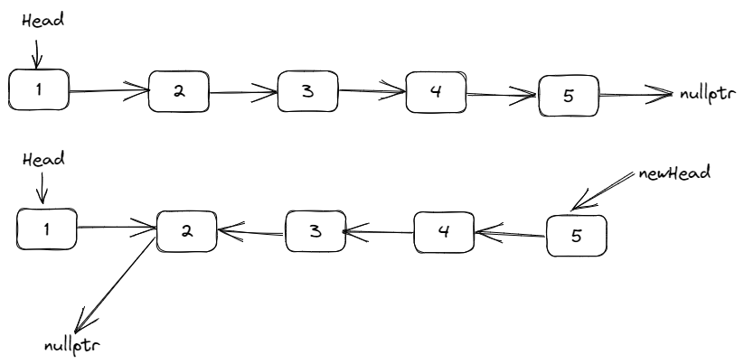

# [剑指 Offer 24. 反转链表](https://leetcode.cn/problems/fan-zhuan-lian-biao-lcof/)

定义一个函数，输入一个链表的头节点，反转该链表并输出反转后链表的头节点。

**示例:**

**输入:** 1->2->3->4->5->NULL  
**输出:** 5->4->3->2->1->NULL

**限制：**

`0 <= 节点个数 <= 5000`

## 解题思路

### 1. 暴力？

一种比较粗暴，但是可能不符合题意的方法是，遍历一下链表，将数据放入数组中，然后反转数组，再将链表中的值修改一下：

```cpp
/**
 * Definition for singly-linked list.
 * struct ListNode {
 *     int val;
 *     ListNode *next;
 *     ListNode(int x) : val(x), next(NULL) {}
 * };
 */
class Solution {
public:
    ListNode* reverseList(ListNode* head) {
        vector<int> nums;
        ListNode *p = head;
        // 1. 遍历链表，将元素放入数组中
        while (p != nullptr) {
            nums.emplace_back(p->val);
            p = p->next;
        }
        // 2. 反转数组中元素
        reverse(nums.begin(), nums.end());
        p = head;
        // 3. 修改链表中元素的值
        for (auto val : nums) {
            p->val = val;
            p = p->next;
        }
        return head;
    }
};
```

### 2. 头插法

第二种方法是创建一个新的头结点，然后遍历原来的链表，每次将节点插入到头结点的下一个位置，先遍历的节点会放到最后的位置，就达成了反转链表：

```cpp
class Solution {
public:
    ListNode* reverseList(ListNode* head) {
        // 1. 创建一个头结点，用来头插法插入数据
        ListNode* dummy = new ListNode(0);
        ListNode* p = head;
        // 2. 遍历链表，每次将节点插入到dummy的后面
        while (p != nullptr) {
            ListNode* next = p->next;
            p->next = dummy->next;
            dummy->next = p;
            p = next;
        }
        ListNode* res = dummy->next;
        delete dummy; // new和delete对应
        return res;
    }
};
```

### 3. 双指针

第三种思路是双指针，一个指针指向前一个节点，一个指针指向当前节点，每次遍历的时候将当前指针指向上一个节点，依次遍历即可反转。

```cpp
class Solution {
public:
    ListNode* reverseList(ListNode* head) {
        if (head == nullptr || head->next == nullptr) {
            return head;
        }
        ListNode *pre = nullptr, *cur = head;
        while (cur != nullptr) {
            ListNode *next = cur->next;
            cur->next = pre;
            pre = cur;
            cur = next;
        }
        return pre;
    }
};
```

### 4. 递归

递归的思路和上面的双指针有点像，都是将当前节点指向上一个节点。

```cpp
class Solution {
public:
    ListNode* reverseList(ListNode* head) {
        return reverseListNode(nullptr, head);
    }

    ListNode* reverseListNode(ListNode *pre, ListNode *cur) {
        if (cur == nullptr) {
            return pre;
        }
        ListNode *next = cur->next;
        cur->next = pre;
        return reverseListNode(cur, next);
    }
};
```

补充：看了官方的递归，稍微有点不太一样

```cpp
class Solution {
public:
    ListNode* reverseList(ListNode* head) {
        if (!head || !head->next) {
            return head;
        }
        ListNode* newHead = reverseList(head->next); // 递归反转下一个节点
        head->next->next = head;
        head->next = nullptr;
        return newHead;
    }
};
```

官方这里得到的 newHead 是指递归反转之后的**头结点**，但是因为此时 head 并没有改变指向，他指向的下一个节点还是原来的节点，所以 `head->next->next = head` 的含义是将 head 的下一个节点指向 head，然后将 head 指向 nullptr，用图示意，如下：  

