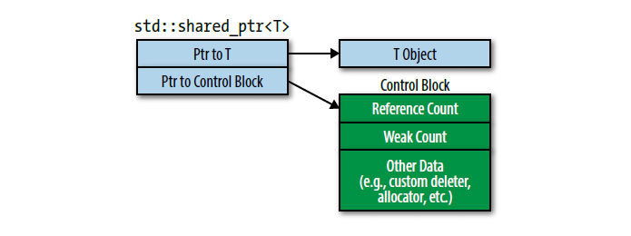
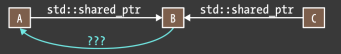

#! https://zhuanlan.zhihu.com/p/644833547
# C++ 笔记 | 智能指针
## 原始指针

**指针**是一种指向另外一个类型的复合类型，它实现了对其他对象的间接访问。定义指针类型的方法是将说明符写成 `T* d` 形式（d 是变量名，T 为类型）

```cpp
int *ip1;    // 指向int类型的指针
double *dp1; // 指向double类型的指针
```

指针存放的是某个对象的地址，可以通过**取地址符**（&）来获得对象的地址：

```cpp
int ival = 42;
int *p = &ival; // p存放的是ival的地址，p是指向ival变量的指针
```

如果指针指向了一个对象，可以通过**解引用符**（\*）来访问该对象：

```cpp
int ival = 42;
int *p = &ival;
cout << *p << endl;  // 42
```

对指针解引用得到的就是原来的对象，给解引用赋值就相当于对原对象赋值：

```cpp
int ival = 42;
int *p = &ival;
*p = 20;
cout << ival << endl;  // 20
```

**空指针**：是指没有指向任何对象的指针，如果试图访问一个空指针，程序会出错。下面是几种空指针的定义方法：

```cpp
int *p = nullptr; // C++11之后
int *p2 = 0;
int *p3 = NULL;   // C风格
```

在 C++11 中用 nullptr 表示空指针，它是一种特殊的字面量，可以转换成任意的其他指针类型。

### 使用原始指针可能存在的问题
#### 1. 野指针

野指针指的是未初始化任何内容的指针（也没初始化为 NULL 指针）

```cpp
// wild_pointer.cpp
#include <iostream>

int main() {
	int *p; /* p是野指针 */
    // 下面直接访问*p对象会出错
    std::cout << *p << std::endl;

	int x = 10;
	// p现在不是野指针了
    p = &x;
    std::cout << *p << std::endl; // 10
	return 0;
}
```

#### 2. 悬空指针

**悬空指针**：指向已删除（或释放）的内存位置的指针。一般有三种情况导致悬空指针：

**2.1 释放 ptr 指向的内存**

```cpp
int* p = (int *)malloc(sizeof(int));

// free释放内存后，p是一个悬空指针
free(ptr);

// p置为NULL，不再是悬空指针
p = NULL;
```

**2.2 函数返回局部对象的地址**

```cpp
#include <iostream>

int* func() {
    int x = 10;
    // 返回x的地址，但是这个函数作用域结束后x对象的内存会被回收
    return &x; 
}

int main() {
    int *p = func(); // p是一个悬空指针

    std::cout << *p << std::endl; // 段错误
    return 0;
}
```

**2.3 变量离开作用域**

```c
// main.c
#include <stdio.h>

int main() {
    int *p;

    {
        int x = 10;
        p = &x;
    }
    // 离开作用域之后p是一个悬空指针
    // 但是下面代码实际还能正常运行
    printf("*p = %d\n", *p);
    return 0;
}
```

上面代码实际上还能正常运行，为了探究为什么，这里将上面代码编译得到汇编代码进行查看（因为个人稍微熟悉一点 RISCV，所以用交叉编译 gcc 命令即 `$ riscv64-linux-gnu-gcc -S main.c`）：

```asm
	.file	"main.c"
	.option pic
	.text
	.section	.rodata
	.align	3
.LC0:
	.string	"*p = %d\n"
	.text
	.align	1
	.globl	main
	.type	main, @function
main:
	addi sp, sp, -48   # 在栈上为函数分配48字节的空间
	sd ra, 40(sp)      # 保存返回地址
	sd s0, 32(sp)      # 保存调用者的栈帧指针
	addi s0, sp, 48    # 设置当前栈帧指针
	la a5, __stack_chk_guard  # 加载__stack_chk_guard的地址到a5
	ld a4, 0(a5)       # 将__stack_chk_guard的值加载到a4
	sd a4, -24(s0)     # 在当前栈帧上保存__stack_chk_guard的值
	li a4, 0           # 将0加载到a4作为局部变量
	li a5, 10          # 将10加载到a5作为局部变量
	sw a5, -36(s0)     # 将a5的值存储在相对于s0偏移量为-36的位置
	addi a5, s0, -36   # 计算相对于s0偏移量为-36的位置
	sd a5, -32(s0)     # 存储a5的值在相对于s0偏移量为-32的位置
	# 加载局部变量
	ld	a5,-32(s0) # 从相对于s0偏移量为-32的位置加载局部变量的值
	lw	a5,0(a5)   # 将加载的值存储在a5中
	mv	a1,a5      # 将a5的值移动到a1作为参数
	lla	a0,.LC0
	call	printf@plt # 调用printf函数
	li a5, 0
	mv a4, a5
	la a5, __stack_chk_guard
	ld a3, -24(s0)
	ld a5, 0(a5)
	xor a5, a3, a5
	li a3, 0
	beq a5, zero, .L3
	call __stack_chk_fail@plt
.L3:
	mv a0, a4
	ld ra, 40(sp)
	ld s0, 32(sp)
	addi sp, sp, 48
	jr ra
	.size main, .-main
	.ident "GCC: (Ubuntu 11.3.0-1ubuntu1~22.04.1) 11.3.0"
	.section .note.GNU-stack,"",@progbits
```

在 gpt 帮助下，可以详细看下注释，可以发现上面的局部作用域实际上并没有起到作用。（这里具体局部作用域没起作用的原因不知）

#### 3. 重复释放

重复释放：程序试图去释放已经被释放过的内存单元，或者释放已经被重新分配过的内存单元，就会导致重复释放错误。通常重复释放内存会导致 C/C++ 运行时系统打印出大量错误及诊断信息。  

```cpp
#include <iostream>

int main() {
    int *p = new int(10);
    delete p;
    // ...
    delete p;
}
```

#### 4. 内存泄漏

内存泄漏：不再需要使用的内存单元如果没有被释放就会导致内存泄漏。如果程序不断地重复进行这类操作，将会导致内存占用剧增。

```cpp
#include <iostream>
#include <cstdio>
#include <cstdlib>

int main() {
    int *p = (int*)malloc(sizeof(int*));
    *p = 10;

    int *q = new int(10);
    std::cout << *q << std::endl;
    return 0;    
}
```

最常见的情况就是使用 malloc/new 分配一块堆内存，但是没有使用对应的 free/delete 释放这块内存，导致内存一直被占用。

## 智能指针

前面提到使用原始指针可能会存在一些问题，C++11 标准提供了两种**智能指针**（shared_ptr 和 unique_ptr）来动态的管理对象。智能指针的行为和原始指针类似，但是智能指针会自动释放所指向的资源，这其中利用的就是 RAII 的思想（这里暂时不拓展）。

### shared_ptr 类

`shared_ptr` 本身是一个模版类，创建它的时候需要指定类型，表示指向这个类型的指针。

```cpp
shared_ptr<string> p1;    // 指向string的智能指针
shared_ptr<list<int>> p2; // 指向一个list的指针（list的类型是int）
```


#### `shared_ptr` 的成员函数

这里只介绍一下一些常用的成员函数

**1. 构造函数**

- `shared_ptr` 可以采用默认构造函数 `shared_ptr<T> sp;`，表示一个空智能指针，它可以指向类型为 T 的对象；
- 可以将一个原始指针作为参数，调用对应的构造函数来创建一个 `shared_ptr`；
- `shared_ptr` 也可以进行拷贝构造，或者是将 `unique_ptr` 作为参数进行构造；
- 构造函数也可以自定义删除器，用来释放原始指针的资源；

下面是个简单的例子：

```cpp
// shared_ptr1.cpp
#include <memory>
#include <iostream>
 
class Foo {
public:
    Foo() { std::cout << "Foo...\n"; }
    ~Foo() { std::cout << "~Foo...\n"; }
};

// 函数对象，作为删除器
class D { 
public:
    void operator()(Foo* p) const {
        std::cout << "函数对象作为删除器...\n";
        delete p;
    }
};
 
int main() {
    {
        std::cout << "默认构造函数，无任何参数\n";
        shared_ptr<Foo> sh1;
        std::cout << "=======================\n";
    }
 
    {
        std::cout << "构造函数，有参数\n";
        shared_ptr<Foo> sh2(new Foo); // 原始指针
        shared_ptr<Foo> sh3(sh2);     // 拷贝构造
        std::cout << "sh2 的引用计数为 " << sh2.use_count() << '\n';
        std::cout << "sh3 的引用计数为 " << sh3.use_count() << '\n';
        std::cout << "=======================\n";
    }
 
    {
        std::cout << "构造函数，有参数和删除器\n";
        shared_ptr<Foo> sh4(new Foo, D());
        shared_ptr<Foo> sh5(new Foo, [](auto p) {
           std::cout << "lambda函数作为删除器...\n";
           delete p;
        });
        std::cout << "=======================\n";
    }
}
```

**2. get()** 返回保存的原始指针  
**3. `operator*` 和 `operator->`** 解引用存储的指针

```cpp
// shared_ptr2.cpp
#include <cstdio>
#include <iostream>
#include <memory>

class Foo {
public:
    Foo() { std::cout << "Foo...\n"; }
    ~Foo() { std::cout << "~Foo...\n"; }
    void someFunction() {
        printf("Some function, the addr = %p\n", this);
    }
};

int main() {
    shared_ptr<Foo> sp1(new Foo);
    Foo *foo = sp1.get();  // get方法获得原始指针
    foo->someFunction();
    sp1->someFunction();    // operator->
    (*sp1).someFunction();  // operator*
    return 0;
}
/*
$ g++ shared_ptr2.cpp -o shared_ptr && ./shared_ptr 
Foo...
Some function, the addr = 0x557ea5f79eb0
Some function, the addr = 0x557ea5f79eb0
Some function, the addr = 0x557ea5f79eb0
~Foo...
*/
```

**4. operator bool()** 检查 \*this 是否存储非空指针，即是否有 get() != nullptr 。

```cpp
// shared_ptr3.cpp
#include <cstdio>
#include <iostream>
#include <memory>

void report(shared_ptr<int> ptr) {
    if (ptr) {
        std::cout << "*ptr=" << *ptr << "\n";
    } else {
        std::cout << "ptr is not a valid pointer.\n";
    }
}

int main() {
    {
        shared_ptr<int> ptr;
        report(ptr);
    }

    {
        shared_ptr<int> ptr(new int(7));
        report(ptr);
    }
    return 0;
}
/*
$ g++ shared_ptr3.cpp -o shared_ptr && ./shared_ptr 
ptr is not a valid pointer.
*ptr=7
*/
```

**5. reset()** 释放并销毁原生指针。如果参数为一个新指针，将管理这个新指针

```cpp
// shared_ptr4.cpp
#include <iostream>
#include <memory>

struct Foo {
    Foo(int n = 0) noexcept : bar(n) {
        std::cout << "Foo: constructor, bar = " << bar << '\n';
    }
    ~Foo() {
        std::cout << "Foo: destructor, bar = " << bar << '\n';
    }
    int getBar() const noexcept { return bar; }

private:
    int bar;
};

int main() {
    shared_ptr<Foo> sptr = std::make_shared<Foo>(1);
    std::cout << "The first Foo's bar is " << sptr->getBar() << "\n";

    // 重置，交与新的 Foo 实例
    // （此调用后将销毁旧实例）
    sptr.reset(new Foo);
    std::cout << "The second Foo's bar is " << sptr->getBar() << "\n";
    return 0;
}
/*
$ g++ shared_ptr4.cpp -o shared_ptr && ./shared_ptr 
Foo: constructor, bar = 1
The first Foo's bar is 1
Foo: constructor, bar = 0
Foo: destructor, bar = 1
The second Foo's bar is 0
Foo: destructor, bar = 0
*/
```

**6. unique()** 如果引用计数为 1，则返回 true，否则返回 false  
**7. use_count()** 返回引用计数的大小

```cpp
// shared_ptr5.cpp
#include <cstdio>
#include <iostream>
#include <memory>

struct Foo {
    Foo() {
        std::cout << "Foo: constructor\n";
    }
    ~Foo() {
        std::cout << "Foo: destructor\n";
    }
};

int main() {
    shared_ptr<Foo> sp(new Foo);
    if (sp.unique()) {
        std::cout << "sp 的引用计数为1" << std::endl;
    } else{
        std::cout << "sp 的引用计数不为1" << std::endl;
    }
    std::cout << "sp ref count = " << sp.use_count() << std::endl;

    shared_ptr<Foo> sp2(sp); // 拷贝构造，引用计数+1
    if (sp.unique()) {
        std::cout << "sp 的引用计数为1" << std::endl;
    } else{
        std::cout << "sp 的引用计数不为1" << std::endl;
    }
    std::cout << "sp ref count = " << sp.use_count() << std::endl;
    return 0;
}
/*
$ g++ shared_ptr5.cpp -o shared_ptr && ./shared_ptr 
Foo: constructor
sp 的引用计数为1
sp ref count = 1
sp 的引用计数不为1
sp ref count = 2
Foo: destructor
*/
```

**8. std::make_shared**  

除了 `shared_ptr` 的成员函数，另外一个比较重要的非成员函数是 `std::make_shared` 用来创建一个新的 `shared_ptr`，它本质上是接收任意个参数集合，完美转发到构造函数去动态的分配一个对象，然后返回指向这个对象的指针，可能的实现如下：

```cpp
template<typename T, typename... Ts>
std::shared_ptr<T> make_shared(Ts&&... params)
{
    return std::shared_ptr<T>(new T(std::forward<Ts>(params)...));
}
```

实际上 `std::make_shared` 额外调用了 `std::allocate_shared` ，而 `std::allocate_shared` 第一个参数是用来动态分配内存的 allocator 对象；

下面是简单的示例：

```cpp
// shared_prt6.cpp
#include <iostream>
#include <memory>
using namespace std;

class Foo {
public:
    Foo() {
        std::cout << "Foo默认构造函数..." << std::endl;
    }
    Foo(int _x) : x(_x) {
        std::cout << "Foo(int x)构造函数" << std::endl;
    }
    ~Foo() {}

private:
    int x;
};

int main() {
    auto sp = std::make_shared<int>(10);
    if (sp.unique()) {
        std::cout << "sp引用计数为1" << std::endl;
    }
    std::shared_ptr<int> ssp = sp;
    std::cout << "sp use_count = " << sp.use_count() << std::endl;

    auto fp1 = std::make_shared<Foo>();    // 调用Foo默认构造函数
    auto fp2 = std::make_shared<Foo>(10);  // 调用Foo(int x)构造函数
    return 0;
}
/*
$ g++ shared_ptr6.cpp -o shared_ptr && ./shared_ptr 
sp引用计数为1
sp use_count = 2
Foo默认构造函数...
Foo(int x)构造函数
*/
```

#### shared_ptr 引用计数

`shared_ptr` 强调的是共享所有权，它的内部采用的是引用计数原理，引用计数关联资源并跟踪有多少个 `shared_ptr` 指向该资源：

- 构造函数递增引用计数值，析构函数递减值；（注：移动构造函数并不增加引用计数值）
- 拷贝赋值运算符做前面这两个工作（ `sp1` 和 `sp2` 是 `shared_ptr` 并且指向不同对象，赋值 `sp1 = sp2;` 会使 `sp1` 指向 `sp2` 指向的对象。 `sp1` 指向原资源的引用计数减一，`sp2` 引用计数加一）
- 如果 `shared_ptr` 在计数值递减后发现引用计数值为零，此时没有其他 `shared_ptr` 指向该资源，它就会销毁资源；

引用计数意味着 `shared_ptr` 的大小会比原始指针要大，一般来说是原始指针的两倍大小，因为内部包含一个指向资源的原始指针，另外一个指向资源控制块（包括引用计数值，次级引用计数，删除器等），图示如下：

<!--  -->


`shared_ptr` 使用默认的 delete 作为资源的默认销毁机制，但是也可以自定义删除器，对于 `shared_ptr` 来说删除器是存放在控制块部分的，而并不属于指针类型的一部分：

```cpp
auto customDeleter1 = [](Widget *pw) { … };     //自定义删除器，
auto customDeleter2 = [](Widget *pw) { … };     //每种类型不同
shared_ptr<Widget> pw1(new Widget, customDeleter1);
shared_ptr<Widget> pw2(new Widget, customDeleter2);
```

上面自定义了两种删除器，但是对于 pw1 和 pw2 来说，它们属于同一类型，可以放在同一个容器中，甚至也可以互相赋值（这对于后面要说的 unique_ptr 就不行）；

```cpp
std::vector<shared_ptr<Widget>> vpw{ pw1, pw2 };
pw1 = pw2; 
```

当指向对象的 `shared_ptr` 一创建，对象的控制块也就创建了，控制块的创建会遵循一下规则：

- **`std::make_shared` 总是创建一个控制块**。它创建一个要指向的新对象，所以可以肯定 `std::make_shared` 调用时对象不存在其他控制块；
- **当从独占指针（即 `std::unique_ptr` 或者 `std::auto_ptr`）上构造出 `shared_ptr` 时会创建控制块**。独占指针没有使用控制块，所以指针指向的对象没有关联控制块。（作为构造的一部分，`shared_ptr` 侵占独占指针所指向的对象的独占权，所以独占指针被设置为 null）；
- **当从原始指针上构造出 `shared_ptr` 时会创建控制块；

如果想从一个早已存在控制块的对象上创建 `shared_ptr`，需要传递一个 `shared_ptr` 或者 `weak_ptr` 作为构造函数实参，而不是原始指针。用 `shared_ptr` 或者 `weak_ptr` 作为构造函数实参创建 `shared_ptr` 不会创建新控制块，因为它可以依赖传递来的智能指针指向控制块；

上面控制块的规则导致如果在原始指针上构造超过一个 `shared_ptr` 的话，会造成对象被销毁多次：

```cpp
{
	auto pw = new Widget;                           //pw是原始指针
	...
	std::shared_ptr<Widget> spw1(pw, loggingDel);   //为*pw创建控制块
	...
	std::shared_ptr<Widget> spw2(pw, loggingDel);   //为*pw创建第二个控制块
} // 作用域结束 pw 被释放两次，相当于被 delete 两次，出错
```

所以对于 `shared_ptr` 来说，需要：
- 1. 尽量避免使用原始指针，考虑用 `std::make_shared` 替代，但是如果需要自定义删除器， `std::make_shared` 无法实现；
- 2. 如果必须传原始指针给 `shared_ptr` 的构造函数的话，使用直接 new 出来的结果，而不是已经创建的指针变量，如上面修改为 `std::shared_ptr<Widget> spw1(new Widget, loggingDel);`

#### shared_ptr 是否线程安全

**`shared_ptr` 本身并不是线程安全的**，如果多个线程访问同一个 `shared_ptr` 对象而无同步，且这些访问中任意一个线程使用 `shared_ptr` 的非 const 成员函数，则会发生数据竞争，除非这些访问都是通过对应的原子访问函数（`std::atomic_load`、`std::atomic_store` 等）进行；

比如，指向某种资源的 `shared_ptr` 可能在一个线程执行析构（于是递减指向的对象的引用计数），在另一个不同的线程，`shared_ptr` 指向相同的对象，但是执行的却是拷贝操作（因此递增了同一个引用计数）；

**但是 `shared_ptr` 的控制块是线程安全的**：多个线程能同时用读/写操作不同的 `shared_ptr` 对象，如 operator= 或 reset ，即使这些实例是副本，并内部共享同一控制块；

因为控制块内部使用的就是原子操作来更新引用计数的。原子操作通常比非原子操作要慢，所以即使引用计数通常只有一个 _word_ 大小，你也应该假定读写它们是存在开销的。

### unique_ptr 类

一个 `unique_ptr` 拥有它所指向的对象，任意时刻只能有一个 `unique_ptr` 指向一个给定的对象，当 `unique_ptr` 被销毁时，它所指向的对象也被销毁。
- `unique_ptr` 体现的是专有所有权语义，一个非空的 `unique_ptr` 始终拥有它指向的对象；
- 移动一个 `unique_ptr`，会将所有权进行转移（原指针被设为 null）；
- 拷贝一个 `unique_ptr` 是被禁止的；
- `unique_ptr` 是一种只可移动类型（_move-only type_）；
- 析构时，一个 non-null `std::unique_ptr` 销毁它指向的资源；
- 默认情况下，资源析构通过对 `std::unique_ptr` 里原始指针调用 `delete` 来实现；

#### unique_ptr 成员函数

`unique_ptr` 和 `shared_ptr` 有一些类似的成员函数，比如默认的构造函数，`get()`、`operator*`、`operator->`、`operator bool`，这里就不赘述了；

**1. 构造函数**

下面是来自 cppreference 的例子，展示了 `unique_ptr` 各种构造函数的使用方法：

```cpp
// unique_ptr1.cpp
#include <iostream>
#include <memory>

struct Foo {  // 要管理的对象
    Foo() { std::cout << "Foo ctor\n"; }
    Foo(const Foo&) { std::cout << "Foo copy ctor\n"; }
    Foo(Foo&&) { std::cout << "Foo move ctor\n"; }
    ~Foo() { std::cout << "~Foo dtor\n"; }
};

struct D {  // 删除器
    D(){};
    D(const D&) { std::cout << "D copy ctor\n"; }
    D(D&) { std::cout << "D non-const copy ctor\n"; }
    D(D&&) { std::cout << "D move ctor \n"; }
    void operator()(Foo* p) const {
        std::cout << "D is deleting a Foo\n";
        delete p;
    };
};

int main() {
    std::cout << "Example constructor(1)...\n";
    std::unique_ptr<Foo> up1;            // up1 为空
    std::unique_ptr<Foo> up1b(nullptr);  // up1b 为空

    std::cout << "Example constructor(2)...\n";
    {
        std::unique_ptr<Foo> up2(new Foo);  // up2 现在占有 Foo
    }                                       // Foo 被删除

    std::cout << "Example constructor(3)...\n";
    D d;
    {                                             // 删除器类型不是引用
        std::unique_ptr<Foo, D> up3(new Foo, d);  // 复制删除器
    }
    {                                               // 删除器类型是引用
        std::unique_ptr<Foo, D&> up3b(new Foo, d);  // up3b 保有到 d 的引用
    }

    std::cout << "Example constructor(4)...\n";
    {                                               // 删除器不是引用
        std::unique_ptr<Foo, D> up4(new Foo, D());  // 移动删除器
    }

    std::cout << "Example constructor(5)...\n";
    {
        std::unique_ptr<Foo> up5a(new Foo);
        std::unique_ptr<Foo> up5b(std::move(up5a));  // 所有权转移
    }

    std::cout << "Example constructor(6)...\n";
    {
        std::unique_ptr<Foo, D> up6a(new Foo, d);       // 复制 D
        std::unique_ptr<Foo, D> up6b(std::move(up6a));  // 移动 D

        std::unique_ptr<Foo, D&> up6c(new Foo, d);      // D 是引用
        std::unique_ptr<Foo, D> up6d(std::move(up6c));  // 复制 D
    }

    std::cout << "Example array constructor...\n";
    {
        std::unique_ptr<Foo[]> up(new Foo[3]);
    }  // 删除三个 Foo 对象
}
```

**2. release()** 释放所有权，返回指针，并将原对象置为空  
**3. reset()** 替换被管理对象

```cpp
// unique_ptr2.cpp
#include <cassert>
#include <iostream>
#include <memory>

struct Foo {
    Foo() { std::cout << "Foo\n"; }
    ~Foo() { std::cout << "~Foo\n"; }
};

struct D {
    void operator() (Foo* p) {
        std::cout << "Calling delete for Foo object... \n";
        delete p;
    }
};

int main() {
    // 创建一个新的unique_ptr对象，指向Foo
    std::unique_ptr<Foo> up1(new Foo()); 
    // 释放up1的所有权，返回Foo对象指针
    Foo* fp = up1.release();
    assert(up1.get() == nullptr);
    
    std::cout << "==========================" << std::endl;

    std::cout << "Creating new Foo...\n";
    std::unique_ptr<Foo, D> up(new Foo(), D());  // up 占有 Foo 指针（删除器 D ）
 
    std::cout << "Replace owned Foo with a new Foo...\n";
    up.reset(new Foo());  // 替换up2指向的对象，并调用旧者的删除器
 
    std::cout << "Release and delete the owned Foo...\n";
    up.reset(nullptr);          // 将up2置空
}
/*
$ g++ unique_ptr2.cpp -o unique_ptr && ./unique_ptr 
Foo
==========================
Creating new Foo...
Foo
Replace owned Foo with a new Foo...
Foo
Calling delete for Foo object... 
~Foo
Release and delete the owned Foo...
Calling delete for Foo object... 
~Foo
*/
```

虽然不能拷贝或者赋值 `unique_ptr` ，但是可以通过 `release()` 或者 `reset()` 来将指针的所有权进行转移；

**4. make_unique** 创建一个 unique_ptr 对象，类似于 `make_shared`，都是非成员函数

注：C++11 中并没有 make_unique 这个非成员函数，到了 C++14 标准库才定义了这个函数

有以下几种用法：

```cpp
// unique_ptr3.cpp
#include <iostream>
#include <memory>

struct Vec3 {
    int x, y, z;
    Vec3(int x = 0, int y = 0, int z = 0) noexcept : x(x), y(y), z(z) {}
    friend std::ostream& operator<<(std::ostream& os, const Vec3& v) {
        return os << '{' << "x:" << v.x << " y:" << v.y << " z:" << v.z << '}';
    }
};

int main() {
    // 使用默认构造函数。
    std::unique_ptr<Vec3> v1 = std::make_unique<Vec3>();
    // 使用匹配这些参数的构造函数
    std::unique_ptr<Vec3> v2 = std::make_unique<Vec3>(0, 1, 2);
    // 创建指向 5 个元素数组的 unique_ptr
    std::unique_ptr<Vec3[]> v3 = std::make_unique<Vec3[]>(5);

    std::cout << "make_unique<Vec3>():      " << *v1 << '\n'
              << "make_unique<Vec3>(0,1,2): " << *v2 << '\n'
              << "make_unique<Vec3[]>(5):   " << '\n';
    for (int i = 0; i < 5; i++) {
        std::cout << "     " << v3[i] << '\n';
    }
}
/*
$ g++ unique_ptr3.cpp -o unique_ptr && ./unique_ptr 
make_unique<Vec3>():      {x:0 y:0 z:0}
make_unique<Vec3>(0,1,2): {x:0 y:1 z:2}
make_unique<Vec3[]>(5):   
     {x:0 y:0 z:0}
     {x:0 y:0 z:0}
     {x:0 y:0 z:0}
     {x:0 y:0 z:0}
     {x:0 y:0 z:0}
*/
```

#### unique_ptr 和 shared_ptr

上面通过构造函数自定义删除器的时候，会发现一个和 `shared_ptr` 不太一样的地方，即

```cpp
// 假设T为类型，D为删除器
std::unique_ptr<T, D> up(new T, D()); // 删除器也是指针类型的一部分
std::shared_ptr<T> sp(new T, D());    // 删除器并不是指针类型的一部分
```

可以发现 `unique_ptr` 中的删除器也是类型定义的一部分，而 `shared_ptr` 不是（前面提到过，删除器存放在控制块上），所以对于不同删除器的 `unique_ptr` 不能存放在同一个容器中；

使用默认的删除器的时候，可以认为 `unique_ptr` 的大小和原始指针一样，当自定义删除器时，有以下的情况：
- 函数指针形式的删除器，通常会使 std::unique_ptr 的从一个字（word）大小增加到两个；
- 对于函数对象形式的删除器来说，变化的大小取决于函数对象中存储的状态多少；
- 无状态函数对象（比如不捕获变量的 lambda 表达式）对大小没有影响；
- 这意味当自定义删除器可以实现为函数或者 lambda 时，尽量使用 lambda：

而对于 shared_ptr 来说不管有没有自定义删除器，它的大小都是两个指针的大小（一个指向原始对象，另外指向资源控制块）

unique_ptr 可以很容易的转为 shared_ptr（前面也提到过）：

```cpp
// 假设makeUniquePtr返回一个unique_ptr指针
std::shared_ptr<T> sp = makeUniquePtr(arguments); // unique_ptr转为shared_ptr
```

最后 shared_ptr 和 unique_ptr 的另一个区别是：unique_ptr 可以管理数组对象，而 shared_ptr 不可以；

### weak_ptr 类

`weak_ptr` 并不控制所指向对象的生命周期，它指向一个由 `shared_ptr` 管理的对象。将 `weak_ptr` 绑定到一个 `shared_ptr` 并不会改变 `shared_ptr` 的引用计数。一旦最后一个指向对象的 `shared_ptr` 销毁，对象会被释放，此时 `weak_ptr` 是悬空的；

```cpp
// weak_ptr1.cpp
#include <iostream>
#include <memory>

int main() {
    auto sp = std::make_shared<int>(100);
    std::cout << "sp的引用计数为：" << sp.use_count() << std::endl;
    std::weak_ptr<int> wp(sp); // 创建一个weak_ptr
    std::cout << "sp的引用计数为：" << sp.use_count() << std::endl;
    std::cout << "wp的引用计数为：" << wp.use_count() << std::endl;
}
/*
$ g++ weak_ptr1.cpp -o weak_ptr && ./weak_ptr
sp的引用计数为：1
sp的引用计数为：1
wp的引用计数为：1
*/
```

由于 `weak_ptr` 指向的对象可能不存在，不能直接使用 `weak_ptr` 来访问对象，需要调用 `lock` 函数返回一个 `shared_ptr`，然后再进行指针访问等操作，也可以通过 `expired` 函数来判断 `weak_ptr` 是否悬空：

```cpp
// weak_ptr2.cpp
#include <iostream>
#include <memory>

int main() {
    auto sp = std::make_shared<int>(100);
    std::weak_ptr<int> wp(sp); // 创建一个weak_ptr
    
    if (std::shared_ptr<int> np = wp.lock()) { // 通过lock判断共享的对象是否存在
        std::cout << "wp指向的对象的值为：" << *np << std::endl;
    }

    sp = nullptr; // sp置为空

    if (std::shared_ptr<int> np = wp.lock()) {
        std::cout << "此时这个条件不会成立" << std::endl;
    } else {
        std::cout << "wp指向的对象已经销毁" << std::endl;
    }

    if (wp.expired()) {
        std::cout << "wp已经悬空，又称已经expired（过期）" << std::endl;
    }
}
/*
$ g++ weak_ptr2.cpp -o weak_ptr && ./weak_ptr
wp指向的对象的值为：100
wp指向的对象已经销毁
wp已经悬空，又称已经expired（过期）
*/
```

此外 weak_ptr 还有一些成员函数，`use_count()` 返回原生指针的引用计数，`reset()` 将本身置空，这里不再举例了；

`weak_ptr` 的作用是为了解决 `shared_ptr` 循环引用问题，考虑下面是个例子：

现在有三个对象 A、B 和 C，假设 A 和 C 共享 B 的所有权，因此持有 `shared_ptr`：

<!--  -->


如果 B 指向 A 的指针也很有用，应该使用哪种指针？

<!--  -->


三种选择：

- 1. **原始指针**：如果 A 销毁了，C 继续指向 B，B 会有一个指向 A 的悬空指针。B 不知道指针是否悬空，此时 B 访问 A 会导致未定义行为；
- 2. **shared_ptr**：A 和 B 都持有对方的 `shared_ptr`，当 C 不指向 B 的时候，包括也没有其他结构指向 A 和 B，但是 A 和 B 互相阻止对方销毁，每个引用计数都为 1，此时 A 和 B 都被泄露；
- 3. **weak_ptr**：如果 A 被销毁，B 指向它的指针悬空，此时通过 `weak_ptr` 的 `lock` 方法能够检测到悬空。另外 B 虽然也有指针指向 A，但是不会影响 A 的引用计数，不会导致 A 无法被销毁；

### make 函数和直接 new 优缺点对比

这里的 make 函数指的是 `make_shared` 和 `make_unique`

#### make 函数好处

优先使用 make_shared 和 make_unique 函数的第一个好处：可以简化代码（

```cpp
auto upw1(std::make_unique<Widget>());      //使用make函数
std::unique_ptr<Widget> upw2(new Widget);   //不使用make函数
auto spw1(std::make_shared<Widget>());      //使用make函数
std::shared_ptr<Widget> spw2(new Widget);   //不使用make函数
```

第二个好处有关异常安全：

```cpp
// 根据优先级处理Widge
void processWidget(std::shared_ptr<Widget> spw, int priority);
// 另外一个计算优先级的函数
int computePriority();

int main() {
	processWidget(std::shared_ptr<Widget>(new Widget),  //潜在的资源泄漏！
              computePriority());

}
```

这里使用 new 创建一个 shared_ptr 可能会发生内存泄漏，因为对于一个函数调用来说，需要先计算出实参，然后再调用这个函数，而编译器不会根据实参的顺序来计算，所以可能的顺序如下：

- 1. 执行 `new Widget`
- 2. 执行 `computePriority`
- 3. 运行 `std::shared_ptr` 构造函数

如果 computePriority 函数发生异常，那么 new 出来的对象就会发生泄漏，使用 make_shared 可以防止这个问题

```cpp
processWidget(std::make_shared<Widget>(), //没有潜在的资源泄漏
		  computePriority());
```

另外 make_shared 相比于直接 new 来说，会提升效率：

```cpp
// 实际上执行了两次内存分配，先分配Widge对象，再分配控制块
std::shared_ptr<Widget> spw(new Widget); 
// 下面只需要分配一块内存即可，这块内存同时包含Widget对象和控制块
auto spw = std::make_shared<Widget>();
```

#### make 函数缺点

当然直接 new 相比 make_shared 来说，可以自定义删除器，这是 make_shared/make_unique 无法做到的；

```cpp
auto widgetDeleter = [](Widget* pw) { … };
std::unique_ptr<Widget, decltype(widgetDeleter)>
    upw(new Widget, widgetDeleter);

std::shared_ptr<Widget> spw(new Widget, widgetDeleter);
```

另外一个场景 make 函数可能有问题，即利用花括号初始化：

```cpp
// make_shared.cpp
#include <iostream>
#include <vector>
#include <memory>

int main() {
    // 下面直接使用花括号初始化vector会编译失败，花括号不能完美转发
    // auto sp = std::make_shared<std::vector<int>>({10, 20}); 
    
    // 可以利用auto先创建一个std::initializer_list对象，再传递给make函数
    auto initList = {10, 20};
    auto spv = std::make_shared<std::vector<int>>(initList);
    for (auto it : *spv) {
        std::cout << it << std::endl;
    }
    return 0;
}
/*
$  g++ make_shared.cpp -o make_shared && ./make_shared 
10
20
*/
```

最后一个可能不适合使用 make 函数的场景是：创建很大的对象

前面提到过，直接使用 new 会先分配对象的内存，再分配控制块的内存，如果使用 make 函数的话，只会分配一次内存，这个内存包含对象和控制块。

假设现在对象非常大，如果使用 make 函数创建，另外有一个 `weak_ptr` 指向这个对象，这样的话，即使没有 `shared_ptr` 指向该对象（即引用计数为 0），仍然有一个 `weak_ptr` 会保存这个控制块，这就导致这个大对象的内存一直没释放，直到最后一个 `shared_ptr` 和最后一个指向它的 `weak_ptr` 已被销毁，才会释放。

## 参考资料

- [Dangling, Void , Null and Wild Pointers - GeeksforGeeks](https://www.geeksforgeeks.org/dangling-void-null-wild-pointers/)
- [shared_ptr - cppreference.com](https://zh.cppreference.com/w/cpp/memory/shared_ptr)
- 《C++Primer 第五版》第 12 章
- 《Effective Modern C++》第 4 章