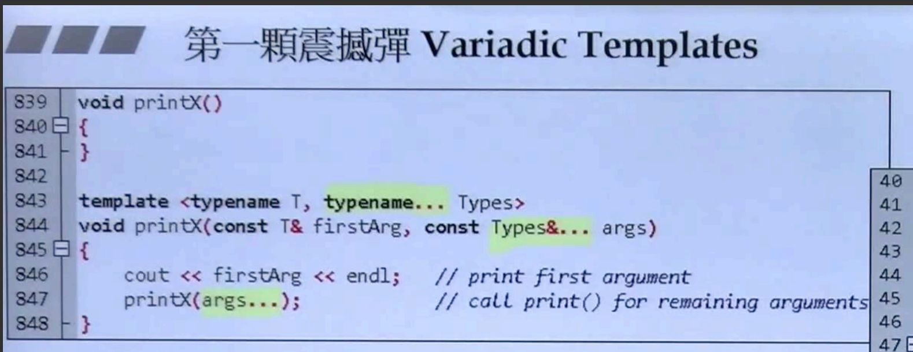
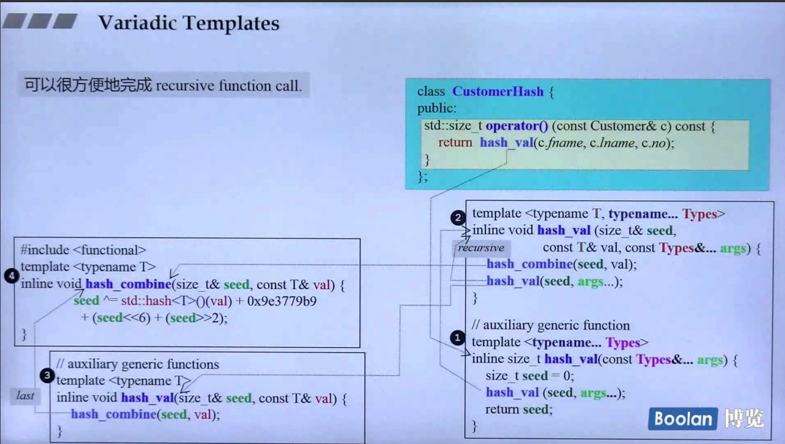

# 04-C++新标准 C++11&14
## 前言
本文是我看侯捷老师 C++11 课程视频做的简短的笔记，主要便于后续复习，做笔记的思路来源于
- [侯捷——C++面向对象高级开发（上）（面向对象程序设计）学习笔记 - 知乎](https://zhuanlan.zhihu.com/p/351925048)
- [侯捷——C++面向对象高级开发（下）（兼谈对象模型）学习笔记 - 知乎](https://zhuanlan.zhihu.com/p/352104978)  
感兴趣的小伙伴可以看下这位大佬的笔记，我这里只是拙劣模仿，仅供参考

## 1. 演进、环境与资源

介绍了 C++2.0 版本头文件的变化，还有一些网站、书、工具啥的，感觉要不太古老，要不就是已经知道了，这节没必要深究

## 2. Variadic Templates

数量不定的模板参数




- 递归处理参数，每次参数个数减一，直到没有参数调用上面没有参数的 `print` 函数，如果没有这个函数程序将会出错
- 调用 `sizeof...(args)` 可以参考有多少个参数



- 有多个模板参数函数时，调用的时候看哪个更加特化，先调用特化版本的，再调用泛化版本的


- 利用可变模板参数进行递归的继承
- tuple 可以放入任意的对象（类型也任意）

## 3. Spaces in Template Expression、nullptr、auto


```
vector<list<int> >; // ok in each C++ version
vector<list<int>>;  // ok since C++11
```

- C++11 之前模板类型之间直接需要加个空格
- C++11 之后不需要多余的空格

### nullptr and std::nullptr_t


- nullptr 代替了之前的 0/NULL，避免使用 NULL 的时候可能出现歧义的情况

### Automatic Type Deduction with auto


- 利用 `auto` 关键字可以进行类型自动推导
- `auto` 一般用于类型比较长的情况，像迭代器、lambda 表达式等等


## 4. Unifrom Initialization


- C++11 之前初始化变量/对象可能会混淆用小括号、大括号、赋值等等进行初始化
- 现在可以统一的在变量/对象之后直接用大括号进行初始化
- 当遇见大括号的时候，其实编译器是生成一个 `initializer_list<T>`
	- 对于容器来说会有一个接收 `initializer_list<T>` 的构造函数，会直接调用
	- 而没有 `initializer_list<T>` 的构造函数的则会将里面的值一个一个分解传给构造函数

## 5-6. Inititalizer List


- 利用 Initalizer list 可以用来初始化一个变量或者指针类型，大括号里面不写的话默认是 0/nullptr
- 对于类型不一致的会报错，实际中编译器会发出警告


- C++11 提供了一个模板类 `std::initializer_list<>`，它可以放在任何你想处理一系列值的地方，比如上面作为 `print` 函数参数，可以直接用大括号作为参数传给 `print`


- 对于左边的 P 类，下面三个构造函数，小 p 用的是小括号，直接调用的是版本 1 构造函数，q、r、s 都是大括号所以调用的是版本 2 构造函数
- 如果没有版本 2 构造函数，对于 q、s 会将值拆解为两个，然后调用版本 1 的构造函数，而 r 没有对应 3 个参数的构造函数会报错

- 右边是 `initializer_list` 的源代码，中间标记的话是编译器可以调用那个私有的构造器，正常情况是不能直接调用 `private` 的构造器的，只有当编译器看见大括号的时候会直接调用
- `initializer_list` 内部是有一个指向 `array` 头部的迭代器
- **注意**：`initializer_list` 内部并没有 `array` 里面的数组，只是有一个指向头部的指针，如果拷贝一个 `initializer_list` 对象，只是将指针指向原来的对象，相当于是一个 **浅拷贝**


- `array` 相当于是对内部的数组进行了封装，对于 STL 来说主要通过迭代器来使用一些算法等，内置的数组不支持迭代器，而 `array` 是支持的


- 这张图其实就是说明 C++11 之后所有的容器包括算法，都可以使用 `initializer_list` 来进行构造/拷贝/赋值等

以下是例子：


值得注意的是 `min/max` 之前只能传入 2 个参数，现在可以通过 `initializer_list` 接收任意参数

## 7. Explicit

C++11 之前：


- 对于左边的情况，`c2 = c1+5` 的时候，首先会根据 c1 找到 `operator+` 操作符，然后因为构造函数中第二个参数默认是 0，所以能够将 5 隐式的转换为一个 Complex 类型即 `5 + 0i` ，再通过 `operator+` 进行相加
- 如果不想让编译器进行自动的转换，可以加一个 `explicit` 关键字
- `explicit` 关键字在 C++11 之前只能加在一个参数的构造函数之上，C++11 之后多个参数也可以使用 `explicit` 参数避免隐式的转换

C++11 之后：  


## 8. Range - based for statement

```cpp
for (decl : coll) {
	statement;
}

for (int i : {1, 2, 3, 4, 5, 6}) {
	cout << i << endl;
}

vector<int> vec;
...
for (auto elem : vec) {
	cout << elem << end;
}
// 加引用版本
for (auto &elem : vec) {
	elem *= 3;
}
```
- for loop 循环直接从容器中取出
- 加引用版本改变值的时候会改变原容器的内容


- 右边通过迭代器遍历和左边 for 循环等价


- `explicit` 禁止了字符串向 `string` 自动转换

## 9. default，delete


- 如果你自己定义了一个构造函数，编译器不会提供构造函数
- 如果加上 =default 关键字，就重新获得一个默认的构造函数
- =delete 关键字表示，这个函数不能被使用，编译器也不会自动生成


- 拷贝构造/拷贝赋值函数不能够被重载
- 一般的函数没有 default 版本，写上 =default 会报错，但是写上 =delete 仍可运行


- 编译器会自动生成默认版本的函数


- 一个类如果带有指针成员，需要自己实现 Big-Three
- 如果没有指针，绝大部分使用默认的即可
- 例如字符串需要实现 Big-Three，甚至是 Big-Five，而 `Complex<T>` 则不需要

>这里说明一下视频里提到的 Big-Three/Five  
>编译器一般会自动生成拷贝构造、拷贝赋值函数和析构函数，这三个当中如果你自己实现了某个版本，那么对于编译器将不会自动提供其他两个，所以往往将这三个看成一个整体，如果要实现某个版本的函数，还需要同时实现其他两个版本，到了 C++11 之后加上了移动构造函数和移动赋值，所以就是将 5 个看成一个整体


- 如果想让类不能被拷贝，在拷贝构造/拷贝赋值加上 =delete 关键字
- 在类的析构函数加上 =delete 关键字，此时不能直接删除该类

## 10. Alias Template


- 使用 `using` 关键字可以对模板类创建一个别名，可以直接用来使用
- 用宏或 `typedef` 无法达到相同的效果
- 不能对 alias template 进行特化或偏特化


- 这里开始我们想实现一个函数接受两个参数，一个是容器 C，另外一个是变量 T，使用的时候创建一个类型为 T 的容器 C，但是直接是不可以的


- 通过容器中的迭代器萃取机智，可以将类型提取出来，但是如果不使用迭代器萃取机制能否实现原函数的功能？

## 11. Template template parameter


- 模板模板类，顾名思义就是一个类模板中参数为另外一个模板
- 利用模板模板类，可以实现前面的函数功能，但此时由于容器推导过程中需要两个参数，所以需要利用 alias template 方法来实现
- 这两讲感觉挺深入的，建议听视频理解一下，我这里表述可能不够清晰

## 12. Type Alias, noexcept, override, final
### Type Alias


- 借助 `using` 关键字创建一个类型的别名
- 使用 `type alias` 和 `typedef` 没有太大区别


- 所有使用 `using` 关键字的地方：
- 使用命名空间、使用其他命名空间的函数或类型、加上现在的 type alias 和 alias template

### noexcept


- 在函数后面写上 `noexcept` 关键字保证这个函数不会丢出异常
- 也可以在 `noexcept` 后面加上小括号表示满足某个条件不会丢出异常
- 异常会进行传递，加入 A 调用 B，B 出现异常之后会传递给 A，A 会接着传递，一直没有处理的话，会调用 `std::terminate()`，它会默认调用 `std::abort()`，最终程序中断


- 类中有移动构造和移动赋值函数时，如果被放在 vector 当中，需要在移动构造/赋值函数加上 `noexcept` 关键字，否则 vector 在 ==grows== 的时候不会被调用移动构造/赋值函数
- 为什么要调用移动构造/赋值函数？相比拷贝构造/赋值而言，移动的效率更高
- grows 是什么？就是 vector 在容量不足的时候会自动扩容，每次以 2 倍容量进行增加

### override


- `override` 关键字用在虚函数上
- 如果子类在重写父类虚函数的时候，函数名不小心写错了，那么编译器会认为子类这个函数是一个新的函数，而不是继承父类的虚函数
- 如果在子类重写父类虚函数时，加上 `override` 关键字表示这就是从父类继承而来的函数，这时候如果函数名写错了，编译器会报错

### final


- `final` 修饰 class 表示这个类不会被继承
- `final` 修饰虚函数表示这个函数不会被子类重写

## 13. decltype


- 使用 `decltype` 关键字可以获得表达式的类型
- `decltype` 三种应用场景：
	- 1）用来声明一个返回值
	- 2）模板元编程
	- 3）传递 lambda 表达式的类型


- `decltype` 用来声明一个返回值类型
- 上述开始例子让返回类型为 x + y，但是 x + y 不能参数定义前使用，所以 C++11 出现新的方法，利用 auto 自动推导类型


- 通过 `decltype` 获得模板类的类型


- `decltype` 用来推导 lambda 表达式的类型

## 14. Lambda


- 使用 Lambda 表达式可以创建函数对象


- 这张展示了 Lambda 表达式详细形式，其中中间三个可以省略
- `[...]` 中间表示是否取用外面的的变量，用的时候加上 & 表示传引用，否则为传值
- `(...)` 里面放的是参数列表
- `{...}` 里面是具体的语句块


- 在 `[]` 中没有加 & 表示传值，此时相当于创建一个含有 id 的匿名函数对象


- 没有加上 `mutable` 关键字的时候通过传值的变量，不能够直接通过 `++` 等操作符改变变量的值


- 这张图看着有点复杂，其实就是使用关联式容器的时候，我们可以自定义排序方法，此时可以使用 Lambda 表达式，同时使用 `decltype` 关键字可以自动推导出 Lambda 表达式的类型
- 但是需要注意的是，同时需要将 Lambda 表达式作为参数传给 set 容器，否则 set 会自动调用模版参数中传入的函数对象的默认构造函数作为排序的准则，但是对于 Lambda 表达式来说没有默认的构造函数，结果会报错
- 这里相当于是如果没将 cmp 传给 coll，coll 相当于只获得以 cmp 的类型，但是没有获得具体的 cmp，就会调用对于 decltype(cmp) 类型的默认构造函数，但是 Lambda 表达式并没有默认构造函数

## 15-21. Variadic Templates


- C++11 之后，模版的参数列表也可以省略，表示可以接收多种类型/多个参数


- 第一个例子是实现一个可以打印任意个/任意种类参数的函数，通过参数逐渐减少，递归的方法实现
- 注意：打印 firstArg 的时候，如果不支持 cout，会出现错误，即如果是打印自己定义的类型，需要重载 << 操作符
- 图中的 1 和 3 可以同时存在，会优先调用更加特化的版本 1


- 第二个例子是利用 variadic templates 重写 printf 函数，这里是用 C++ 模拟 C 中 `printf` 的实现，正常情况下是无法传入可变的参数类型/个数，使用 variadic templates 就可以实现


- 从第三个例子开始是需要实现一个可以传入任意数量的 max 函数
- 如果类型都相同的话，可以直接使用 initializer list 来实现 max 函数


- 如果不想使用 initializer list 实现 max 函数的话，可以通过 variadic templates 写法传入多个参数，内部进行递归调用即可


- `sizeof...(Args)` 获得参数个数
- 第五个例子是递归的创建 PRINT_TUPLE 模板函数，然后根据 `get<index>(t)` 获得第 `index` 个元素，直到 IDX == MAX 调用最下面的函数，递归终止


- 第六个例子是介绍 tuple 源代码的实现
- variadic templates 用来递归的继承，tuple 每次会继承自一个参数减 1 的父类，直到最终没有参数
- 上面代码有个问题，通过 `typename Head::type` 获取 Head 的类型，这里编译器会出错


- 可以想到前面的 `decltype` 来获取返回值类型
- 这样的话需要用尾置返回类型，同时还需要将 m_head 的声明提到前面


- 但其实直接返回 Head 即可，前面的写法完全多此一举


- 第七个例子是像 tuple 一样进行仿写，不同的是这里用的是复合，每个类中包含更小的类

### C++ keywords


## 22. 标准库源代码分布

一般通过 IDE 可以快速定位源代码，所以感觉没必要自己一个一个去找源代码来看

## 23. Rvalue references and Move Semantics
### Rvalue references


- 右值引用可以用来解决不必要的拷贝
- 左值一般指在赋值运算符左边的变量，而右值是赋值运算符右边的部分，一般为临时对象


- `foo()` 表示调用函数返回的内容，不能直接取地址，如果是对 `foo` 取地址是可以的，表示取得是 `foo` 函数指针的地址


- 这张内容较多，首先看下右边 `test_moveable` 函数，中间的 `c.insert()` 使用 `Vtype(buf)` 相当于创建了一个临时对象，传给容器 c，而对于右值 C++11 之后可以用 `&&` 表示对右值进行引用，在容器 c 的 `insert` 函数中就会优先调用版本 2（传入的是右值），版本 2 的 `insert` 会调用 `MyString` 的移动构造函数，此时将临时对象移动到容器 c 中
- 移动的时候，相当于一次浅拷贝，只是将原来的数据的指针交给新的数据，这样的话对于原来的数据就不能继续使用了
- 对于左值如果想通过移动语义进行转移，可以使用 `std::move()` 函数，注意原来的数据不能再被使用


- 这里展示了两个 `insert` 函数的具体源代码，4.9 版本下面的是右值引用版本

## 24. Perfect Forwarding


- 完美转发就是使参数在调用的过程中保持原来的特性，比如说 `const`、左值、右值等等


- 这页介绍了不完美的情况，前三个调用 `process()` 都可以调用相应的版本，而调用 `forward(2)` 的时候，在传递的过程中发生了一些变化，导致右值变成了左值，这样的实现就是不完美的


- 标准库提供了一个完美转发的函数 `forward` ，上面是源代码，详细内容不看了，知道有这个东西怎么用就行

## 25. 写一个 Move-aware class


- 设计一个带有 move 特性的类，黄色部分是为了测试而用，实际不需要
- 类似拷贝构造/赋值函数的写法，移动构造/赋值只是在参数上加上了两个 &
- 看下移动构造函数，在 initializer list 中先进行对 `str` 中的数据进行一次拷贝，然后将 `str` 置为 NULL，长度设为 0，这样就符合移动语义，对于移动后原来的数据不再能被使用


- 移动赋值函数和移动构造其实差不多，写法类似
- 在析构函数中，会检查 `_data` 是否为空，不为空的需要 delete，这就配合了上面移动构造/赋值置空的操作，加入不写判断直接删除的话，可能会将一个 NULL 进行 delete ，就会出现问题
- 这页其他部分，比如 operator 重载操作符以及 hash 函数是为了后面 `set` 等容器测试用的

## 26. Move-aware class 对容器性能测试


- 这是测试程序，相当于是调用两种版本，一个是带有 move 语义的类，另外一个则没有 move 语义，两者测试的时候主要是调用时间以及构造函数调用的次数
- 中间的部分是分别进行拷贝、移动以及交换元素


- 重点看下 vector，调用次数是 300 万次，但是可以看到构造函数调用的次数超过 700 万次，主要是因为 vector 会有自身增长的过程，会再次调用构造函数
- 对于移动构造和拷贝构造速度上差别较大
- 然后是中间的拷贝测试，可以看到拷贝的时间较长，而移动和交换时间几乎为 0，后续几个测试也是这样


- 这几个是对 list、deque、multiset 和 unordered_multiset 的测试，其实几个相对而言差别不大，对于拷贝和移动调用 300 万次的时间也差不多


- 这里解释了上面关于容器本身进行拷贝、移动的测试为啥时间差距较大
- 对于 vector 的自身拷贝版本，会将原来的从头到尾拷贝一次，而移动版本只是将对应的指针进行交换，这就是为啥两者时间差距较大的原因

## 27. 容器——新旧容器比较


- 红色部分为 C++11 新增加的容器，有 Array、forward_list 和 unordered containers

## 28. Array


- array 相当于对 C++ 的原始数组进行一个封装，没有构造/析构函数


- G4.9 版本的 array 较为复杂，重点看右边蓝色部分，可以用 typedef 对一个固定长度的数组起别名，侯捷老师都说了不太欣赏这个版本，建议也不用多看了（逃~）

## 29. Hashtable


- Separate Chaining：分离链接法实现 hashtable，具体内容建议去其他地方看看吧

## 30. Hash Function

- Hash function 就是将任意类型的变量计算出对应的 hash code


- 好像我看的视频少了一节，应该就是介绍一下 unordered 容器，其实并不难，经常刷力扣都会用到的


- 这是直接使用标准库里面的 hash function，用两个小括号是因为第一个是创建一个函数对象，第二个是进行调用
- C++11 之前没有处理 string 类型的 hash function


- 这里都是 hash 类的特化版本，对于整型类型的参数，直接返回原来的值即可

  


- 这是 G2.9 版本针对 C 语言类型字符串的 hash function

  
  


- G4.9 版本对所有基本类型都进行特化，这三张看着内容比较多，其实没啥必要细看，大概知道标准库实现了这些 hash function 即可


- 这个是字符串实现的 hash function


- 对于一般的类型该怎么实现 hash function 呢？
- 并不能简单的将每个成员变量拿出来分别计算 hash code，然后再加起来


- PPT 上面给的具体实现方法，好像没有这节课的视频，很神奇，不过这部分看着也比较难，跳过也无妨


- 介绍了一下黄金分割比？？？

## 31. Tuple


- tuple 在前面 variadic template 已经说过了，这里重点说一下使用方法
- sizeof(t) 是 32 不是 28，老师说他也不知道，哈哈
- `get<idx>(t)` 可以获得 tuple 类型 t 中的第 idx 个元素
- `make_tuple` 可以创建一个 tuple
- tuple 可以直接进行比较、赋值以及直接使用 cout 打印输出
- 使用 `tie` 将多个类型的元素进行捆绑然后可以拿 tuple 类型进行赋值
- `tuple_size<TupleType>::value` 获取 tuple 中有几个类型
- `tuple_element<idx, TupleType>::type` 获取 tuple 第 idx 个元素的类型


- 最后两张就是 tuple 没放入标准库之前，类型的版本

## 小结

这门课比我预想的花费时间要少，大概花了 6h，因为开了 2 倍数，之前有的部分也接触过，所以看的比较快，不过这门课和之前看过的《 Modern Effective C++ 》那本书来说感觉内容可能浅一点，Modern 那本书感觉有点难，这门课感觉就刚刚好

写于 2022/10/19 21:23
