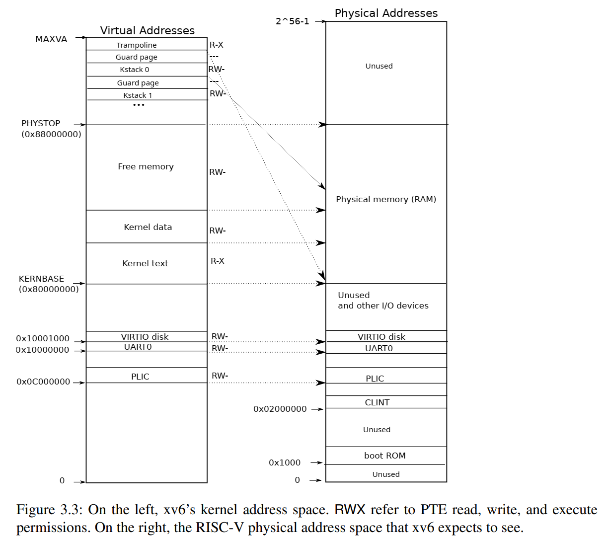
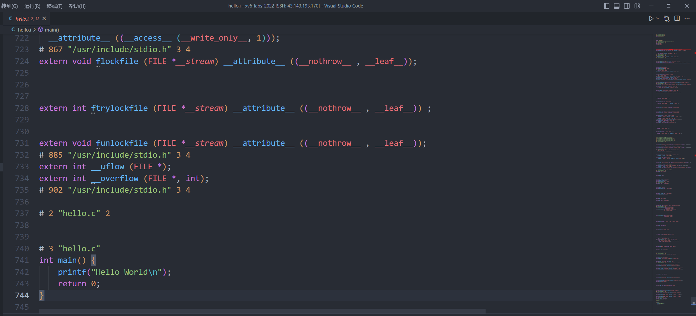
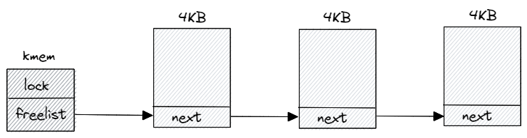

#! https://zhuanlan.zhihu.com/p/643749962
# xv6 物理内存管理
## 物理内存布局

上一篇内核启动中，我们知道启动 xv6 的时候 Qemu 设置了物理内存参数为 128M，这部分物理内存对应的地址是 `[0x80000000, 0x88000000]`，可以看下 xv6-book 上面的图：

<!--  -->


`0x80000000` 地址以下是其他的设备，虚拟地址中这部分是直接映射到对应的物理地址上的。但是对于物理内存来说，就不完全是对应的了，而是采用了复杂的页表机制。

在 `kernel/memlayout.h` 文件中也定义了相关的宏，`[KERNBASE, PHYSTOP]` 就是对应的物理内存区间。

```c
// the kernel expects there to be RAM
// for use by the kernel and user pages
// from physical address 0x80000000 to PHYSTOP.
#define KERNBASE 0x80000000L
#define PHYSTOP (KERNBASE + 128*1024*1024)
```

## xv6 是如何运行的？

上篇说到 Qemu 启动的时候，会先将必要的文件加载到 Qemu 模拟的物理内存上，然后执行一些 Qemu 的指令后会跳转到 `0x80000000` 对应的指令。

但是这里有很多问题，比如说哪些是必要的文件？xv6 中那么多文件是如何组织的？为什么 `0x80000000` 对应的就是内核第一条指令？等等

为了解答以上的疑惑，我们需要先来看一下对于一个普通程序是如何运行的（因为 xv6 本身也是一个程序），以最经典的 hello world 为例：

```c
#include <stdio.h>

int main() {
    printf("Hello World\n");
    return 0;
}
```

可以使用 gcc 编译上面的程序：

```shell
$ gcc hello.c
$ ./a.out
Hello World
```

当实际上上面的过程可以分为 4 个步骤：**预处理**、**编译**、**汇编**和**链接**。

**预处理**

可以通过 `gcc -E hello.c -o hello.i` 得到预处理后的文件 `hello.i`。预处理会做以下事情：
- 预处理会将所有的 `#define` 删除，并展开宏定义；
- 会处理条件编译预编译指令，如 `#if`、`#ifdef`、`#elif`、`#else`、`#endif` 等；
- 处理 `#include` 预编译指令，将被包含的文件插入到该预编译的位置（这个过程可能是递归的）；
- 删除所有注释；
- 添加行号，编译编译器产生调试信息的的行号，以及编译错误或警告时能显示行号；
- 保留所有的 `#pragma` 编译器指令，编译器需要使用它；

可以打开预处理得到的 `hello.i` 文件：

<!--  -->


可以发现仅仅 3 行代码的 hello 程序经过预处理之后，长度达到了 700 多行。

**编译**

编译过程是将预处理得到的文件经过一系列的词法分析、语法分析、语义分析和目标代码优化来产生汇编代码文件（详细内容请参考编译原理相关书籍）。可以通过 `gcc -S hello.i -o hello.s` 命令得到汇编文件。

**汇编**

汇编是将汇编代码转化为机器可执行指令，生成可重定位目标文件。每条汇编语句都对应一条机器指令，汇编器只需要根据汇编指令和机器指令的对照表一一翻译即可。可以通过汇编器 `as` 或 `gcc -c` 来完成：

```shell 
$ as hello.s -o hello.o
$ gcc -c hello.s -o hello.o 
```

**链接**

链接器会将所有的可重定位目标文件以及需要的库文件组合成一个可执行的二进制文件。可以用 `ld hello.o -o hello -lc` 命令生成可执行二进制文件（但实际上这样是没法运行的，因为还需要链接上其他的可重定位目标文件）

对于 xv6 来说，也是以上分为以上几个步骤，但是一般来说 Linux 环境是 x86 架构的，而 xv6 是 RISCV 的，不能直接本地编译，需要交叉编译，这也是为什么配置环境的时候需要安装 `riscv64-linux-gnu-gcc` 等工具链。

启动 Qemu 的时候，我们需要执行 `make qemu` 命令，然后就可以看到具体的编译过程，这里调出来一些内容：

```cpp
$ make qemu
riscv64-unknown-elf-gcc    -c -o kernel/entry.o kernel/entry.S
riscv64-unknown-elf-gcc -Wall -Werror -O -fno-omit-frame-pointer -ggdb -gdwarf-2 -DSOL_UTIL -DLAB_UTIL -MD -mcmodel=medany -ffreestanding -fno-common -nostdlib -mno-relax -I. -fno-stack-protector -fno-pie -no-pie  -c -o kernel/kalloc.o kernel/kalloc.c
riscv64-unknown-elf-gcc -Wall -Werror -O -fno-omit-frame-pointer -ggdb -gdwarf-2 -DSOL_UTIL -DLAB_UTIL -MD -mcmodel=medany -ffreestanding -fno-common -nostdlib -mno-relax -I. -fno-stack-protector -fno-pie -no-pie  -c -o kernel/string.o kernel/string.c
...
riscv64-unknown-elf-ld -z max-page-size=4096 -N -e start -Ttext 0 -o user/initcode.out user/initcode.o
riscv64-unknown-elf-objcopy -S -O binary user/initcode.out user/initcode
riscv64-unknown-elf-objdump -S user/initcode.o > user/initcode.asm
riscv64-unknown-elf-ld -z max-page-size=4096 -T kernel/kernel.ld -o kernel/kernel kernel/entry.o kernel/kalloc.o kernel/string.o kernel/main.o kernel/vm.o kernel/proc.o kernel/swtch.o kernel/trampoline.o kernel/trap.o kernel/syscall.o kernel/sysproc.o kernel/bio.o kernel/fs.o kernel/log.o kernel/sleeplock.o kernel/file.o kernel/pipe.o kernel/exec.o kernel/sysfile.o kernel/kernelvec.o kernel/plic.o kernel/virtio_disk.o kernel/start.o kernel/console.o kernel/printf.o kernel/uart.o kernel/spinlock.o
riscv64-unknown-elf-objdump -S kernel/kernel > kernel/kernel.asm
riscv64-unknown-elf-objdump -t kernel/kernel | sed '1,/SYMBOL TABLE/d; s/ .* / /; /^$/d' > kernel/kernel.sym
...
```

大概可以看到先通过 `riscv64-unknown-elf-gcc` 将源代码进行编译得到可重定位目标文件，然后通过 `riscv64-unknown-elf-ld` 将可重定位目标文件链接成 `kernel/kernel` 可执行文件。

对于可重定位文件来说，一般是按照段进行组织的，比如程序源代码编译后机器指令被放在**代码段**(.text)，已经初始化的全局变量和局部静态变量放在**数据段**(.data)，未初始化的全局变量和局部静态变量放在**BSS 段**(.bss)，除此之外还包含只读数据段 (.rodata)、注释信息段 (.comment) 和调试信息段 (.debug) 等等。

可以通过 `riscv64-unknown-elf-objdump -h kernel/kernel` 来查看 kernel 的各个段的信息，其中包含了每个段的大小，虚拟地址和加载地址等等：

```shell
$ riscv64-unknown-elf-objdump -h kernel/kernel

kernel/kernel:     file format elf64-littleriscv

Sections:
Idx Name          Size      VMA               LMA               File off  Algn
  0 .text         00008000  0000000080000000  0000000080000000  00001000  2**4
                  CONTENTS, ALLOC, LOAD, READONLY, CODE
  1 .rodata       00000840  0000000080008000  0000000080008000  00009000  2**3
                  CONTENTS, ALLOC, LOAD, READONLY, DATA
  2 .data         00000044  0000000080008840  0000000080008840  00009840  2**3
                  CONTENTS, ALLOC, LOAD, DATA
  3 .bss          000194a0  0000000080008890  0000000080008890  00009884  2**4
                  ALLOC
  4 .riscv.attributes 00000039  0000000000000000  0000000000000000  00009884  2**0
                  CONTENTS, READONLY
  5 .comment      0000002a  0000000000000000  0000000000000000  000098bd  2**0
                  CONTENTS, READONLY
  6 .debug_info   00011b2d  0000000000000000  0000000000000000  000098e7  2**0
                  CONTENTS, READONLY, DEBUGGING, OCTETS
  7 .debug_abbrev 00003098  0000000000000000  0000000000000000  0001b414  2**0
                  CONTENTS, READONLY, DEBUGGING, OCTETS
  8 .debug_loc    0000fc89  0000000000000000  0000000000000000  0001e4ac  2**0
                  CONTENTS, READONLY, DEBUGGING, OCTETS
  9 .debug_aranges 00000450  0000000000000000  0000000000000000  0002e135  2**0
                  CONTENTS, READONLY, DEBUGGING, OCTETS
 10 .debug_line   0000a600  0000000000000000  0000000000000000  0002e585  2**0
                  CONTENTS, READONLY, DEBUGGING, OCTETS
 11 .debug_str    00000f78  0000000000000000  0000000000000000  00038b85  2**0
                  CONTENTS, READONLY, DEBUGGING, OCTETS
 12 .debug_frame  00002d70  0000000000000000  0000000000000000  00039b00  2**3
                  CONTENTS, READONLY, DEBUGGING, OCTETS
 13 .debug_ranges 00000830  0000000000000000  0000000000000000  0003c870  2**0
                  CONTENTS, READONLY, DEBUGGING, OCTETS
```

这里另外的问题是多个可重定位文件是如何组织的？实际上是根据链接器脚本文件控制的，可以查看 `kernel/kernel.ld` 文件：

```ld
OUTPUT_ARCH( "riscv" )
ENTRY( _entry )

SECTIONS
{
  /*
   * ensure that entry.S / _entry is at 0x80000000,
   * where qemu's -kernel jumps.
   */
  . = 0x80000000;

  .text : {
    *(.text .text.*)
    . = ALIGN(0x1000);
    _trampoline = .;
    *(trampsec)
    . = ALIGN(0x1000);
    ASSERT(. - _trampoline == 0x1000, "error: trampoline larger than one page");
    PROVIDE(etext = .);
  }

  .rodata : {
    . = ALIGN(16);
    *(.srodata .srodata.*) /* do not need to distinguish this from .rodata */
    . = ALIGN(16);
    *(.rodata .rodata.*)
  }

  .data : {
    . = ALIGN(16);
    *(.sdata .sdata.*) /* do not need to distinguish this from .data */
    . = ALIGN(16);
    *(.data .data.*)
  }

  .bss : {
    . = ALIGN(16);
    *(.sbss .sbss.*) /* do not need to distinguish this from .bss */
    . = ALIGN(16);
    *(.bss .bss.*)
  }

  PROVIDE(end = .);
}
```

稍微解释一下链接器脚本文件的语法：
- `ENTRY( _entry )` 是设置整个程序的入口点，这里设置 `_entry` 符号为入口点；
- `.` 表示当前的位置，开始的时候 `. = 0x80000000;` 是将入口点设置为 `0x80000000` ；
- 接下来是控制每个段，告诉链接器如何把输入段映射到输出段，以及内存中如何存放这些段（以 `.text` 为例）：
	- `.text` 表示段的名字
	- `*(.text .text.*)` 是指将每个文件中的 `.text` 和 `.text.*` 段都放到 `kernel` 的 `.text` 段上，`*` 是通配符，匹配所有文件；
	- `ALIGN(0x1000)` 是返回下一个与 0x1000 字节对齐的地址，它是基于当前位置来计算对齐地址的，所以 ` . = ALIGN(0x1000);` 就是将当前地址设置为对齐地址；
	- `_trampoline = .;` 指的是 `_trampoline` 设置为当前地址；
	- `PROVIDE` 函数是从链接脚本导出一个符号，这个符号只有在其他地方没有定义才会生效，`PROVIDE(etext = .);` 就是设置 etext 为 .text 段结束的地址；

当所有段都设置好了， `PROVIDE(end = .);` 提供了 end 符号，表示可重定位文件结束地址；

所以最后实际上对于物理内存 `[0x80000000, end]` 这块区域存放的二进制执行文件，而剩下的 `[end, PHYSTOP]` 才是真正需要由 xv6 管理的物理内存。

所以回到标题 xv6 是如何运行的？大概就是由我们本地的系统进行交叉编译，得到二进制执行文件，然后存放在物理内存 `[0x80000000, end]`，Qemu 启动的时候会跳转到这个地址，然后执行相应的指令，xv6 也就运行起来了。（以上只是我的个人理解，欢迎大佬指正）

## 空闲链表管理

前面分析可知，实际上需要由 xv6 本身管理的内存是 `[end, PHYSTOP]` 这块区域。对于 xv6 来说采用了非常简单的空闲链表管理，即将内存按照 4KB 来组织，每块内存通过链表进行管理，需要分配内存的时候从链表中找到一块区域返回，释放内存的时候再将内存放入链表中。

具体看下代码（`kernel/kalloc.c`）：

```c
extern char end[]; // first address after kernel.
                   // defined by kernel.ld.

struct run {
  struct run *next;
};

struct {
  struct spinlock lock;
  struct run *freelist;
} kmem;
```

首先定义了一个全局的 kmem 结构体来管理整个空闲链表，空闲链表实际上利用了嵌入式指针来进行管理，具体就是将这块区域的前 8 个字节当成一个指针，指向下一块区域。

```c
void
kinit()
{
  initlock(&kmem.lock, "kmem");
  freerange(end, (void*)PHYSTOP);
}

void
freerange(void *pa_start, void *pa_end)
{
  char *p;
  p = (char*)PGROUNDUP((uint64)pa_start); // 按照4KB对齐
  // 每4KB作为一页进行管理
  for(; p + PGSIZE <= (char*)pa_end; p += PGSIZE)
    kfree(p);
}

// Free the page of physical memory pointed at by pa,
// which normally should have been returned by a
// call to kalloc().  (The exception is when
// initializing the allocator; see kinit above.)
void
kfree(void *pa)
{
  struct run *r;
  // 判断地址是否和PGSIZE对齐，是否在[end, PHYSTOP]范围内
  if(((uint64)pa % PGSIZE) != 0 || (char*)pa < end || (uint64)pa >= PHYSTOP)
    panic("kfree");

  // Fill with junk to catch dangling refs.
  memset(pa, 1, PGSIZE);
  // 将地址的前8个字节作为指针
  r = (struct run*)pa;

  acquire(&kmem.lock);
  // 头插法插入到kmem的空闲链表中
  r->next = kmem.freelist;
  kmem.freelist = r;
  release(&kmem.lock);
}
```

初始化的时候，先初始化锁，然后通过 `freerange()` 函数遍历每个页，接着调用 `kfree()` 。kfree 想判断地址是否对齐，是否在 ` [end, PHYSTOP]` 范围内，然后填充垃圾数据，在利用嵌入式指针，插入到 kmem 的空闲链表中。

```c
// Allocate one 4096-byte page of physical memory.
// Returns a pointer that the kernel can use.
// Returns 0 if the memory cannot be allocated.
void *
kalloc(void)
{
  struct run *r;

  acquire(&kmem.lock);
  r = kmem.freelist;
  if(r)
    kmem.freelist = r->next;
  release(&kmem.lock);

  if(r)
    memset((char*)r, 5, PGSIZE); // fill with junk
  return (void*)r;
}
```

分配一页时候，从 kmem 的空闲链表中取出一页返回。

空闲链表用图示大概就是这个样子：

<!--  -->


## 参考资料

- 《程序员自我修养——链接、转载与库》
- 《RISC-V 体系结构编程与实践》