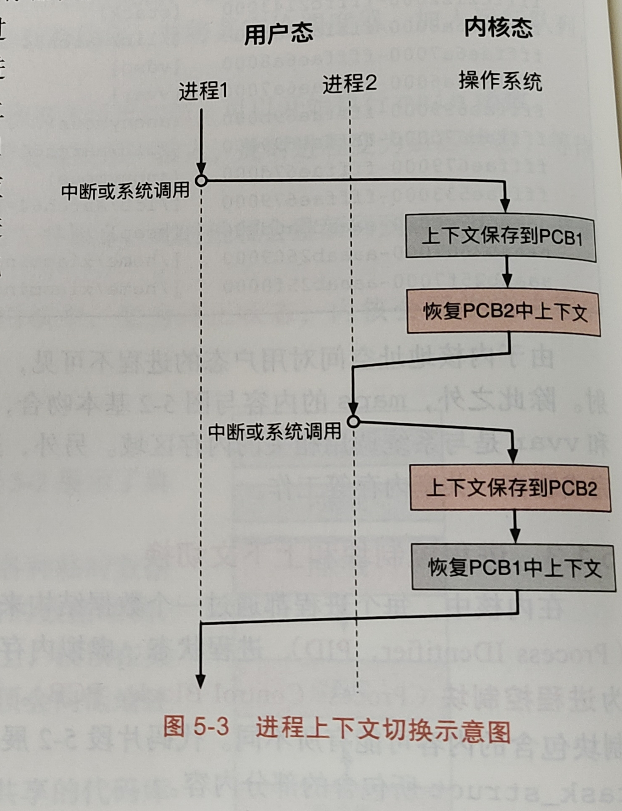
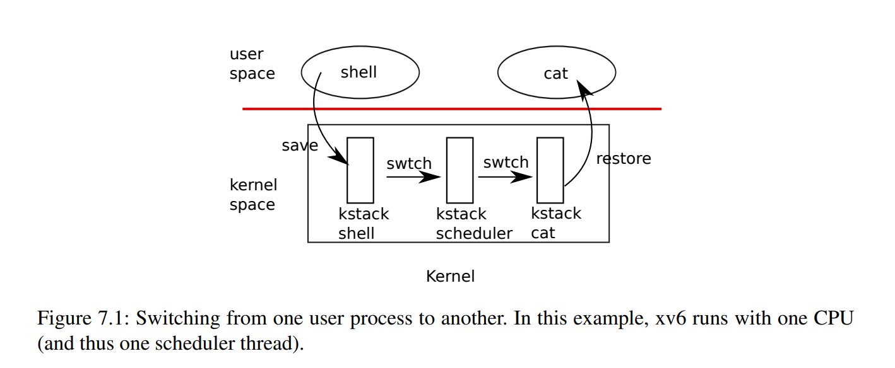

#! https://zhuanlan.zhihu.com/p/646876948
# xv6 进程管理
## 进程理论基础
### 1. 抽象：进程

操作系统为了管理各种各样程序的运行，提出了**进程**的抽象，每个进程都对应一个程序，有了进程的抽象，仿佛应用程序占用了整个 CPU，而不需要考虑何时需要将 CPU 让给其他程序；进程的管理、CPU 的资源分配是交给操作系统来处理的；

进程是由哪些部分组成的？需要了解一下机器状态：  

**机器状态**：程序在运行时可以读取或更新的内容，包括以下几个部分：
- 内存：指令存放在内存中，进程读取写入的数据也存放在内存中，进程可以访问的地址（称为地址空间）是进程的一部分；
- 寄存器：许多指令可以读取或更新寄存器；
	- 程序计数器 (PC)：告诉我们当前正在执行的指令；
	- 栈指针和帧指针：用于管理函数参数栈、局部变量和返回地址；
- 持久性设备：I/O 信息可能包含打开的文件列表。

### 2. 进程 API

现代操作系统都以某种形式提供下面几种 API：

1. **创建**：操作系统必须包含一些创建新进程的方法。在 shell 中键入命令或双击应用程序图标时，会调用操作系统来创建新进程，运行指定的程序。
2. **销毁**：由于存在创建进程的接口，因此系统还提供了一个强制销毁进程的接口。当然，很多进程会在运行完成后自行退出。但是，如果它们不退出，用户可能希望终止它们，因此停止失控进程的接口非常有用。
3. **等待**：有时等待进程停止运行是有用的，因此经常提供某种等待接口。
4. **其他控制**：除了杀死或等待进程外，有时还可能有其他 控制。例如，大多数操作系统提供某种方法来暂停进程（停止运行一段时间），然后恢复（继续运行）。
5. **状态**：通常也有一些接口可以获得有关进程的状态信息，例如运行了多长时间，或者处于什么状态

### 3. 进程创建

操作系统运行程序必须做的第一件事是将代码和所有静态数据（例如初始化变量）**加载** 到内存中，加载到进程的地址空间中。程序最初以某种可执行格式驻留在磁盘上（ 或 SSD 上）。因此，将程序和静态数据加载到内存中的过程， 需要操作系统从磁盘读取这些字节， 并将它们放在内存中的某处（见图 4.1）。


操作系统运行程序需要进程以下几个步骤：
1. 将代码和静态数据加载的内存中；
2. 为程序的运行时栈分配一些内容，C 语言中栈用来存放局部变量、函数参数和返回地址；
3. 为程序的堆分配一些空间，C 语言中堆用于显示请求动态分配数据，一般通过 malloc() 调用；
4. 执行输入输出相关的任务，默认情况下每个进程都打开 3 个文件描述符，用于标准输入，输出，错误；
5. 启动程序，在入口处运行，即 `main()` 函数。通过跳转到 `main()` 例程，OS 将 CPU 的控制权转移到新创建的进程中，从而程序开始执行。

### 4. 进程状态

**运行：** 该状态下，进程正在处理器中运行；

**就绪：** 就绪态下，进程已准备好运行，但由于某种情况，操作系统此时不运行该进程；

**阻塞/等待：** 阻塞状态下，进程执行了某种操作，直到发生其他事件时才会准备运行。 例如：当进程向磁盘发起 I/O 请求时， 它会被阻塞，因此其他进程可以使用处理器。

除了上述三个状态，一般还有 **创建** 状态，和 **终止** 状态。

<!-- ![[../操作系统导论/pics/processStatus.png]] -->


### 5. 数据结构

每个进程都有一个数据结构来保存它的相关状态，例如进程标识符（PID）、进程状态、虚拟内存地址、打开的文件描述符等。这个数据结构称为**进程控制块**（PCB）。

操作系统可以通过 PCB 来跟踪进程的相关信息，比如跟踪被阻塞的进程，或当 IO 事件完成时，操作系统能够正确的唤醒进程，使其继续运行。

当操作系统需要切换当前运行的进程时，会利用**上下文切换机制**，该机制会将一个进程的寄存器保存到 PCB 中，然后将下一个进程先前保存的状态写入寄存器中，从而切换到这个进程运行；

<!--  -->


## xv6 进程管理
### 1. 进程控制块 PCB

xv6 中进程控制块的定义在 `kernel/proc.h` 中：

```c
// Per-process state
struct proc {
  struct spinlock lock;

  // p->lock must be held when using these:
  enum procstate state;        // Process state
  void *chan;                  // If non-zero, sleeping on chan
  int killed;                  // If non-zero, have been killed
  int xstate;                  // Exit status to be returned to parent's wait
  int pid;                     // Process ID

  // wait_lock must be held when using this:
  struct proc *parent;         // Parent process

  // these are private to the process, so p->lock need not be held.
  uint64 kstack;               // Virtual address of kernel stack
  uint64 sz;                   // Size of process memory (bytes)
  pagetable_t pagetable;       // User page table
  struct trapframe *trapframe; // data page for trampoline.S
  struct context context;      // swtch() here to run process
  struct file *ofile[NOFILE];  // Open files
  struct inode *cwd;           // Current directory
  char name[16];               // Process name (debugging)
};
```

包含了进程的 PID，进程状态，内核栈地址，进程页表等基本内容，大部分内容都会在后面涉及。

xv6 初始化的时候创建了一个进程池（应该可以这样称呼？），当需要进程的时候会从池中找到一个未使用的进程，然后分配出去。进程池的大小为 64，也就是说 xv6 中最多支持 64 个进程同时运行，超过这个数量就不支持了，相关定义如下：

```c
// kernel/proc.c
struct proc proc[NPROC];

// kernel/param.h
#define NPROC        64  // maximum number of processes
```

下面来看下进程的状态，定义在 `kernel/proc.h` 的 procstate 枚举类型中：

```c
enum procstate { UNUSED, USED, SLEEPING, RUNNABLE, RUNNING, ZOMBIE };
```

- SLEEPING 、 RUNNABLE 和 RUNNING 分别表示睡眠、阻塞和正在运行三个状态，这个比较好理解；
- UNUSED：在进程池中，尚未使用，还没有被分配出去；
- USED：刚从进程池中分配出去，但是此时进程相关资源还没分配；
- ZOMBIE：僵尸状态，当一个进程执行完成的时候，会调用 exit 退出，此时进程会进入这个状态，需要等待父进程调用 wait 来回收子进程所有剩下的资源；

当一个子进程执行 exit 退出的时候，但是父进程一直没有调用 wait 来回收子进程的资源，这个时候这个子进程就被称为**僵尸进程**；

如果子进程退出之前，父进程就已经终止了，此时子进程还在运行，这个进程就称为**孤儿进程**，孤儿进程会被 init 进程所接管，最后会由 init 进程调用 wait 来释放资源；

除了每个进程有一个控制块外，每个 CPU 也有一个状态，结构体如下，可以看到对于一个 CPU 来说，它保存了当前运行在 CPU 上的进程状态，以及 context 上下文（下面会提到），另外两个变量与中断相关（以后有机会在分析一下时钟中断和设备中断）；

```c
// Per-CPU state.
struct cpu {
  struct proc *proc;          // The process running on this cpu, or null.
  struct context context;     // swtch() here to enter scheduler().
  int noff;                   // Depth of push_off() nesting.
  int intena;                 // Were interrupts enabled before push_off()?
};
```

CPU 和进程一样也有一个结构体数组，说明 xv6 最多可支持 8 核：

```c
// kernel/proc.c
struct cpu cpus[NCPU];

// kernel/param.h
#define NCPU          8  // maximum number of CPUs
```

### 2. 进程的初始化

进程的初始化，准确来说应该是进程池初始化，因为当进程池初始化完成后，需要进程的时候从池子中取出，释放进程的时候再放回进程池中（这里的取和放，对应的其实就是将进程的状态设为 USED 和 UNUSED），定义在 `kernel/proc.c` 中：

```c
// initialize the proc table.
void
procinit(void)
{
  struct proc *p;
  // 初始化相关的锁
  initlock(&pid_lock, "nextpid");
  initlock(&wait_lock, "wait_lock");
  // 枚举进程池，设置进程状态以及内核栈
  for(p = proc; p < &proc[NPROC]; p++) {
      initlock(&p->lock, "proc");
      p->state = UNUSED;
      p->kstack = KSTACK((int) (p - proc));
  }
}
```

这样需要注意一下 kstack 这个成员变量，它的含义是内核栈，它是在内核物理地址空间中最上面的一块区域，每个栈下面还有一页 PageGuard，为了防止栈溢出；内核栈进程池初始化之前就映射到物理地址上了，在 `kernel/proc.c` 中可以看到 `proc_mapstacks` 函数，它是在内核页表初始化的时候被调用的：

```c
// Allocate a page for each process's kernel stack.
// Map it high in memory, followed by an invalid
// guard page.
void
proc_mapstacks(pagetable_t kpgtbl)
{
  struct proc *p;
  // 枚举进程池
  for(p = proc; p < &proc[NPROC]; p++) {
    // 分配一页物理地址作为内核栈
    char *pa = kalloc(); 
    if(pa == 0)
      panic("kalloc");
    // 计算得到进程内核栈的虚拟地址
    uint64 va = KSTACK((int) (p - proc)); 
    // 在内核页表中建立映射关系
    kvmmap(kpgtbl, va, (uint64)pa, PGSIZE, PTE_R | PTE_W);
  }
}
```

**这里区分一下内核栈和用户栈：**
- 用户栈：用来保存用户进程的一些局部变量，以及函数调用是保存相关的寄存器等；
- 内核栈：当发生系统调用/中断/异常等 trap 的时候，从用户模式切换到内核模式的时候，栈指针就切换为内核栈了，内核栈用来保存内核代码的一些局部变量，以及相应的函数调用需要保存的寄存器等；

所以对于一个进程来说，可以认为它有一个对应的用户线程，以及一个对应的内核线程，一个进程最多只能运行一个线程，要不运行在用户模式下，要不运行在内核模式下。当发现 trap 的时候会从用户线程切换到内核线程；

### 3. 进程的分配

当需要创建一个新的进程的时候，会调用 `allocproc` 函数从进程池中分配一个进程以供使用，定义在 `kernel/proc.c` 中：

```c
// Look in the process table for an UNUSED proc.
// If found, initialize state required to run in the kernel,
// and return with p->lock held.
// If there are no free procs, or a memory allocation fails, return 0.
static struct proc*
allocproc(void)
{
  struct proc *p;
  // 遍历进程池，找到未使用的进程
  for(p = proc; p < &proc[NPROC]; p++) {
    acquire(&p->lock);
    if(p->state == UNUSED) {
      goto found;
    } else {
      release(&p->lock);
    }
  }
  return 0;

found: // 找到一个未使用的进程
  p->pid = allocpid(); // 分配一个PID
  p->state = USED;     // 设置进程状态，此时已经被分配出去了

  // Allocate a trapframe page.
  // 分配一页物理内存作为进程的trap上下文切换页面
  if((p->trapframe = (struct trapframe *)kalloc()) == 0){
    freeproc(p);
    release(&p->lock);
    return 0;
  }

  // An empty user page table.
  // 初始化进程页表，只对trampoline和trapframe页面做了映射
  // 并没有实际任何的物理内存大小，即此时的进程可以使用的空间大小为0
  p->pagetable = proc_pagetable(p);
  if(p->pagetable == 0){
    freeproc(p);
    release(&p->lock);
    return 0;
  }

  // Set up new context to start executing at forkret,
  // which returns to user space.
  // 设置进程切换上下文
  memset(&p->context, 0, sizeof(p->context));
  // forkret作为进程切换的返回地址
  p->context.ra = (uint64)forkret;
  // 设置进程的内核栈指针（栈是向上生长的，栈大小为PGSIZE）
  p->context.sp = p->kstack + PGSIZE;

  return p;
}
```

`allocproc` 函数找到一个未使用的进程，然后设置进程的 PID、状态、进程页表等内容，下面简要介绍一下相关函数：

`allocpid()` 函数分配一个 PID 号，相关定义如下，可以用一个全局变量 `nextpid`，每分配一个 PID 号，`nextpid` 就加 1，`pid_lock` 是自选锁避免多线程写入 `nextpid` 导致数据竞争：

```c
// kernel/proc.c
int nextpid = 1;
struct spinlock pid_lock;
...

int
allocpid()
{
  int pid;
  
  acquire(&pid_lock);
  pid = nextpid;
  nextpid = nextpid + 1;
  release(&pid_lock);

  return pid;
}
```

`proc_pagetable()` 这个函数创建了一个空的页表，并映射了 TRAMPOLINE 以及 TRAPFRAME 这两个虚拟地址，这两个地址都是固定的，TRAMPOLINE 在内核页表中也是映射在同样的物理内存上，TRAPFRAME 映射到进程的 p->trapframe 上，这个变量前面已经提到了。

```c
// Create a user page table for a given process, with no user memory,
// but with trampoline and trapframe pages.
pagetable_t
proc_pagetable(struct proc *p)
{
  pagetable_t pagetable;

  // An empty page table.
  // 新创建一个空的页表
  pagetable = uvmcreate();
  if(pagetable == 0)
    return 0;

  // map the trampoline code (for system call return)
  // at the highest user virtual address.
  // only the supervisor uses it, on the way
  // to/from user space, so not PTE_U.
  // 将虚拟地址TRAMPOLINE映射到物理地址trampoline（全局符号）上
  // TRAMPOLINE页面只有S模式下才能使用
  if(mappages(pagetable, TRAMPOLINE, PGSIZE,
              (uint64)trampoline, PTE_R | PTE_X) < 0){
    uvmfree(pagetable, 0);
    return 0;
  }

  // map the trapframe page just below the trampoline page, for
  // trampoline.S.
  // 将虚拟地址TRAPFRAME映射到进程控制块的成员p->trapframe上
  if(mappages(pagetable, TRAPFRAME, PGSIZE,
              (uint64)(p->trapframe), PTE_R | PTE_W) < 0){
    uvmunmap(pagetable, TRAMPOLINE, 1, 0);
    uvmfree(pagetable, 0);
    return 0;
  }

  return pagetable;
}
```

### 4. 进程上下文切换

进程分配的最后一个地方可能不是很好理解，这里来详细介绍一下进程的上下文切换机制。首先看下 `struct context` 结构体，进程控制块中也有一个 context，p->context 是进程上下文切换需要保存的一些寄存器，它定义在 `kernel/proc.h` 中：

```c
// Saved registers for kernel context switches.
struct context {
  uint64 ra;
  uint64 sp;

  // callee-saved
  uint64 s0;
  uint64 s1;
  uint64 s2;
  uint64 s3;
  uint64 s4;
  uint64 s5;
  uint64 s6;
  uint64 s7;
  uint64 s8;
  uint64 s9;
  uint64 s10;
  uint64 s11;
};
```

可以看到 context 保存了 ra(当前函数的返回地址)、sp(栈指针) 以及所有的被调用者寄存器。

这里插入一下 RISC-V 中寄存器的调用规范（来自 [为内核支持函数调用 - rCore-Tutorial-Book-v3 3.6.0-alpha.1 文档 (rcore-os.cn)](http://rcore-os.cn/rCore-Tutorial-Book-v3/chapter1/5support-func-call.html)）：

RISC-V 架构上的 C 语言调用规范对通用寄存器的使用做出了如下约定：

|寄存器组|保存者|功能|
|---|---|---|
|a0~a7（ `x10~x17` ）|调用者保存|用来传递输入参数。其中的 a0 和 a1 还用来保存返回值。|
|t0~t6( `x5~x7,x28~x31` )|调用者保存|作为临时寄存器使用，在被调函数中可以随意使用无需保存。|
|s0~s11( `x8~x9,x18~x27` )|被调用者保存|作为临时寄存器使用，被调函数保存后才能在被调函数中使用。|

剩下的 5 个通用寄存器情况如下：

- zero( `x0` ) 之前提到过，它恒为零，函数调用不会对它产生影响；
- ra( `x1` ) 是被调用者保存的。被调用者函数可能也会调用函数，在调用之前就需要修改 `ra` 使得这次调用能正确返回。因此，每个函数都需要在开头保存 `ra` 到自己的栈帧中，并在结尾使用 `ret` 返回之前将其恢复。栈帧是当前执行函数用于存储局部变量和函数返回信息的内存结构。
- sp( `x2` ) 是被调用者保存的。这个是之后就会提到的栈指针 (Stack Pointer) 寄存器，它指向下一个将要被存储的栈顶位置。
- fp( `s0` )，它既可作为 s0 临时寄存器，也可作为栈帧指针（Frame Pointer）寄存器，表示当前栈帧的起始位置，是一个被调用者保存寄存器。fp 指向的栈帧起始位置 和 sp 指向的栈帧的当前栈顶位置形成了所对应函数栈帧的空间范围。
- gp( `x3` ) 和 tp( `x4` ) 在一个程序运行期间都不会变化，因此不必放在函数调用上下文中。它们的用途在后面的章节会提到。

然后看下 `swtch` 函数，它定义在汇编代码 `kernel/swtch.S` 中：

```asm
# Context switch
#
#   void swtch(struct context *old, struct context *new);
# 
# Save current registers in old. Load from new.	


.globl swtch
swtch:
	sd ra, 0(a0)
	sd sp, 8(a0)
	sd s0, 16(a0)
	sd s1, 24(a0)
	sd s2, 32(a0)
	sd s3, 40(a0)
	sd s4, 48(a0)
	sd s5, 56(a0)
	sd s6, 64(a0)
	sd s7, 72(a0)
	sd s8, 80(a0)
	sd s9, 88(a0)
	sd s10, 96(a0)
	sd s11, 104(a0)

	ld ra, 0(a1)
	ld sp, 8(a1)
	ld s0, 16(a1)
	ld s1, 24(a1)
	ld s2, 32(a1)
	ld s3, 40(a1)
	ld s4, 48(a1)
	ld s5, 56(a1)
	ld s6, 64(a1)
	ld s7, 72(a1)
	ld s8, 80(a1)
	ld s9, 88(a1)
	ld s10, 96(a1)
	ld s11, 104(a1)
	
	ret
```

`swtch` 函数有两个参数，第一个参数是当前进程的上下文，第二个参数是待切换的新进程的上下文。`swtch` 函数将当前相关寄存器保存到第一个参数中，然后从第二个参数恢复这些寄存器的内容，最后的 sret 指令会将程序寄存器 PC 设置为 ra 寄存器的内容，也就是第二个参数的函数返回地址。

这里为什么只保存了**被调用者保存寄存器**，是因为 swtch 是按照普通函数调用的，在调用 swtch 之前 C 编译器会将**调用者保存寄存器**保存到栈上，而剩下的**被调用者保存寄存器**需要由 swtch 函数自行保存。

然后看下调度函数 `scheduler()`，对于每个 CPU 来说都有一个 `scheduler` 程序，CPU 也有和进程控制块相同的上下文 context 变量，下面是 `scheduler` 函数定义：

```c
// Per-CPU process scheduler.
// Each CPU calls scheduler() after setting itself up.
// Scheduler never returns.  It loops, doing:
//  - choose a process to run.
//  - swtch to start running that process.
//  - eventually that process transfers control
//    via swtch back to the scheduler.
void
scheduler(void)
{
  struct proc *p;
  struct cpu *c = mycpu();
  
  c->proc = 0;
  for(;;){
    // Avoid deadlock by ensuring that devices can interrupt.
    intr_on();
    // 从进程池中找到一个可运行的进程
    for(p = proc; p < &proc[NPROC]; p++) {
      acquire(&p->lock);
      if(p->state == RUNNABLE) {
        // Switch to chosen process.  It is the process's job
        // to release its lock and then reacquire it
        // before jumping back to us.
        p->state = RUNNING;
        c->proc = p;
        // 调用swtch，进行上下文切换
        // scheduler -> process
        swtch(&c->context, &p->context);

        // Process is done running for now.
        // It should have changed its p->state before coming back.
        c->proc = 0;
      }
      release(&p->lock);
    }
  }
}
```

`sheduler()` 函数是个死循环，它一直不断的从进程池中找到一个可运行的进程，然后调用 swtch 进行上下文切换。切换到新的进程后，执行控制流就不在这里了。

下面是 `sched()` 函数，这个函数相当于从一个进程执行控制流切换到 `scheduler` 调度函数中，切回到 `scheduler` 函数后，调度程序会继续从进程池找找到可运行的其他进程，然后再发现上下文切换。

```c
// Switch to scheduler.  Must hold only p->lock
// and have changed proc->state. Saves and restores
// intena because intena is a property of this
// kernel thread, not this CPU. It should
// be proc->intena and proc->noff, but that would
// break in the few places where a lock is held but
// there's no process.
void
sched(void)
{
  int intena;
  struct proc *p = myproc();

  if(!holding(&p->lock))
    panic("sched p->lock");
  if(mycpu()->noff != 1)
    panic("sched locks");
  if(p->state == RUNNING)
    panic("sched running");
  if(intr_get())
    panic("sched interruptible");

  intena = mycpu()->intena;
  swtch(&p->context, &mycpu()->context);
  mycpu()->intena = intena;
}
```

另外一个函数 `yield` 是将进程设置为 RUNABLE 可运行状态，并调用 `sched` 函数，相当于放弃了 CPU，并进入 `scheduler` 调度程序中；

```c
// Give up the CPU for one scheduling round.
void
yield(void)
{
  struct proc *p = myproc();
  acquire(&p->lock);
  p->state = RUNNABLE;
  sched();
  release(&p->lock);
}
```

xv6 book 中有一张图更加详细的解释了两个用户进程之间是如何发生上下文切换的：


<!--  
-->

假设现在在用户空间的 shell 进程准备切换到 cat 进行：
- 首先可能是因为 shell 的时间片到了，发生了时钟中断，这个时候会跳转到内核空间；
- 之前异常处理介绍过，发生中断的时候会跳转到异常向量表上，同时 shell 进程的有关寄存器会保存到 TRAPFRAME 页面。
- 然后会跳转到 `usertrap` 函数上，`usertrap` 进行中断处理，发现是时间中断，此时会调用 `yield()` 函数；
- `yield` 函数将进程状态设置为 RUNNABLE 可运行的状态，然后调用 `sched` 函数切换到内核的 `scheduler` 调度程序；
- `scheduler` 再从进程池中找到一个可运行的进程，假设这里找到 cat 对应的内核线程，即程序计数器 PC 设置为 cat 内核线程的 context 成员的 ra 寄存器的值。而我们前面又知道对于任何一个进程初始化的时候，ra 都设置为了 `forkret` 函数地址，所以相当于跳转到 `forkret` 函数这里；
- `forkret` 函数又调用了 `usertrapret` 函数，最终从内核空间又返回到用户空间中执行 cat 用户线程。

所以对于任意的用户进程来说，想切换到其他的进程都是要进程 `sheduler` 调度函数的。

### 5. 第一个进程 init

下面来看下 xv6 第一个进程 init 进程的创建过程，在 `kernel/main.c` 中调用了 `userinit()` 函数来初始化第一个进程，`userinit()` 定义在 `kernel/proc.c` 文件中：

```c
// Set up first user process.
void
userinit(void)
{
  struct proc *p;
  // 从进程池中分配一个进程
  p = allocproc();
  // 设置全局的initproc
  initproc = p; 
  
  // allocate one user page and copy initcode's instructions
  // and data into it.
  // 创建新的进程页表，并将initcode的内容写入到物理地址中
  // 这里写入的地址就是从进程内核地址空间起始地址0开始的
  uvmfirst(p->pagetable, initcode, sizeof(initcode));
  p->sz = PGSIZE;

  // prepare for the very first "return" from kernel to user.
  // 设置epc寄存器，返回到用户空间的时候，用户程序计数器会设置为0
  p->trapframe->epc = 0;      // user program counter
  // 用户栈，从PGSIZE开始，这里因为initcode大小不会超过PGSIZE
  // 所以设置为PGSIZE没有关系
  p->trapframe->sp = PGSIZE;  // user stack pointer

  // 设置进程的名字、cwd以及state变量
  safestrcpy(p->name, "initcode", sizeof(p->name));
  p->cwd = namei("/");

  p->state = RUNNABLE;

  release(&p->lock);
}
```

`userinit` 函数最主要的工作是，创建了用户进程的页表，并将 initcode 的内容写入到虚拟地址 0 开始的位置上。

而 initcode 定义如下，是用二进制形式表示的：

```c
// a user program that calls exec("/init")
// assembled from ../user/initcode.S
// od -t xC ../user/initcode
uchar initcode[] = {
  0x17, 0x05, 0x00, 0x00, 0x13, 0x05, 0x45, 0x02,
  0x97, 0x05, 0x00, 0x00, 0x93, 0x85, 0x35, 0x02,
  0x93, 0x08, 0x70, 0x00, 0x73, 0x00, 0x00, 0x00,
  0x93, 0x08, 0x20, 0x00, 0x73, 0x00, 0x00, 0x00,
  0xef, 0xf0, 0x9f, 0xff, 0x2f, 0x69, 0x6e, 0x69,
  0x74, 0x00, 0x00, 0x24, 0x00, 0x00, 0x00, 0x00,
  0x00, 0x00, 0x00, 0x00
};
```

实际上就是 `user/initcode.S` 汇编代码：

```asm
# Initial process that execs /init.
# This code runs in user space.

#include "syscall.h"

# exec(init, argv)
.globl start
start:
        la a0, init
        la a1, argv
        li a7, SYS_exec
        ecall

# for(;;) exit();
exit:
        li a7, SYS_exit
        ecall
        jal exit

# char init[] = "/init\0";
init:
  .string "/init\0"

# char *argv[] = { init, 0 };
.p2align 2
argv:
  .long init
  .long 0

```

可以看出这段汇编代码调用 `exec` 系统调用执行了 `init` 用户进程，init 用户进程对应的是 `user/init.c` 文件的内容：

```c
// init: The initial user-level program

#include "kernel/types.h"
#include "kernel/stat.h"
#include "kernel/spinlock.h"
#include "kernel/sleeplock.h"
#include "kernel/fs.h"
#include "kernel/file.h"
#include "user/user.h"
#include "kernel/fcntl.h"

char *argv[] = { "sh", 0 };

int
main(void)
{
  int pid, wpid;

  // 打开控制台，对应着标准输入0
  if(open("console", O_RDWR) < 0){
    mknod("console", CONSOLE, 0);
    open("console", O_RDWR);
  }
  // dup创建标准输出1，和标准错误2
  dup(0);  // stdout
  dup(0);  // stderr

  // 无限循环
  for(;;){ 
    printf("init: starting sh\n");
    pid = fork();
    if(pid < 0){
      printf("init: fork failed\n");
      exit(1);
    }
    // 创建一个子进程运行 sh 程序
    if(pid == 0){
      exec("sh", argv);
      printf("init: exec sh failed\n");
      exit(1);
    }
    // 父进程一直死循环，等待子进程
    for(;;){
      // this call to wait() returns if the shell exits,
      // or if a parentless process exits.
      // 这里等待shell退出，或者一个孤儿进程退出
      wpid = wait((int *) 0);
      // 如果是shell进程退出，需要重启一下
      if(wpid == pid){
        // the shell exited; restart it.
        break;
      } else if(wpid < 0){ // 发生错误，init程序退出
        printf("init: wait returned an error\n");
        exit(1);
      } else { // 孤儿进程，这里无需处理，wait系统调用已经收回相关的资源了
        // it was a parentless process; do nothing.
      }
    }
  }
}

```

init 进程是一个无限循环，先创建一个子进程，子进程用来执行 sh 进程（即 Shell 命令行），然后父进程一直等待，如果发现是 shell 进程退出，需要重启一下。或者有孤儿进程退出了，这里不需要做任何处理，因为 wait 系统调用已经回收孤儿进程相关资源了。

至此，第一个进程 init 以及 shell 命令行是如何创建的，整个流程大概就清楚了。

## xv6 进程管理其他相关函数
### growproc

```c
// Grow or shrink user memory by n bytes.
// Return 0 on success, -1 on failure.
int
growproc(int n)
{
  uint64 sz;
  struct proc *p = myproc();
  // 进程的原来大小
  sz = p->sz;
  // 如果需要增加进程地址空间，调用uvmalloc函数，分配相应的物理内存和页表
  if(n > 0){
    if((sz = uvmalloc(p->pagetable, sz, sz + n, PTE_W)) == 0) {
      return -1;
    }
  } else if(n < 0){ 
    // 否则，减少进程地址空间，调用uvmdealloc函数释放相关的页表
    sz = uvmdealloc(p->pagetable, sz, sz + n);
  }
  p->sz = sz;
  return 0;
}
```

`growproc` 函数是用来增加或减少进程的地址空间的，前面分析过进程的地址空间，如果想增加进程的地址空间，就需要将增加的空间在进程页表上建立相关的映射关系，并分配相应的物理内存；反之，如果减少进程的地址空间，需要是否物理内存，并取消进程页表的映射关系，这两个都是由 `uvmalloc` 和 `uvmdealloc` 函数封装好了；

### fork

```c
// Create a new process, copying the parent.
// Sets up child kernel stack to return as if from fork() system call.
int
fork(void)
{
  int i, pid;
  struct proc *np; // 新的进程
  struct proc *p = myproc();

  // Allocate process.
  // 从进程池中取出一个未使用的进程
  if((np = allocproc()) == 0){
    return -1;
  }

  // Copy user memory from parent to child.
  // 拷贝父进程的地址空间
  if(uvmcopy(p->pagetable, np->pagetable, p->sz) < 0){
    freeproc(np);
    release(&np->lock);
    return -1;
  }
  np->sz = p->sz; // 设置子进程的地址空间大小

  // copy saved user registers.
  // 拷贝进程的trapframe，用于trap上下文切换
  *(np->trapframe) = *(p->trapframe);

  // Cause fork to return 0 in the child.
  np->trapframe->a0 = 0; // 返回值为0

  // increment reference counts on open file descriptors.
  // 拷贝文件描述符
  for(i = 0; i < NOFILE; i++)
    if(p->ofile[i])
      np->ofile[i] = filedup(p->ofile[i]);
  np->cwd = idup(p->cwd);
  // 拷贝进程的名字
  safestrcpy(np->name, p->name, sizeof(p->name));

  pid = np->pid;

  release(&np->lock);

  acquire(&wait_lock);
  np->parent = p; // 设置进程父子关系
  release(&wait_lock);

  acquire(&np->lock);
  np->state = RUNNABLE; // 子进程状态设置为RUNNABLE，表示就绪状态
  release(&np->lock);

  return pid; // 返回子进程的PID
}
```

`fork` 函数创建一个子进程，然后拷贝父进程的相关内容（这里没有实现 COW，相关 lab 需要实现），注意的是对于文件描述符来说也是直接拷贝的，相当于父进程和子进程共享打开的文件，子进程修改文件内容，也会影响到父进程；

### sleep/wakeup

```c
// Atomically release lock and sleep on chan.
// Reacquires lock when awakened.
void
sleep(void *chan, struct spinlock *lk)
{
  struct proc *p = myproc();
  
  // Must acquire p->lock in order to
  // change p->state and then call sched.
  // Once we hold p->lock, we can be
  // guaranteed that we won't miss any wakeup
  // (wakeup locks p->lock),
  // so it's okay to release lk.

  acquire(&p->lock);  //DOC: sleeplock1
  release(lk);

  // Go to sleep.
  p->chan = chan; // 设置当前进程的chan，chan作为睡眠和唤醒的条件
  p->state = SLEEPING; // 设置进程状态为睡眠状态

  sched(); // 调度，让其他进程运行

  // Tidy up.
  p->chan = 0;

  // Reacquire original lock.
  release(&p->lock);
  acquire(lk);
}
```

`sleep` 函数，将当前进程状态设置为睡眠状态，并且保存 chan 到进程控制块中，用来作为唤醒的条件；

```c
// Wake up all processes sleeping on chan.
// Must be called without any p->lock.
void
wakeup(void *chan)
{
  struct proc *p;
  // 枚举所有进程
  for(p = proc; p < &proc[NPROC]; p++) {
    // 除去当前进程
    if(p != myproc()){ 
      acquire(&p->lock);
      // 如果发现这个进程处于睡眠状态
      // 并且chan和参数传入的相同，则需要唤醒这个线程
      if(p->state == SLEEPING && p->chan == chan) {
        p->state = RUNNABLE;
      }
      release(&p->lock);
    }
  }
}
```

`wakeup` 函数找到处于睡眠状态的进程，并且该进程的 chan 和参数 chan 相同，则唤醒这个进程；

### wait

```c
// Wait for a child process to exit and return its pid.
// Return -1 if this process has no children.
int
wait(uint64 addr)
{
  struct proc *pp;
  int havekids, pid;
  struct proc *p = myproc();

  acquire(&wait_lock);

  for(;;){
    // Scan through table looking for exited children.
    havekids = 0; // 记录当前进程是否有子进程
    // 枚举进程池
    for(pp = proc; pp < &proc[NPROC]; pp++){
      // 找到当前进程p的子进程
      if(pp->parent == p){
        // make sure the child isn't still in exit() or swtch().
        acquire(&pp->lock);

        havekids = 1;
        // 子进程是ZOMBIE，说明子进程已经退出
        if(pp->state == ZOMBIE){
          // Found one.
          pid = pp->pid;
          // 如果addr不为0，从进程地址空间中拷贝出子进程的状态
          if(addr != 0 && copyout(p->pagetable, addr, (char *)&pp->xstate,
                                  sizeof(pp->xstate)) < 0) {
            release(&pp->lock);
            release(&wait_lock);
            return -1;
          }
          freeproc(pp); // 回收子进程，放入到进程池中
          release(&pp->lock);
          release(&wait_lock);
          return pid;
        }
        release(&pp->lock);
      }
    }

    // No point waiting if we don't have any children.
    // 当前进程没有子进程，返回-1
    // 当前进程有子进程，但是不是ZOMBIE，即还没有退出，执行下面的slepp
    // 或者当前进程需要被kill掉，返回-1
    if(!havekids || killed(p)){
      release(&wait_lock);
      return -1;
    }
    
    // Wait for a child to exit.
    // 睡眠，等待子进程退出
    sleep(p, &wait_lock);  //DOC: wait-sleep
  }
}
```

`wait` 函数是父进程等待子进程退出，如果没有子进程则返回 -1，如果子进程还没退出则调用 `sleep` 函数进入睡眠状态；

`wait` 调用 `sleep` 函数的时候，把进程本身作为 chan 作为唤醒的条件，这样子进程退出的时候，可以通过 `wakeup` 函数来唤醒父进程；

```c
// Exit the current process.  Does not return.
// An exited process remains in the zombie state
// until its parent calls wait().
void
exit(int status)
{
  struct proc *p = myproc();

  if(p == initproc) // initproc 进程不能退出
    panic("init exiting");

  // Close all open files.
  // 关闭所有的文件描述符
  for(int fd = 0; fd < NOFILE; fd++){
    if(p->ofile[fd]){
      struct file *f = p->ofile[fd];
      fileclose(f);
      p->ofile[fd] = 0;
    }
  }

  begin_op();
  iput(p->cwd); // cwd相关的inode引用计数-1
  end_op();
  p->cwd = 0;

  acquire(&wait_lock);

  // Give any children to init.
  // 将当前进程的父进程设为init进程，用来回收孤儿进程
  reparent(p); 

  // Parent might be sleeping in wait().
  // 父进程可能处于睡眠状态，唤醒父进程
  wakeup(p->parent);
  
  acquire(&p->lock);

  p->xstate = status; // 退出状态
  p->state = ZOMBIE; // 此时该进程是僵尸进程，等待父进程回收资源

  release(&wait_lock);

  // Jump into the scheduler, never to return.
  // 进行调度，让其他进程运行
  sched();
  panic("zombie exit");
}
```

`exit` 退出一个进程，可能会有父进程出于等待状态，需要调用 `wakeup` 函数来唤醒父进程，同时当前进程的状态设置为僵尸状态；

### kill

kill 有几个相关的函数，先看下这两个简单的：

```c
void
setkilled(struct proc *p)
{
  acquire(&p->lock);
  p->killed = 1;
  release(&p->lock);
}

int
killed(struct proc *p)
{
  int k;
  
  acquire(&p->lock);
  k = p->killed;
  release(&p->lock);
  return k;
}
```

`setkilled` 就是将进程的 killed 字段设置为 1，而 `killed` 函数则返回进程的 `killed` 字段；

下面是 `kill` 函数：

```c
// Kill the process with the given pid.
// The victim won't exit until it tries to return
// to user space (see usertrap() in trap.c).
int
kill(int pid)
{
  struct proc *p;
  // 枚举所有的进程
  for(p = proc; p < &proc[NPROC]; p++){
    acquire(&p->lock);
    // 根据pid找到需要kill掉的进程
    if(p->pid == pid){
      p->killed = 1; // 设置killed变量为1
      // 如果进程处于睡眠状态，设置为RUNNABLE
      // 相当于唤醒睡眠的进程，
      if(p->state == SLEEPING){
        // Wake process from sleep().
        p->state = RUNNABLE;
      }
      release(&p->lock);
      return 0;
    }
    release(&p->lock);
  }
  // 没找到相关的进程，返回-1
  return -1;
}
```

可以看到实际上 kill 一个进程的时候，并不是立刻将这个进程杀死，而是将处于睡眠状态的进程唤醒，并且设置 killed 字段为 1，这样等后续调度的时候，就能运行这个这个进程。

killed 字段为 1 的时候，前面的 wait 函数，会直接退出，而不会继续等待子进程，也就是当 kill 一个父进程，但是子进程还没退出的时候，此时子进程成为孤儿进程，子进程会转移给 init 进程；另外在发生 trap 的时候，发现 killed 字段为 1，会直接调用 `exit(-1)` 来退出这个进程；

### either_copyout/either_copyin

这两个函数是从用户或内核地址空间中拷贝或写入数据，实际上就是对 copyout/copyint 的一层封装，不难理解，就不多说了

```c
// Copy to either a user address, or kernel address,
// depending on usr_dst.
// Returns 0 on success, -1 on error.
int
either_copyout(int user_dst, uint64 dst, void *src, uint64 len)
{
  struct proc *p = myproc();
  if(user_dst){
    return copyout(p->pagetable, dst, src, len);
  } else {
    memmove((char *)dst, src, len);
    return 0;
  }
}

// Copy from either a user address, or kernel address,
// depending on usr_src.
// Returns 0 on success, -1 on error.
int
either_copyin(void *dst, int user_src, uint64 src, uint64 len)
{
  struct proc *p = myproc();
  if(user_src){
    return copyin(p->pagetable, dst, src, len);
  } else {
    memmove(dst, (char*)src, len);
    return 0;
  }
}
```

至此，进程管理的大概脉络已经捋清楚了。

## 参考资料
- 《操作系统导论》第 4 章
- 《现代操作系统——原理与实现》第 5 章