#! https://zhuanlan.zhihu.com/p/644773423
# xv6 虚拟内存管理
## 内存管理理论基础

上篇文章介绍了 xv6 物理内存是如何管理的，现在考虑对于多个程序如果同时运行的话，操作系统该如何让它们共同使用物理内存资源？考虑一下两种可能的想法：

1. 允许程序访问所有内存
- 当运行程序 A 的时候，让 A 能访问所有的物理内存；
- 切换到另一个程序 B 的时候，将 A 的内存数据保存到存储设备（如磁盘）中，然后将 B 对应的数据加载到内存中；
- 弊端：存储设备的读写相比内存要慢很多，切换程序的时间开销很大；

2. 每个程序独立使用部分内存
- 让每个程序独立使用内存的一部分，数据一直在内存中，程序切换的时候无需操作存储设备；
- 性能相比上个方法要优，但是仍有弊端：
	- 1）无法保证不同程序使用的物理内存相互隔离，程序 A 可能会访问到程序 B 的内存，导致未定义行为发生；
	- 2）无法保证程序使用的地址空间是统一和连续的，增加了程序的编写和编译复杂性；

### 地址空间的抽象

（因为参考书籍不太一致，下文的进程和程序暂且认为是等价的，两者可能会互相替代）

站在使用内存的角度，进程可能在以下 3 个地方使用内存：
- 进程中，代码段及数据段等用来存储程序本身需要的数据；
- 栈空间中，程序运行时需要分配内存来保持函数调用关系、局部变量、函数参数、函数返回值等；
- 堆空间中，程序运行时需要动态分配内存；

如果直接使用物理内存，上述几种情况都需要时刻考虑分配的物理地址是多少，内存是否够用等问题。

为了解决这一问题，现代操作系统将上述用到的内存抽象为**进程地址空间**或**虚拟内存**，进程本身无需关注分配的内存在哪个物理地址上，它只管使用。最终由处理器来处理进程对内存的请求，处理器将进程请求的虚拟地址转换为物理地址，这一过程又称为**地址转换/地址翻译**；

地址翻译的过程通常是由 CPU 中的 **内存管理单元**（MMU）来完成的，同时引入 **转址旁路缓存**（TLB）又称 **快表** 来加速地址翻译过程；

<!-- 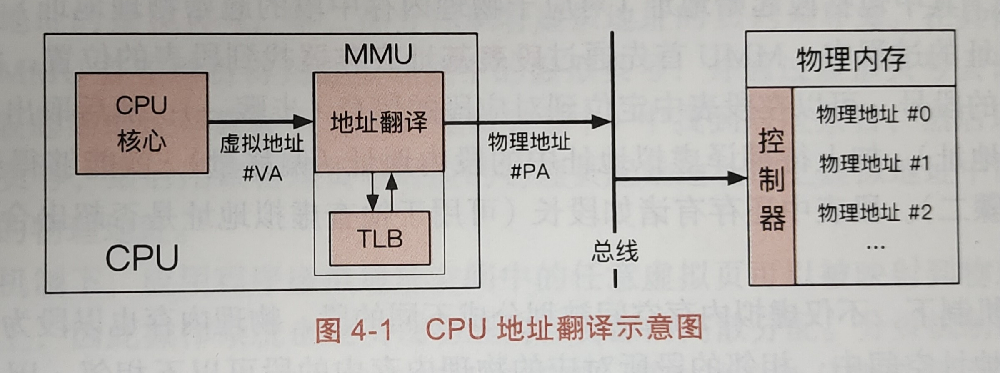 -->


这样处理的好处是：
- 每个进程都感觉自己拥有全部的地址空间，同时也只能看见自己的虚拟地址空间，保证了进程之间的隔离性；
- 每个进程的地址空间都是连续且统一的，进程切换的时候访问的虚拟地址都是相同的，降低了编码的难度；

基于进程地址空间的概念，需要考虑如何将虚拟地址和物理地址之间进行映射，一般来说有**分段**和**分页**两种机制。

### 分段机制
使用分段机制时，操作系统以 **段**（一段连续的物理内存）的形式管理或分配物理内存。应用程序的虚拟地址由若干个大小不同的 **段** 组成（如代码段、数据段...）。

在分段机制下，虚拟地址被分为两个部分：
- 1）**段号**，标识着该虚拟地址对应着虚拟地址空间的哪一个段；
- 2）**段内偏移**，相对于段的起始地址的偏移量；

**段表** 存储着每一个虚拟地址空间中的每一个分段信息，包括 **段起始地址**（对应的是物理内存中某一个段的起始地址）和 **段长**；

地址翻译过程如下：
- MMU 根据 **段表基址寄存器** 找到段表在物理内存中对应的起始地址；
- 通过对虚拟地址进行解析，找到段号，然后通过段表和段号来定位到具体某一个段的信息（相当于找到了数组起始地址和下标）；
- 根据找到的段内的信息（对应的物理地址），加上虚拟地址的段内偏移量，最终得到虚拟地址对应的物理地址；

<!-- 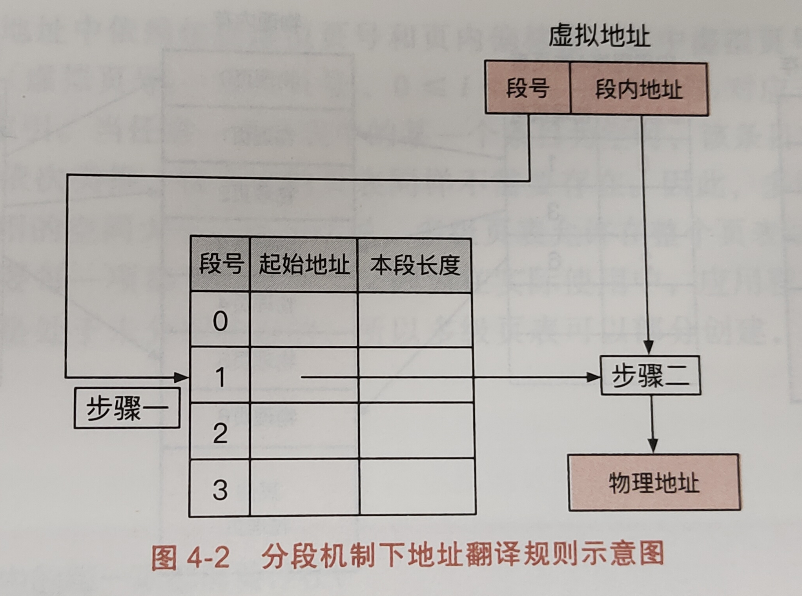 -->


分段机制下，虚拟地址和物理地址都被分为不同大小的段，但是很容易会导致 **外部碎片**，即段与段之间留下碎片空间（不足以作为虚拟地址映射对应的段）

例如：6GB 物理内存，目前分为 0~2GB，2~3GB，3~5GB 和 5~6GB，如果第二段和第四段被释放，此时又需要分配一个 2G 的段，这时虽然有 2G 的空间，但是不连续，分配失败。

### 分页机制

分页机制通常将物理地址和虚拟地址分为连续的、等长的页（通常 4KB）。操作系统为每个程序分配一个页表，即**虚拟地址到物理地址之间的映射关系**（可以将页表看成一个大的数组）；

虚拟内存也分为两个部分：
- 1）**虚拟页号**，标识着虚拟地址在页表中的位置；
- 2）**页内偏移量**，相对于虚拟地址的偏移量；

地址翻译过程：
- 首先 MMU 找到 **页表基址寄存器** 中的页表起始地址；
- 根据虚拟地址的页号，和页表起始地址找到对应的物理页号；
- 由得到的物理页号和虚拟地址的页内偏移量得到最终的物理地址；

<!-- 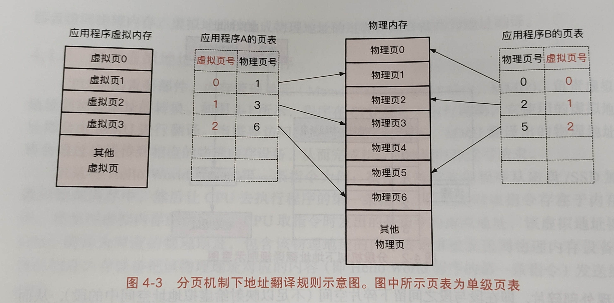 -->


假设现在有一个 64 位虚拟地址，每个页大小为 4KB，页表每一项是 8 个字节（64 位），这样一个页表大小为 2^64 / 4KB * 8 字节 = 33554432 GB，显然操作系统无法存储这么大的页表，通常会采取 **多级页表** 的机制来压缩页表的大小。

## RISC-V 内存管理
### satp 寄存器

上面说过地址转换的时候，MMU 要先找到页表基址寄存器来得到页表的起始地址，在 RISC-V 中这个寄存器是 satp：

<!-- 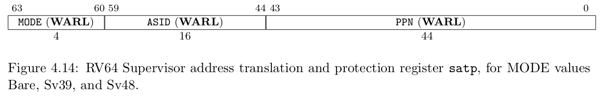 -->


- `MODE` 控制 CPU 使用哪种页表实现；
- `ASID` 表示进程地址空间标识符，用于优化 TLB；
- `PPN` 存的是根页表所在的物理页号。这样，给定一个虚拟页号，CPU 就可以从三级页表的根页表开始一步步的将其映射到一个物理页号。

下面的表格展示了 MODE 字段不同值的含义：

<!-- 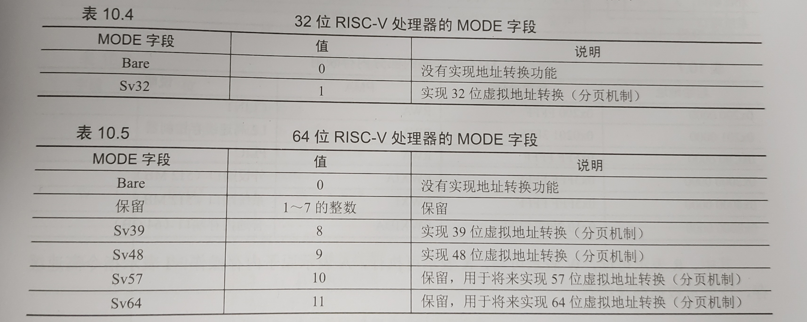 -->


### Sv39 页表映射

当 satp 寄存器的 MODE 字段设置为 8 的时候，表示开启 Sv39 页表映射，这也是 xv6 的页表机制，RISC-V 体系机构下有以下几种页表映射机制：

- Sv32：只支持 32 位 RISC-V 处理器，是一个二级页表，支持 32 位虚拟地址转换；
- Sv39：支持 64 位 RISC-V 处理器（低 39 位用作页表索引），是一个三级页表，支持 39 位虚拟地址转换；
- Sv48：支持 64 位 RISC-V 处理器（低 48 位用作页表索引），是一个四级页表，支持 48 位虚拟地址转换；

在 Sv39 页表映射中，只有低 39 位是有效位，用于页表地址转换，并最终映射到 56 位物理地址上。当虚拟地址的第 38 位是 0 或 1 的时候，整个虚拟地址划分为 3 个区域：

<!-- 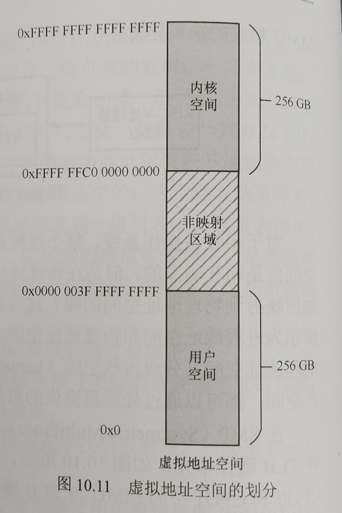 -->


- 第 38 位为 0，剩余高位也为 0，组成了低位的虚拟地址空间 `[0x0, 0x0000 003F FFFF FFFF]` 大小为 256G，一般用作用户空间；
- 第 38 位为 1，剩余高位也为 1，组成了高位的虚拟地址空间 `[0xFFFF FFC0 0000 0000, 0xFFFF FFFF FFFF FFFF]`，大小为 256 G，一般用作内核空间；
- 中间位置为非映射区域，即 `Bit[63:38]` 不全为 0 或 1，处理器访问改区域会触发缺页异常；

在 xv6 中内核的地址空间和进程的地址空间都是用的低位的虚拟地址空间 `[0x0, 0x0000 003F FFFF FFFF]`， `kernel/riscv.h` 文件可以查看到 MAXVA 的定义：

```c
// one beyond the highest possible virtual address.
// MAXVA is actually one bit less than the max allowed by
// Sv39, to avoid having to sign-extend virtual addresses
// that have the high bit set.
#define MAXVA (1L << (9 + 9 + 9 + 12 - 1))
```

MAXVA 比 `0x0000 003F FFFF FFFF` 大了 1，小于 MAXVA 的地址都可以认为是有效的，这里没有使用高位的虚拟地址空间是为了避免需要对虚拟地址进行符号拓展，算是简化了代码实现。

可以看下 xv6 book 的内核地址空间和进程地址空间都是不超过 MAXVA：

内核地址空间：

<!-- 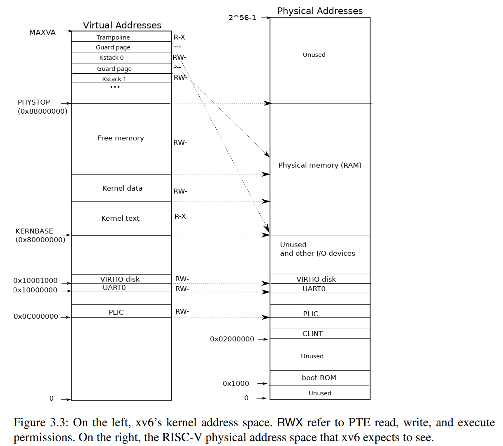 -->


进程地址空间：

<!--  -->


下面来看下虚拟地址和物理地址的格式：

1. 虚拟地址

```c
63       39 38        30 29       21 20      12 11          0
|   保留   |   VPN[2]   |  VPN[1]   |  VPN[0]  | 页内偏移量  | 
            L2页表索引    L1页表索引   L0页表索引      
```

- $Bit[11:0]$ 为页内偏移量，表示 4KB 页面大小的内部偏移量；
- $Bit[20:12]$ 为 L0 页表索引，L0 页表共 512 个表项，每个表项占 8 个字节；
- $Bit[29:21]$ 为 L1 页表索引，L1 页表共 512 个表项，每个表项占 8 个字节；
- $Bit[38:30]$ 为 L2 页表索引，L2 页表共 512 个表项，每个表项占 8 个字节；
- $Bit[63:39]$ 为保留位，必须和第 38 位相同，在 xv6 中都为 0；

2. 物理地址

```c
55                                         12 11          0
|            Physical Page Number            | 页内偏移量  | 
```

- $Bit[11:0]$ 为页内偏移量，表示 4KB 页面大小的内部偏移量；
- $Bit[55:12]$ 为物理页码（Physical Page Number/PPN），因为 xv6 物理内存是按照每 4KB 页面来管理的，所以 PPN 指的就是这些 4KB 页面的起始地址；

知道了物理地址和虚拟地址的组成，下面来看具体的地址转换过程，首先我们需要知道页表本身是存放在物理地址上的，页表的大小是 4KB，每个页表包含 512 个页表项（Page Table Entries/PTE），每个表项大小为 8 个字节，也就是 64 位，这 64 位实际上只用了前 54 位，页表项的格式如下：

```c
63          54 53                                         10 9          0
|    保留位    |            Physical Page Number            |   Flags    | 
```

然后就是地址翻译过程，xv6 book 给了一张非常详细的图：

<!-- 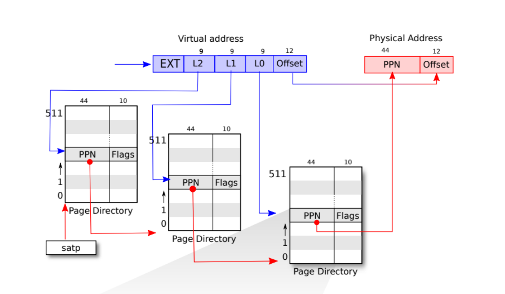 -->


假设现在有一个虚拟地址 VA，下面是地址翻译过程：
- 1）MMU 从 satp 寄存器的 PPN 字段获取页表起始地址，从而得到 L2 页表的物理地址；
- 2）MMU 将 `VA[38:30]` 作为 L2 索引，根据上面得到的 L2 页表的物理地址找到对应的 L1 页表的物理地址；
- 3）MMU 将 `VA[29:21]` 作为 L1 索引，根据上面得到的 L1 页表的物理地址找到对应的 L0 页表的物理地址；
- 4）MMU 将 `VA[20:12]` 作为 L0 索引，根据上面得到的 L0 页表的物理地址找到虚拟地址对应的物理地址的 PPN；
- 5）物理地址的 PPN 再加上 `VA[11:0]` 就构成了新的物理地址，此时 MMU 即完成了地址翻译过程；

实际上在上述地址翻译的过程中，MMU 会对页表项的 Flags 标志位进行检查，如果发现页表项是无效的，就会触发缺页异常。下面详细介绍一下页表项的标志位，可以看下 xv6 book 中的图：

<!-- 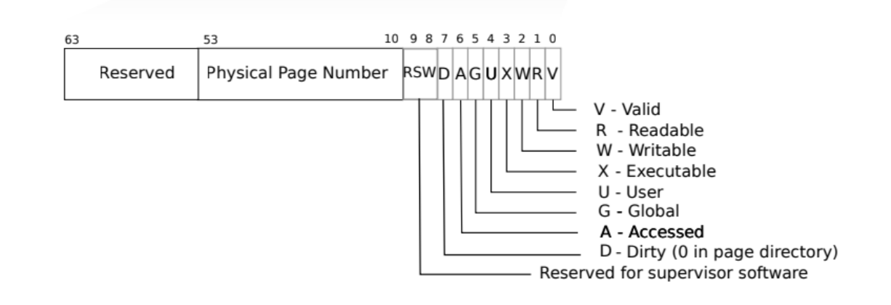 -->


- V 表示页表项是否有效；
- R/W/X：分别控制索引到这个页表项的对应虚拟页面是否允许读/写/执行；
- U 表示用户模式是否能访问这个页面；
- G 全局映射，常用于 TLB，这里可以不用管；
- A 表示处理器是否访问过该页面；
- D 表示这个页面是否被修改过；
- RSW 预留给系统管理员使用；

对于一个页表项来说分为 3 类：
- 1）V = 0 时，代表当前的页表项是无效的，不能走向下一级页表或指向物理地址；
- 2）V = 1，且 R/W/X 均为 0，表示页目录表项，它的 PPN 是指向下一级页表的基地址；
- 3）V = 1，且 R/W/X 不全为 0，表示叶节点页表项，它的 PPN 是虚地址对应的物理页号；

下面是更加详细的权限说明：

<!-- 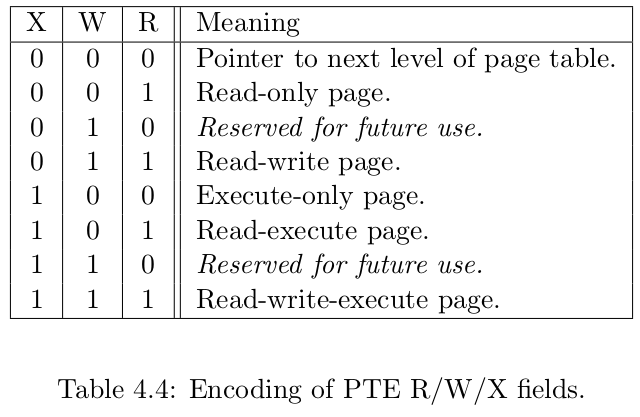 -->


注意：在没有相应权限的页面中进行读、写或者执行代码等操作或触发缺页异常
- 如果在没有可执行权限的页面中预取指令，触发预取缺页异常（fetch page fault）；
- 如果在没有可读权限的页面中加载数据，触发加载缺页异常（load page fault）；
- 如果在没有可写权限的页面中写入数据，触发存储缺页异常（store page fault）；

## xv6 页表相关代码

有了前面的理论基础，下面来详细看下 xv6 有关页表的代码

### 相关宏定义

首先看下 `kernel/riscv.h` 中的关于页表项和页表的定义：

```c
typedef uint64 pte_t;
typedef uint64 *pagetable_t; // 512 PTEs
```

可以看到实际上页表项就是一个 64 位的整数，而页表就是一个指向 64 位整数的指针；

下面是一些宏的定义，我加了点注释：

```c
#define PGSIZE 4096 // bytes per page 每个页面大小为4KB
#define PGSHIFT 12  // bits of offset within a page 页内偏移量

#define PGROUNDUP(sz)  (((sz)+PGSIZE-1) & ~(PGSIZE-1)) // 页面向上取整
#define PGROUNDDOWN(a) (((a)) & ~(PGSIZE-1))  // 页面向下取整
```

这里向上取整和向下取整是为了得到任意一个地址的上下边界，比如说现在一个地址为 6 * 1024，将它上下取整得到的分别为 8KB 和 4KB，这样的话更加容易统一处理；

<!-- 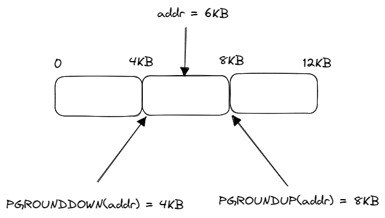 -->


```c
#define PTE_V (1L << 0) // 有效位
#define PTE_R (1L << 1) // 可读页面
#define PTE_W (1L << 2) // 可写页面
#define PTE_X (1L << 3) // 可执行页面
#define PTE_U (1L << 4) // 用户模式可以访问
#define PTE_A (1L << 6) // 处理器访问过
```

这些宏是为了方面修改页表项对应的标志位的；

```c
// shift a physical address to the right place for a PTE.
// 将物理地址转为页表项，即取出物理地址的Bit[55:12]，然后再右移10位作为页表项的前44位
#define PA2PTE(pa) ((((uint64)pa) >> 12) << 10)
// 将页表项转为物理地址，上面转换的逆过程
#define PTE2PA(pte) (((pte) >> 10) << 12)
// 得到页表项的标志位
#define PTE_FLAGS(pte) ((pte) & 0x3FF)

// extract the three 9-bit page table indices from a virtual address.
// 后9位全为1
#define PXMASK          0x1FF // 9 bits
// 根据level来得到该右移的位数，12 + 9 * level
#define PXSHIFT(level)  (PGSHIFT+(9*(level)))
// 通过虚拟地址和level来得到对应的页表项的虚拟页号
#define PX(level, va) ((((uint64) (va)) >> PXSHIFT(level)) & PXMASK)
```

### 页表相关函数

与页表相关操作的函数定义在 `kernel/vm.c` 文件中，下面依次看下相关的函数定义：

#### walk

```cpp
pte_t *
walk(pagetable_t pagetable, uint64 va, int alloc)
{
  // 访问的虚拟地址超过规定的最大值
  if(va >= MAXVA)
    panic("walk");

  // 模拟三级页表访问过程，从L2->L1
  for(int level = 2; level > 0; level--) {
    // PX(level, va)得到页表中的虚拟页号
    // 根据虚拟页号来得到对应的页表项
    pte_t *pte = &pagetable[PX(level, va)];
    // 如果页表项是有效的
    if(*pte & PTE_V) {
      // 将页表项转为物理地址，并更新此时的页表
      pagetable = (pagetable_t)PTE2PA(*pte);
    } else { // 如果页表项是无效的
      // 看是否需要分配新的页表（alloc==1)
      // 需要分配，并且物理内存足够则分配新的页表
      if(!alloc || (pagetable = (pde_t*)kalloc()) == 0)
        return 0;
      // 将页表对应的4KB物理内存清空
      memset(pagetable, 0, PGSIZE);
      // 将分配的物理地址存放在上一级页表项中，并设置页表标志位V=1
      *pte = PA2PTE(pagetable) | PTE_V;
    }
  }
  // 返回最后一级对应的页表项
  return &pagetable[PX(0, va)];
}
```

`walk` 函数是根据虚拟地址来找到最后一级对应的页表项，返回 0 表示没找到；alloc 参数规定了页表遍历的过程，如果遇见无效的页表是否需要分配一块新的物理内存当做页表，体现了按需分配的原则；

```c
uint64
walkaddr(pagetable_t pagetable, uint64 va)
{
  pte_t *pte;
  uint64 pa;

  if(va >= MAXVA)
    return 0;

  pte = walk(pagetable, va, 0);
  if(pte == 0)
    return 0;
  if((*pte & PTE_V) == 0)
    return 0;
  if((*pte & PTE_U) == 0)
    return 0;
  pa = PTE2PA(*pte);
  return pa;
}
```

`walkaddr` 函数是用来得到虚拟地址 va 对应的物理地址，只用来查看用户页面，看代码可以看出来就是对 `walk` 函数进一步封装；

#### mappages/uvmunmap

```c
int
mappages(pagetable_t pagetable, uint64 va, uint64 size, uint64 pa, int perm)
{
  uint64 a, last;
  pte_t *pte;
  // 需要映射的大小为0，panic
  if(size == 0)
    panic("mappages: size");
  
  a = PGROUNDDOWN(va);               // 需要映射的虚拟地址的下边界
  last = PGROUNDDOWN(va + size - 1); // 需要映射的虚拟地址的上边界
  // 遍历每个4KB的页面
  for(;;){
    // 得到最后一级页表项
    if((pte = walk(pagetable, a, 1)) == 0)
      return -1;
    // 如果页表项已经有效了，说明这个页表之前已经被映射过了，panic
    if(*pte & PTE_V)
      panic("mappages: remap");
    // 页表项存放对应的物理地址，并设置页表项的标志位
    *pte = PA2PTE(pa) | perm | PTE_V;
    // 映射完成
    if(a == last)
      break;
    a += PGSIZE;
    pa += PGSIZE;
  }
  return 0;
}
```

`mappages` 这个函数比较重要，它是真正建立起了虚拟地址和物理地址之间的映射，在前面 3 级页表地址转换过程，我们知道最后一级页表项存放的是虚拟地址对应的物理地址的 PPN，`mappages` 就是通过 `walk` 函数得到最后一级页表项，然后存放对应的物理地址的 PPN，并设置标志位，从而形成映射关系；

这里注意 va 和 size 可能不是页面对齐的（即 va % PGSZIE != 0），所以需要向下取整，对于 pa 来说，因为 xv6 物理内存是根据空闲链表来管理的，处理的时候返回的物理地址都是页面对齐的，所以这里不需要考虑 pa 不是页面对齐的情况；

```c
// Remove npages of mappings starting from va. va must be
// page-aligned. The mappings must exist.
// Optionally free the physical memory.
void
uvmunmap(pagetable_t pagetable, uint64 va, uint64 npages, int do_free)
{
  uint64 a;
  pte_t *pte;

  // 页面没对齐，panic
  if((va % PGSIZE) != 0)
    panic("uvmunmap: not aligned");

  // 遍历所有的虚拟地址
  for(a = va; a < va + npages*PGSIZE; a += PGSIZE){
    // 通过walk函数找到最后一级页表项PTE
    if((pte = walk(pagetable, a, 0)) == 0)
      panic("uvmunmap: walk");
    // 页表项无效，即没有映射关系，panic
    if((*pte & PTE_V) == 0)
      panic("uvmunmap: not mapped");
    // 这里是取出PTE的标志位，如果等于PTE_V，说明其他位都是0
    // 其他位都是0的时候，代表这个页表项指向下一级页表，即不是叶子节点
    if(PTE_FLAGS(*pte) == PTE_V)
      panic("uvmunmap: not a leaf");
    // 需要释放物理内存，调用kfree
    if(do_free){
      uint64 pa = PTE2PA(*pte);
      kfree((void*)pa);
    }
    // 页表项清空
    *pte = 0;
  }
}
```

`uvmunmap` 是取消从虚拟地址 va 开始的 npages 个页面的映射关系，do_free 可选是否需要是否物理内存。主要用来释放页表映射关系，和 `mappages` 操作相反；

#### uvmcreate

```c
// create an empty user page table.
// returns 0 if out of memory.
pagetable_t
uvmcreate()
{
  pagetable_t pagetable;
  pagetable = (pagetable_t) kalloc();
  if(pagetable == 0)
    return 0;
  memset(pagetable, 0, PGSIZE);
  return pagetable;
}
```

`uvmcreate` 这个函数比较简单，调用了 `kalloc()` 来分配一页物理内存作为用户页表；

#### uvmfirst

```c
// Load the user initcode into address 0 of pagetable,
// for the very first process.
// sz must be less than a page.
void
uvmfirst(pagetable_t pagetable, uchar *src, uint sz)
{
  char *mem;

  if(sz >= PGSIZE)
    panic("uvmfirst: more than a page");
  mem = kalloc(); // 分配一页物理内存
  memset(mem, 0, PGSIZE);
  // 虚拟地址为0，建立到物理地址mem的映射关系
  mappages(pagetable, 0, PGSIZE, (uint64)mem, PTE_W|PTE_R|PTE_X|PTE_U);
  // 将src数据写入物理内存中
  memmove(mem, src, sz);
}
```

`uvmfirst` 函数是创建第一个进程 init 使用的，它将虚拟地址 0，映射到分配的一页物理内存上，并将 src 数据写入物理内存中；

#### uvamalloc/uvmdealloc

```c
// Allocate PTEs and physical memory to grow process from oldsz to
// newsz, which need not be page aligned.  Returns new size or 0 on error.
uint64
uvmalloc(pagetable_t pagetable, uint64 oldsz, uint64 newsz, int xperm)
{
  char *mem;
  uint64 a;
  // 不需要分配新的页表项
  if(newsz < oldsz)
    return oldsz;

  // 向上取整，从这里开始分配新的内存
  oldsz = PGROUNDUP(oldsz); 
  for(a = oldsz; a < newsz; a += PGSIZE){
    mem = kalloc(); // 分配一页物理内存
    if(mem == 0){ 
      // 物理内存用完了，取消已经建立的映射关系
      uvmdealloc(pagetable, a, oldsz);
      return 0;
    }
    memset(mem, 0, PGSIZE);
    // 建立映射关系，虚拟地址a -> 物理地址mem，标志位 PTE_R|PTE_U|xperm
    if(mappages(pagetable, a, PGSIZE, (uint64)mem, PTE_R|PTE_U|xperm) != 0){
      // 映射关系建立失败，释放内存，并取消已经建立的映射关系
      kfree(mem); 
      uvmdealloc(pagetable, a, oldsz);
      return 0;
    }
  }
  return newsz;
}

// Deallocate user pages to bring the process size from oldsz to
// newsz.  oldsz and newsz need not be page-aligned, nor does newsz
// need to be less than oldsz.  oldsz can be larger than the actual
// process size.  Returns the new process size.
uint64
uvmdealloc(pagetable_t pagetable, uint64 oldsz, uint64 newsz)
{
  if(newsz >= oldsz)
    return oldsz;

  // oldsz和newsz都向上取整
  if(PGROUNDUP(newsz) < PGROUNDUP(oldsz)){
    // 计算npages
    int npages = (PGROUNDUP(oldsz) - PGROUNDUP(newsz)) / PGSIZE;
    // 从虚拟地址PGROUNDUP(newsz)开始，取消npages个页面的映射关系，需要释放相关物理内存
    uvmunmap(pagetable, PGROUNDUP(newsz), npages, 1);
  }

  return newsz;
}
```

`uvmalloc` 和 `uvmdealloc` 是用来给调整进程的内存大小的，`uvmalloc` 用 `kalloc` 分配物理内存，并用 `mappages` 将 PTE 添加到用户页表中。`uvmdealloc` 调用 `uvmunmap`，`uvmunmap` 使用 `walk` 来查找对应的 PTE，并使用 `kfree` 来释放 PTE 引用的物理内存。

这里注意两者的参数，`uvmalloc` 是将增长 `[oldsz, newsz]` 这块内存，而 `uvmdealloc` 是缩减 `[newsz, oldsz]` 这块内存，稍微有点区别；

#### freewalk

```c
// Recursively free page-table pages.
// All leaf mappings must already have been removed.
void
freewalk(pagetable_t pagetable)
{
  // there are 2^9 = 512 PTEs in a page table.
  // 遍历512个页表项
  for(int i = 0; i < 512; i++){
    pte_t pte = pagetable[i];
    // 如果页表项有效，且指向下一级页表
    if((pte & PTE_V) && (pte & (PTE_R|PTE_W|PTE_X)) == 0){
      // this PTE points to a lower-level page table.
      // 递归调用释放下一级页表
      uint64 child = PTE2PA(pte);
      freewalk((pagetable_t)child);
      pagetable[i] = 0;
    } else if(pte & PTE_V){ 
      // 如果页表项有效，且不是指向下一级页表，说明是叶子节点
      // 调用freewalk的之前，要先释放用户的物理内存
      // 即需要将最后一级页表（叶子节点）指向的物理内存释放
      panic("freewalk: leaf");
    }
  }
  // 回收页表的物理内存
  kfree((void*)pagetable);
}

// Free user memory pages,
// then free page-table pages.
void
uvmfree(pagetable_t pagetable, uint64 sz)
{
  // sz大于0，需要先释放用户物理内存页面
  if(sz > 0)
    uvmunmap(pagetable, 0, PGROUNDUP(sz)/PGSIZE, 1);
  // 释放页表
  freewalk(pagetable);
}
```

`freewalk` 是用来释放页表的，这里释放页表指的是一级页表和二级页表（就是指向下一级页表），最后一级页表指向的物理内存是给用户进程使用的（即虚拟内存对应的物理内存），前面的 `uvmunmap` 就是用来释放最后一级页表指向的物理内存，所以可以看到 `uvmfree` 函数先释放用户物理内存页面，再释放相应的页表。

#### uvmcopy 
```c
// Given a parent process's page table, copy
// its memory into a child's page table.
// Copies both the page table and the
// physical memory.
// returns 0 on success, -1 on failure.
// frees any allocated pages on failure.
int
uvmcopy(pagetable_t old, pagetable_t new, uint64 sz)
{
  pte_t *pte;
  uint64 pa, i;
  uint flags;
  char *mem;

  // 进程的虚拟地址空间是从0开始的，遍历每一页
  for(i = 0; i < sz; i += PGSIZE){
    // 找到最后一级页表项PTE
    if((pte = walk(old, i, 0)) == 0)
      panic("uvmcopy: pte should exist");
    // 页表项应该有效
    if((*pte & PTE_V) == 0) 
      panic("uvmcopy: page not present");
    // 得到物理地址和标志位
    pa = PTE2PA(*pte);
    flags = PTE_FLAGS(*pte);
    // 分配一页新的物理内存
    if((mem = kalloc()) == 0)
      goto err;
    // 将物理地址pa这一页的内容，复制到mem上
    memmove(mem, (char*)pa, PGSIZE);
    // 新页表建立映射关系 i -> mem
    if(mappages(new, i, PGSIZE, (uint64)mem, flags) != 0){
      kfree(mem);
      goto err;
    }
  }
  return 0;

 err:
  // 失败情况，需要取消映射关系，并释放物理内存
  uvmunmap(new, 0, i / PGSIZE, 1);
  return -1;
}
```

`uvmcopy` 这个函数是进程 `fork` 的时候将父进程的页表和使用的物理内存，完全复制一份给子进程，这里并没有实现写时复制技术，效率并不高（课程的实验部分有相关内容）；

#### uvmclear

```c
// mark a PTE invalid for user access.
// used by exec for the user stack guard page.
void
uvmclear(pagetable_t pagetable, uint64 va)
{
  pte_t *pte;
  
  pte = walk(pagetable, va, 0);
  if(pte == 0)
    panic("uvmclear");
  *pte &= ~PTE_U;
}
```

`uvmclear` 这个函数比较简单，将虚拟地址 va 对应的页表项取消用户模式的权限，用作 exec 的 guard page，防止用户栈溢出的情况；

#### copyout/copyin/copyinstr

```c
// Copy from kernel to user.
// Copy len bytes from src to virtual address dstva in a given page table.
// Return 0 on success, -1 on error.
int
copyout(pagetable_t pagetable, uint64 dstva, char *src, uint64 len)
{
  uint64 n, va0, pa0;
  // 还剩len个字节待拷贝
  while(len > 0){
    va0 = PGROUNDDOWN(dstva);
    pa0 = walkaddr(pagetable, va0); // 找到物理地址
    if(pa0 == 0)
      return -1;
    // 计算当前需要拷贝的字节数，每次最多拷贝PGSIZE个字节（1个页面大小）
    // 再减去页内偏移量(dstva -va0)，即剩下需要拷贝的字节数
    n = PGSIZE - (dstva - va0);
    if(n > len)
      n = len;
    // 将src开始的内容，拷贝n个字节到物理地址 pa0 + (dstva - va0)
    // dstva - va0是页内偏移量
    memmove((void *)(pa0 + (dstva - va0)), src, n);

    // 更新len，src和dstva的位置
    len -= n;
    src += n;
    dstva = va0 + PGSIZE;
  }
  return 0;
}
```

`copyout` 是将内核地址空间中的内容拷贝到用户空间，src 对应的内核地址空间的物理地址，dstva 是准备拷贝的用户虚拟地址，len 是需要拷贝的字节数，详细过程注释已经写了；

```c
// Copy from user to kernel.
// Copy len bytes to dst from virtual address srcva in a given page table.
// Return 0 on success, -1 on error.
int
copyin(pagetable_t pagetable, char *dst, uint64 srcva, uint64 len)
{
  uint64 n, va0, pa0;
  // 还剩len个字节待拷贝
  while(len > 0){
    va0 = PGROUNDDOWN(srcva);
    pa0 = walkaddr(pagetable, va0); // 找到物理地址
    if(pa0 == 0)
      return -1;
    // 计算当前需要拷贝的字节数，每次最多拷贝PGSIZE个字节（1个页面大小）
    // 再减去页内偏移量(srcva -va0)，即剩下需要拷贝的字节数
    n = PGSIZE - (srcva - va0);
    if(n > len)
      n = len;
    // 将pa0 + (srcva - va0)开始的内容，拷贝n个字节到物理地址 dst
    memmove(dst, (void *)(pa0 + (srcva - va0)), n);

    // 更新len，dst和srcva的位置
    len -= n;
    dst += n;
    srcva = va0 + PGSIZE;
  }
  return 0;
}
```

`copyin` 是从用户地址空间拷贝 len 个字节数据到内核地址空间，和 `copyout` 实现逻辑相似；

```c
// Copy a null-terminated string from user to kernel.
// Copy bytes to dst from virtual address srcva in a given page table,
// until a '\0', or max.
// Return 0 on success, -1 on error.
int
copyinstr(pagetable_t pagetable, char *dst, uint64 srcva, uint64 max)
{
  uint64 n, va0, pa0;
  int got_null = 0;

  while(got_null == 0 && max > 0){
    va0 = PGROUNDDOWN(srcva);
    pa0 = walkaddr(pagetable, va0);
    if(pa0 == 0)
      return -1;
    n = PGSIZE - (srcva - va0);
    if(n > max)
      n = max;

    char *p = (char *) (pa0 + (srcva - va0));
    while(n > 0){
      if(*p == '\0'){
        *dst = '\0';
        got_null = 1;
        break;
      } else {
        *dst = *p;
      }
      --n;
      --max;
      p++;
      dst++;
    }

    srcva = va0 + PGSIZE;
  }
  if(got_null){
    return 0;
  } else {
    return -1;
  }
}
```

`copyinstr` 也是从用户空间拷贝数据到内核空间，不过这里拷贝的是字符串，不一样的是，当遇见 `\0` 就终止拷贝了；

#### kvminit

最后来看下内核页表的建立:

```c
// Make a direct-map page table for the kernel.
pagetable_t
kvmmake(void)
{
  pagetable_t kpgtbl;

  kpgtbl = (pagetable_t) kalloc();
  memset(kpgtbl, 0, PGSIZE);

  // uart registers
  kvmmap(kpgtbl, UART0, UART0, PGSIZE, PTE_R | PTE_W);

  // virtio mmio disk interface
  kvmmap(kpgtbl, VIRTIO0, VIRTIO0, PGSIZE, PTE_R | PTE_W);

  // PLIC
  kvmmap(kpgtbl, PLIC, PLIC, 0x400000, PTE_R | PTE_W);

  // map kernel text executable and read-only.
  kvmmap(kpgtbl, KERNBASE, KERNBASE, (uint64)etext-KERNBASE, PTE_R | PTE_X);

  // map kernel data and the physical RAM we'll make use of.
  kvmmap(kpgtbl, (uint64)etext, (uint64)etext, PHYSTOP-(uint64)etext, PTE_R | PTE_W);

  // map the trampoline for trap entry/exit to
  // the highest virtual address in the kernel.
  kvmmap(kpgtbl, TRAMPOLINE, (uint64)trampoline, PGSIZE, PTE_R | PTE_X);

  // allocate and map a kernel stack for each process.
  proc_mapstacks(kpgtbl);
  
  return kpgtbl;
}

// Initialize the one kernel_pagetable
void
kvminit(void)
{
  kernel_pagetable = kvmmake();
}
```

可以看到先分配一页物理内存作为内核页表，然后将 `UART0` 、`VIRTIO0`、`PLIC`、`KERNBASE` 和 `etext` 都做了直接映射（即虚拟地址和物理地址一样）；另外 `TRAMPOLINE` 页面是映射到物理地址 `trampoline` 上了，关于 etext 和 trampoline 可以在链接脚本 `kernel/kernel.ld` 中查看到：

```ld
OUTPUT_ARCH( "riscv" )
ENTRY( _entry )

SECTIONS
{
  . = 0x80000000;
  .text : {
    *(.text .text.*)
    . = ALIGN(0x1000);
    _trampoline = .;
    *(trampsec)
    . = ALIGN(0x1000);
    ASSERT(. - _trampoline == 0x1000, "error: trampoline larger than one page");
    PROVIDE(etext = .);
  }
  ...// 后面内容省略
}
```

`etext` 是 .text 段结束位置，`_trampoline` 也是写在 .text 段中；

然后是 `proc_mapstacks(kpgtbl);` 这行代码，它实际上为每个进程分配了一块物理内存作为进程的内核栈使用，每个栈的下面还有一块 guard page 来避免栈溢出，下面是 `proc_mapstacks` 函数的定义；

```c
// Allocate a page for each process's kernel stack.
// Map it high in memory, followed by an invalid
// guard page.
void
proc_mapstacks(pagetable_t kpgtbl)
{
  struct proc *p;
  
  for(p = proc; p < &proc[NPROC]; p++) {
    char *pa = kalloc();
    if(pa == 0)
      panic("kalloc");
    uint64 va = KSTACK((int) (p - proc)); // 计算出进程对应的内核虚拟地址
    kvmmap(kpgtbl, va, (uint64)pa, PGSIZE, PTE_R | PTE_W); // 建立映射关系
  }
}
```

可以再看下 xv6 book 上的内核地址空间：

<!--  -->


以上就是 `kernel/vm.c` 所有的函数，最重要理解了页表机制后，这些函数理解起来也不困难了。

## 参考资料

- 《RISC-V 体系结构编程与实践》 第 10 章
- 《现代操作系统——原理与实现》第 4 章
- [第三章 页表 · 6.S081 All-In-One (dgs.zone)](http://xv6.dgs.zone/tranlate_books/book-riscv-rev1/c3/s0.html)